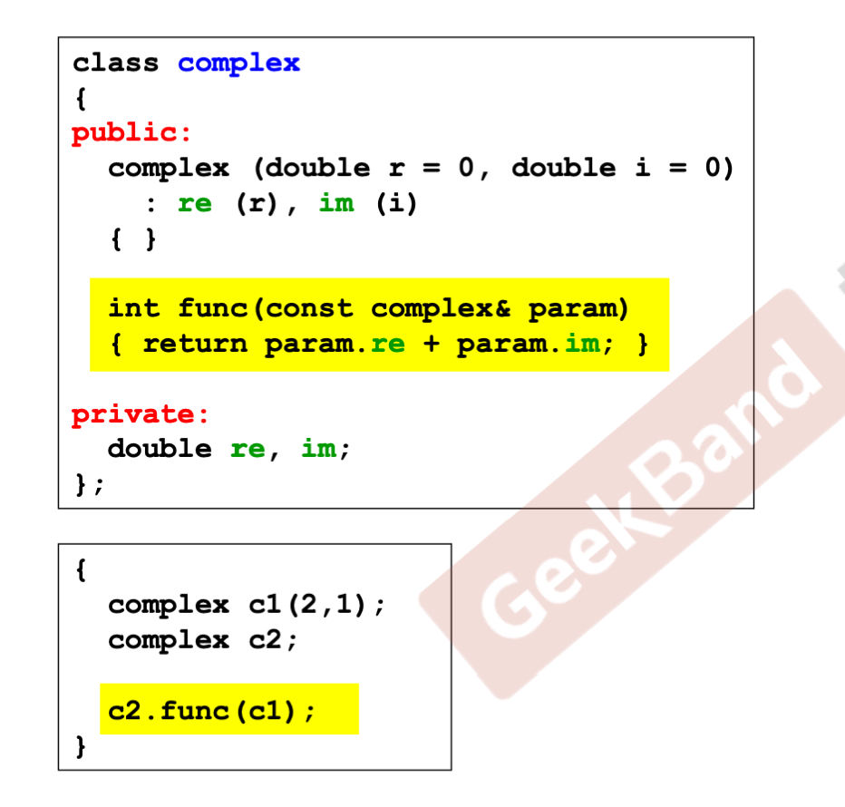

# **C++ programs 代码基本形式**


**Header（头文件）的布局**


# **class 的声明（declaration）**

```cpp
class complex
{
public: // 访问级别
	complex (double r = 0, double i = 0) : re(r), im(i) { }	// inline 内联函数
    // initialization list (初值列，初始列)
    complex &operator += (const complex&);
    double real () const { return re; } // 内联函数
    double imag () const { return im; } // 内联函数
private:
	double re, im;
    friend complex & __doapl (complex*, const complex&);
    // 友元
};
// 自由取得 friend 的 private 成员
inline complex& __doapl (complex *ths, const complex &r)
{
    ths->re += r.re;
    ths->im += r.im;
    return *ths;
}

{
    complex c1(2, 1); // 绑定为double
    complex c2;
}
```

## **constructor（ctor，构造函数）**


函数名和 class 名相同，不需要有返回类型

initialization list 构造函数特有的写法 `re(r), im(i)`

`complex c2` 没有给定参数，调用默认实参

## **ctor可以有多个 —— overloading（重载）**


黄色部分的重载是否可行？

不可行，因为第一个有默认参数，黄色部分没有给定值，编译器在调用时不知道该调用哪一个构造函数

```cpp
{
	complex c1;
    complex c2();
}
```

## ctor 被放在 ==private== 区

不允许外界创建，外界调用只能通过`A::getInstance().setup();`


## 参数传递：pass by value vs. pass by reference (to const)

养成习惯，尽量 pass by reference，速度比 pass by value 快


## 返回值传递：return by value vs. return by refrerence(to const)


## 相同 class 的各个objects 互为 friends（友元）

`c2.func(c1)` 两个为相同的 class，可以直接调用



## operator overloading（操作符重载1，成员函数） ==this==


`this` 不能写到形参里，编译器默认其存在的，但在函数里面可以直接用

## operator overloading（操作符重载2，非成员函数） ==无this==


不可以 `return by reference`，因为它们返回的是个 **local object**

`typename()` 创建临时对象


不能用 `void` 返回后还是 `ostream`

## **ctor 和 dtor （构造函数和析构函数）**


## copy ctor（拷贝构造函数）

```cpp
inline
    String::String(const String &str)
{
	m_data = new char[strlen(str.m_data) + 1]; // 直接取另一个 object 的 private data
    strcpy(m_data, str.m_data);
}

{
    String s1("hello");
    String s2(s1);
    String s2 = s1;
}
```

## copy assignment opeator（拷贝赋值函数）

先杀掉自己的内存，再开辟拷贝需要的内存（需要+1），再进行拷贝


==一定要在operator中检测是否 self assignment==（如果本来指向的就是同一块内存，不检测自我赋值，直接杀掉，就会产生 undefined behavior）

## stack（栈）和 heap（堆）

stack objects的生命期

```cpp
class Complex {...};
...
{
    Complex c1(1,2);
} 
// 生命在作用域（scope）结束时就结束了，这种作用域内的object，又称为 auto object（因为会被自动清理）
```

static local objects 的生命期

```cpp
class Complex {...};
...
{	
    static Complex c1(1,2);
}
// 生命在作用域结束后仍存在，直到整个程序结束
```

global objects 的生命期

```cpp
class Complex {...};
...
Complex c3(1,2);
int main()
{
    ...
}
// c3是global object，其生命在整个程序结束之后才结束，也可以视为是一个static object
```

heap objects的生命期

```cpp
class Complex {...};
...
{	
    Complex *p = new Complex;
    ...
    delete p;
}
// 生命在被 delete 时结束，如果不进行 delete，会出现内存泄露（memory leak）当作用域结束，p 所指的heap object 仍存在，但指针 p 的生命却结束了，作用域之外再也看不到 p
```

## new ：先分配 memory，再调用 ctor


## delete : 先调用 dtor，再释放 memory


## static


静态函数没有 this pointer

调用 static 函数方式：

- 通过 object 调用
- 通过 class name 调用

## function template 函数模版


编译器会做实参推导（argument duduction）

# Object Oriented Programming, Object Oriented Design (OOP, OOD)

- Inheritance（继承)
- Composition（复合）
- Delegation（委托）

## Composition (复合)，表示 has -a


queue 里面有一个（或多个）deque，queue 里面的功能，都通过调用 deque 来实现

设计模式：Adapter

## Composition 关系下的构造和析构


（红色部分，都是编译器帮忙加上的，在调用构造函数时，编译器调用 ==Component 的默认构造函数==）

先后关系：==构造由内而外，析构由外而内==

## Delegation（委托）Composition by reference

用指针相连两个类，左边对外，所有的操作都在右边实现（编译防火墙）


## Inheritance （继承），表示 is -a


## Inheritance 关系下的构造和析构

子类对象有父类的成分


## Inheritance with ==virtual== functions（虚函数）


通过子类对象调用父类函数（在父类不做定义，父类定义为 virtual ，子类去定义 Serialize() 函数）

## Inheritance + Composition 关系下的构造和析构


## Delegation + Inheritance


为 Primititve 和 Composite 写一个父类 Component，这样 vector 中既可以放左边的东西，也可以放右边的东西，add 函数同理。

# 兼谈对象模型（II）

## conversersion function 转换函数


`Fraction` 转为 `double` 

## conversion function vs. non-explicit-one-argument ctor


error 原因：有两条可行的方法，编译器不知道应该走哪条路，会出现二义

## explicit-one-argument ctor


## function template 函数模版


编译器会对 function template 进行实参推导（argument deduction）

## member template 成员模版

```cpp
template <class T1, class T2>
struct pair {
    typedef T1 first_type;
    typedef T2 second_type;
    
    T1 first;
    T2 second;
    
    pair() : first(T1()), second(T2()) {}
    pair(const T1 &a, const T2 &b) : first(a), second(b) {}
    
    // 成员模版
    template <class U1, class U2>
    pair(const pair<U1, U2> &p) : first(p.first), second(p.second) {}
};
```


把一个鲫鱼➕麻雀构成的 pair，放进一个（拷贝到）一个由鱼类和鸟类构成的 pair 中，可以吗？反之？

可以，反之不可以


定义一个指针指向父类，给他设初值，指向子类 （up-cast）

## specialization 模版特化

对于独特的类型做特殊的设计

泛化与特化：


## partial specialization 模版偏特化

- **个数的偏**

- **范围的偏**

## template template parameter 模版模版参数


必须加上中间两行才能通过

## reference


reference 的常见用途：

通常不用于声明变量，而用于参数类型（parameters type）和返回类型（return type）的描述


## vptr 和 vtbl


子类对象有父类的成分，B、C继承了A中的函数和data1、data2

p 动态绑定

## const


const属于函数签名的一部分，故加和不加可以同时存在，不会出现二义

## 重载 member operator new/delete

