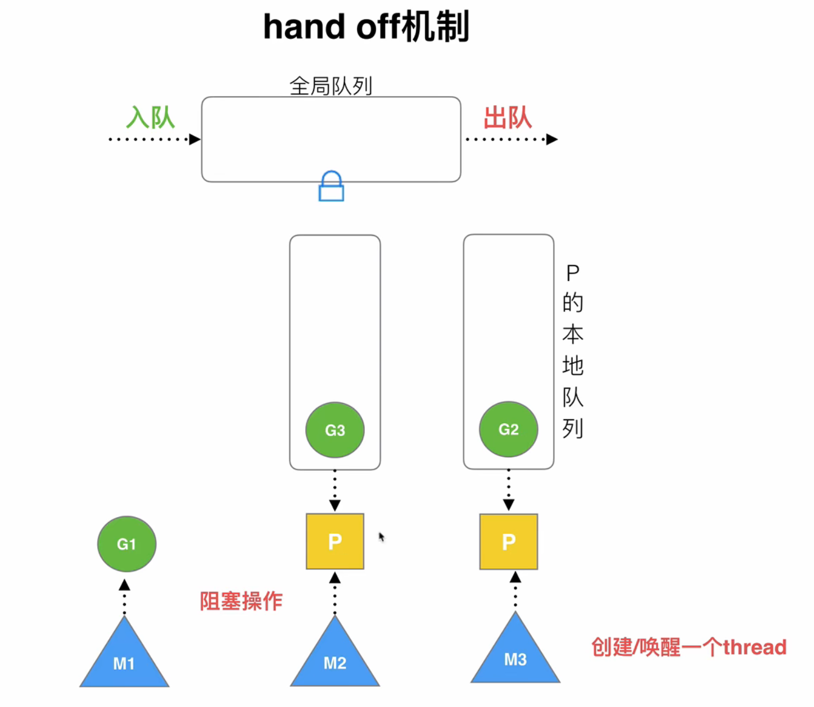
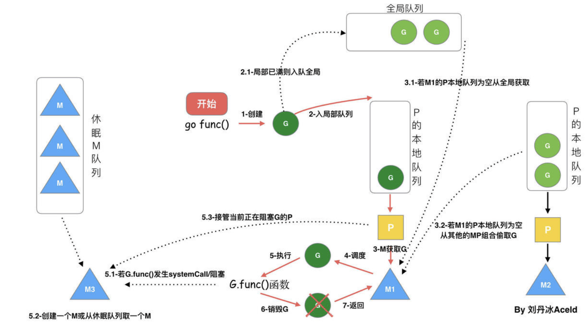
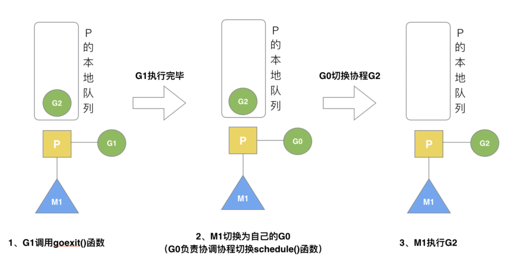
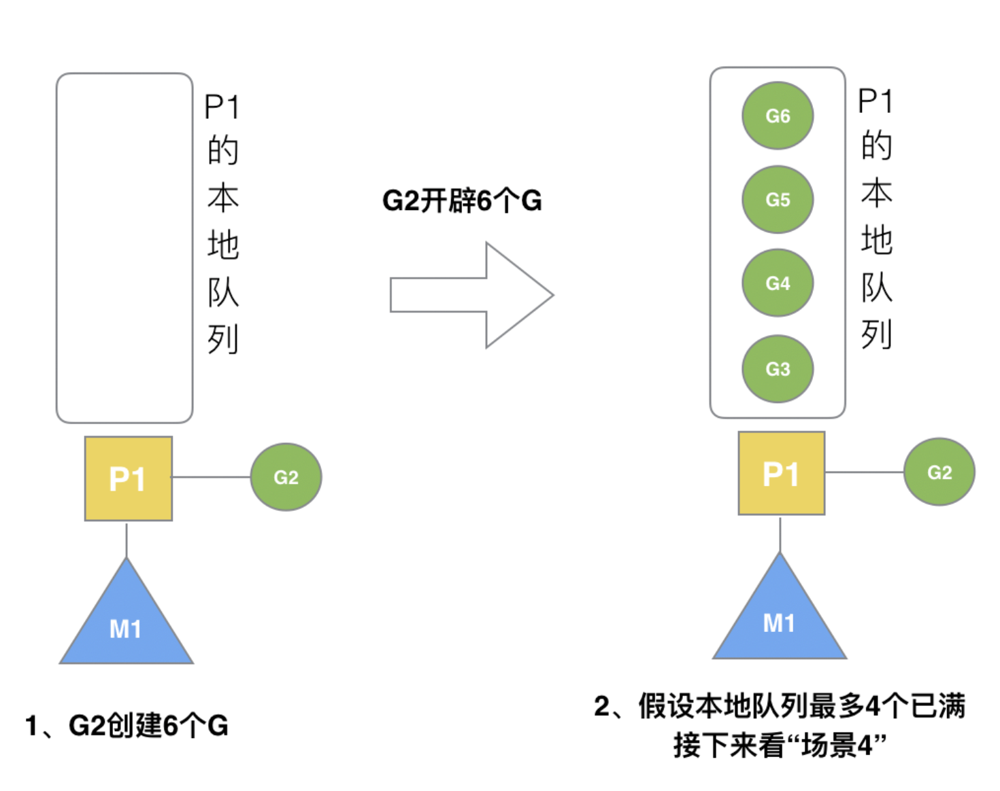
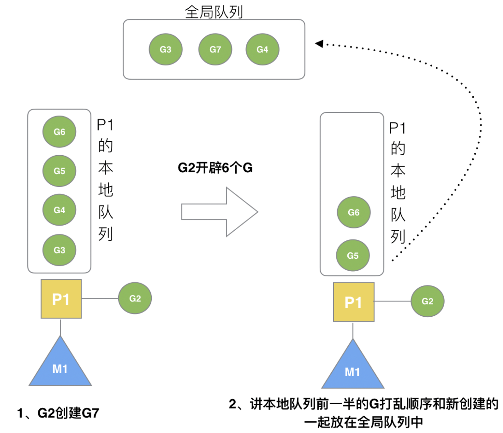
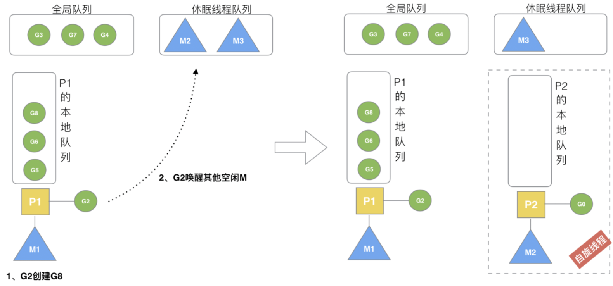
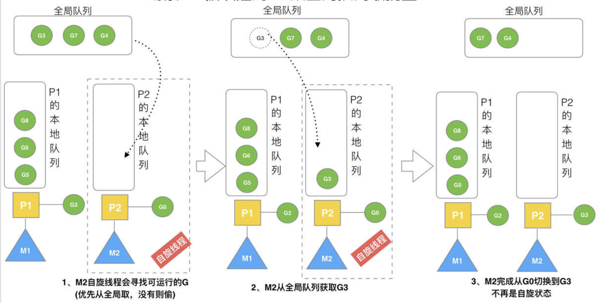
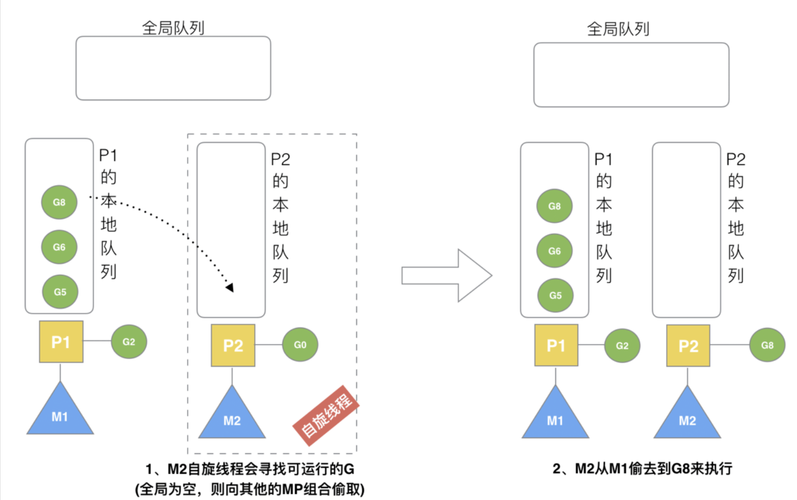
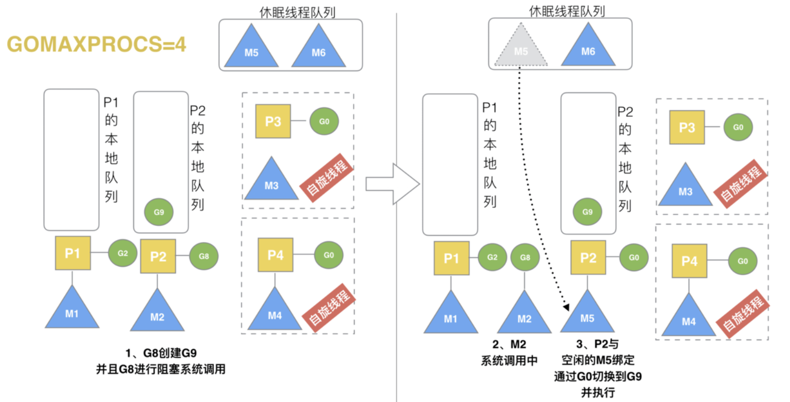
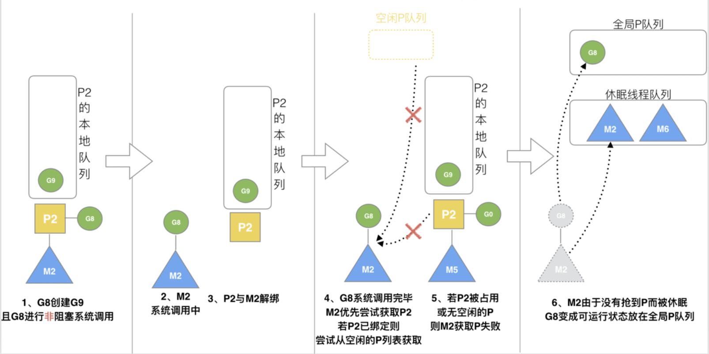

# Golang 调度器的由来

## 单进程时代


面临问题：

- 单一执行流程，计算机只能一个任务一个任务处理；
- 进程阻塞带来 CPU 的时间浪费

进而有最早的并发：多进程并发。

## 多进程/线程时代有了调度器需求


多线程/多进程解决了阻塞问题，但又有新的问题：


进程/线程数量越多，切换成本越大，越浪费（CPU 60%执行程序、40%切换），还有有同步竞争的问题，如锁、竞争冲突等。

## 协程提高 CPU 利用率

一个线程分为内核态线程和用户态线程，一个 “用户态线程” 必须要绑定一个 “内核态线程”，但是 CPU 并不知道有 “用户态线程” 的存在，它只知道它运行的是一个 “内核态线程”(Linux 的 PCB 进程控制块)。

内核线程叫做`线程(thread)`，用户线程叫`协程(co-routine)`


一个协程 (co-routine) 可以绑定一个线程 (thread)，同样的多个协程 (co-routine) 绑定一个或者多个线程 (thread) 上，就有三种协程和线程的映射关系：

> - N : 1 关系
>
>     N 个协程绑定 1 个线程，优点就是**协程在用户态线程即完成切换，不会陷入到内核态，这种切换非常的轻量快速**。但也有很大的缺点，1 个进程的所有协程都绑定在 1 个线程上（一旦某个协程阻塞，就会造成线程阻塞，进程中其他协程无法执行了，失去并发能力）。
>
> - 1  : 1 关系
>
>     一个协程绑定一个线程，协程调度都由 CPU 完成，但协程的创建、删除和切换代价都由 CPU 完成，代价昂贵。
>
> - M : N 关系
>
>     M 个协程绑定 1 个线程，是 N:1 和 1:1 类型的结合，克服了以上 2 种模型的缺点，但实现起来最为复杂。

## Golang 对协程的处理

Go 为了提供更容易使用的并发方法，使用了 goroutine 和 channel。goroutine 来自协程的概念，让一组可复用的函数运行在一组线程之上，即使有协程阻塞，该线程的其他协程也可以被 runtime 调度，转移到其他可运行的线程上。最关键的是，程序员看不到这些底层的细节，这就降低了编程的难度，提供了更容易的并发。

Goroutine 特点：

- 内存占用更小（几KB）
- 调度更灵活（runtime调度）

> 用 G 来表示 Goroutine，用 M 来表示线程

**早期调度器的处理**


缺点：

- 创建、销毁、调度 G 都需要每个 M 获取锁，这就形成了激烈的锁竞争。
- M 转移 G 会造成延迟和额外的系统负载。（当 G 中包含创建新协程的时候，M 创建了 G’，为了继续执行 G，需要把 G’交给 M’执行，也造成了很差的局部性，因为 G’和 G 是相关的，最好放在 M 上执行，而不是其他 M’）
- 系统调用 (CPU 在 M 之间的切换) 导致频繁的线程阻塞和取消阻塞操作增加了系统开销。

# GMP 模型的设计思想

> 新调度器模型中，除了 M(thread) 和 G(goroutine)，又引入了 P(processor)
>
> **Processor，它包含了运行 goroutine 的资源**，如果线程想运行 goroutine，必须先获取 P，P 中还包含了可运行的 G 队列。


## GMP 模型


> - **全局队列**：存放等待运行的 G。
>
> - **P 的本地队列**：同全局队列类似，存放的也是等待运行的 G，存的数量有限，不超过 256 个。新建 G’时，G’优先加入到 P 的本地队列，如果队列满了，则会把本地队列中一半的 G 移动到全局队列。
> - **P 列表**：程序启动时创建，最多有 `GOMAXPROCS` 个，可以自行配置。
> - **M列表**：当前操作系统分配到当前 Go 程序的内核线程数。线程想运行任务就得获取 P，从 P 的本地队列获取 G，P 队列为空时，M 也会尝试从全局队列拿一批 G 放到 P 的本地队列，或从其他 P 的本地队列偷一半放到自己 P 的本地队列。M 运行 G，G 执行之后，M 会从 P 获取下一个 G，不断重复下去。

## 调度器设计策略

**复用线程**：避免频繁的创建、销毁线程，而是对线程的复用。

1）work stealing 机制

 当本线程无可运行的 G 时，尝试从其他线程绑定的 P 偷取 G，而不是销毁线程。

2）hand off 机制

 当本线程因为 G 进行系统调用阻塞时，线程释放绑定的 P，把 P 转移给其他空闲的线程执行。



 M1 阻塞，把它绑定的 P 转移给 M3。

**利用并行**：`GOMAXPROCS` 设置 P 的数量，最多有` GOMAXPROCS `个线程分布在多个 CPU 上同时运行。`GOMAXPROCS` 也限制了并发的程度，比如 GOMAXPROCS = 核数/2，则最多利用了一半的 CPU 核进行并行。

**抢占**：在 coroutine 中要等待一个协程主动让出 CPU 才执行下一个协程，在 Go 中，一个 goroutine 最多占用 CPU 10ms，防止其他 goroutine 被饿死，这就是 goroutine 不同于 coroutine 的一个地方。

**全局 G 队列**：在新的调度器中依然有全局 G 队列，但功能已经被弱化了，当 M 执行 work stealing 从其他 P 偷不到 G 时，它可以从全局 G 队列获取 G。

## `go func()` 调度流程



1. 我们通过 go func () 来创建一个 goroutine；
2. 有两个存储 G 的队列，一个是局部调度器 P 的本地队列、一个是全局 G 队列。新创建的 G 会先保存在 P 的本地队列中，如果 P 的本地队列已经满了就会保存在全局的队列中；
3. G 只能运行在 M 中，一个 M 必须持有一个 P，M 与 P 是 1:1 的关系，M 会从 P 的本地队列获取一个可执行的 G 来执行，如果本地队列为空，那么会想其他的 MP 组合偷取一个可执行的 G；
4. 一个 M 调度 G 执行的过程是一个循环机制；
5. 当 M 执行某一个 G 时候如果发生了 `syscall` 或则其余阻塞操作，M 会阻塞，如果当前有一些 G 在执行，runtime 会把这个线程 M 从 P 中摘除 (detach)，然后再创建一个新的操作系统的线程 (如果有空闲的线程可用就复用空闲线程) 来服务于这个 P；
6. 当 M 系统调用结束时候，这个 G 会尝试获取一个空闲的 P 执行，并放入到这个 P 的本地队列，如果获取不到 P，那么这个线程 M 变成休眠状态，加入空闲线程，然后这个 G 被放入全局队列中。

## 调度器的生命周期 


M0 是启动程序后的编号为 0 的主线程，这个 M 对应的实例会在全局变量` runtime.m0` 中，不需要在 heap 上分配，M0 负责执行初始化操作和启动第一个 G， 在之后 M0 就和其他的 M 一样了。

G0 是每次启动一个 M 都会第一个创建的 goroutine，G0 仅用于负责调度的 G，G0 不指向任何可执行的函数，每个 M 都会有一个自己的 G0。在调度或系统调用时会使用 G0 的栈空间，全局变量的 G0 是 M0 的 G0。

# Go 调度器场景

## 场景1：G1 创建 G3


局部性原理：G3 优先加入 G1 所在的本地队列

## 场景2：G1 执行完毕



G1 运行完成后 (函数：`goexit()`)，M 上运行的 goroutine 切换为 G0，G0 负责调度时协程的切换（函数：`schedule()`）。从 P 的本地队列取 G2，从 G0 切换到 G2，并开始运行 G2 (函数：`execute()`)。实现了线程 M1 的复用。

## 场景3、4、5

### 场景3：G2 开辟了过多的 G

每个 P 的本地队列只能存 4 个 G，G2 要创建 6 个 G，前 4 个 G 已经加入 P1 的本地队列中，P1 的本地队列满。



### 场景4：本地满创建 G7

G2 创建 G7 时，发现本地队列已满，执行**负载均衡**（把 P1 中本地队列前一办的 G 和新创建的 G转移到全局队列中（实现中并不一定是新的 G，如果 G 是 G2 之后就执行的，会被保存在本地队列，利用某个老的 G 替换新 G 加入全局队列）



### 场景5：本地未满创建 G8

本地未满，所以会直接加入 P1 的本地队列中


## 场景6：唤醒正在休眠的 M

创建 G 时，运行的 G 会尝试唤醒其他空闲的 PM 组合去执行。

假定 G2 唤醒了 M2，M2 绑定了 P2，并运行 G0，但 P2 本地队列没有 G，M2 此时为自旋线程**（没有 G 但为运行状态的线程，不断寻找 G）**。



## 场景7：被唤醒的 G2 从全局队列获取 G

M2 从全局队列中取 G 的个数符合下面公式：

```go
n = min(len(GQ)/GOMAXPROCS + 1, len(GQ/2))
```

至少从全局队列取 1 个 g，但每次不要从全局队列移动太多的 g 到 p 本地队列，给其他 p 留点。这是**从全局队列到 P 本地队列的负载均衡**。



## 场景8：M2 从 M1 中偷取 G

假设 G2 一直在 M1 上运行，经过 2 轮后，M2 已经把 G7、G4 从全局队列获取到了 P2 的本地队列并完成运行，全局队列和 P2 的本地队列都空了，如场景 8 图的左半部分。

全局队列已经没有 G，那 m 就要执行 work stealing (偷取)：从其他有 G 的 P 哪里偷取一半 G 过来，放到自己的 P 本地队列。P2 从 P1 的本地队列尾部取一半的 G，本例中一半则只有 1 个 G8，放到 P2 的本地队列并执行。



## 场景9：G 发生系统调用/阻塞

除了 M3 和 M4 为自旋线程，还有 M5 和 M6 为空闲的线程 (没有得到 P 的绑定，注意我们这里最多就只能够存在 4 个 P，所以 P 的数量应该永远是 M>=P, 大部分都是 M 在抢占需要运行的 P)，G8 创建了 G9，G8 进行了阻塞的系统调用，M2 和 P2 解绑。P2 会执行以下判断：如果 P2 本地队列有 G、全局队列有 G 或有空闲的 M，P2 都会立马唤醒 1 个 M 和它绑定，否则 P2 则会加入到空闲 P 列表，等待 M 来获取可用的 p。本场景中，P2 本地队列有 G9，可以和其他空闲的线程 M5 绑定。



## 场景10：G 发生系统调用/非阻塞

G8 创建了 G9，加入 G8 进行了非阻塞系统调用。

 M2 和 P2 会解绑，但 M2 会记住 P2，然后 G8 和 M2 进入系统调用状态。当 G8 和 M2 退出系统调用时，会尝试获取 P2，如果无法获取，则获取空闲的 P，如果依然没有，G8 会被记为可运行状态，并加入到全局队列，M2 因为没有 P 的绑定而变成休眠状态 (长时间休眠等待 GC 回收销毁)。

