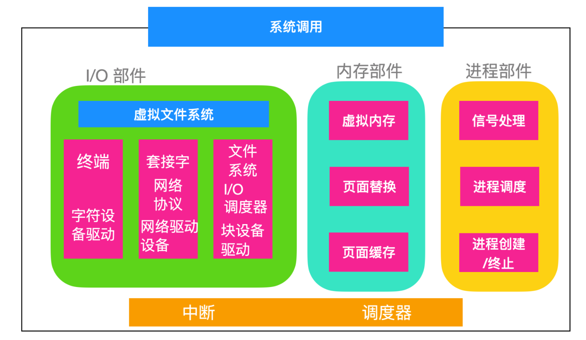
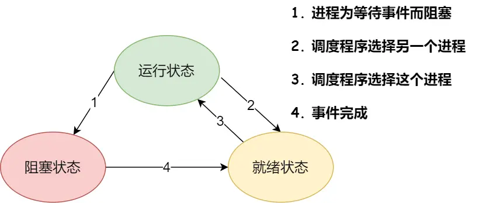
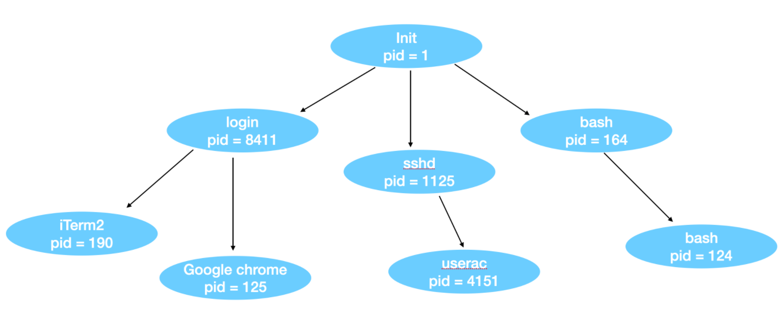
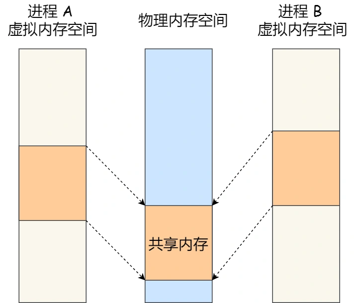
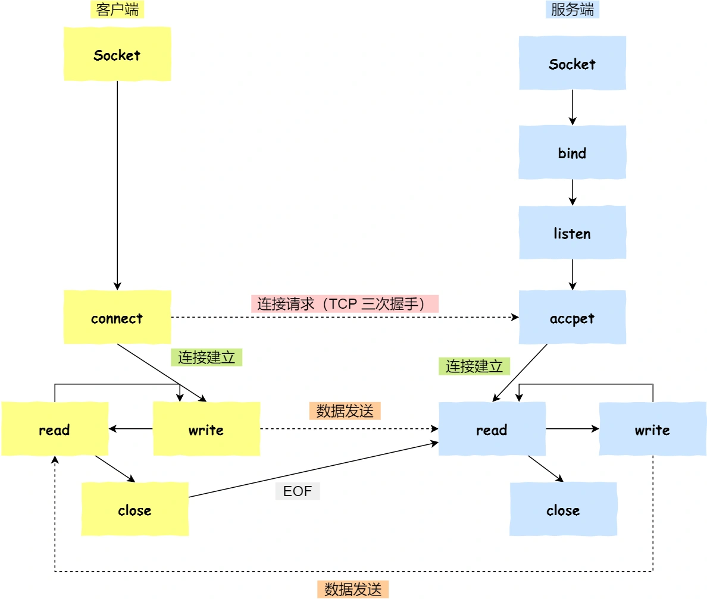
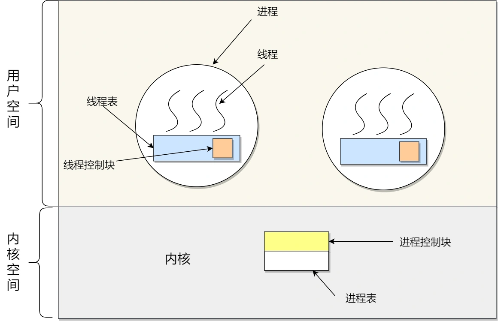
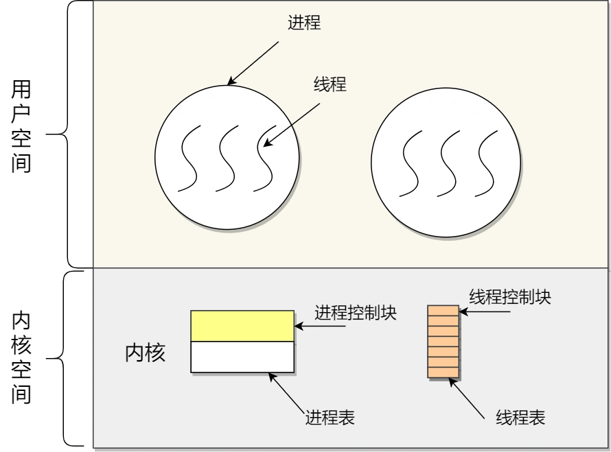
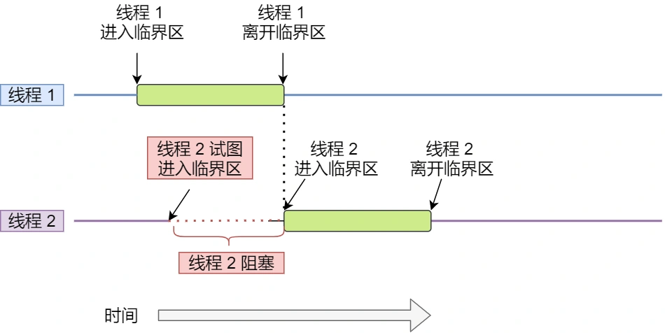
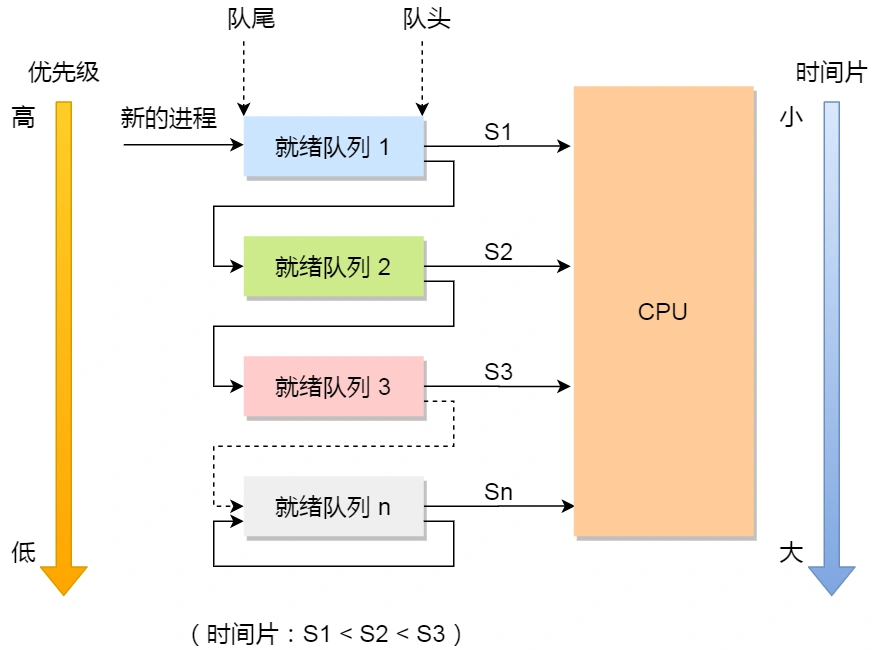

# 操作系统结构

## Linux 接口


应用程序发起系统调用把参数放在寄存器中(有时候放在栈中)，并发出 `trap` 系统陷入指令切换用户态至内核态。因为不能直接在 C 中编写 trap 指令，因此 C 提供了一个库，库中的函数对应着系统调用。有些函数是使用汇编编写的，但是能够从 C 中调用。每个函数首先把参数放在合适的位置然后执行系统调用指令。因此如果你想要执行 read 系统调用的话，C 程序会调用 read 函数库来执行。这里顺便提一下，是由 POSIX 指定的库接口而不是系统调用接口。也就是说，POSIX 会告诉一个标准系统应该提供哪些库过程，它们的参数是什么，它们必须做什么以及它们必须返回什么结果。

除了操作系统和系统调用库外，Linux 操作系统还要提供一些标准程序，比如文本编辑器、编译器、文件操作工具等。直接和用户打交道的是上面这些应用程序。因此我们可以说 Linux 具有三种不同的接口：**系统调用接口、库函数接口和应用程序接口**

## Linux 组成部分

- **引导程序(Bootloader)**：引导程序是管理计算机启动过程的软件，对于大多数用户而言，只是弹出一个屏幕，但其实内部操作系统做了很多事情
- **内核(Kernel)**：内核是操作系统的核心，负责管理 CPU、内存和外围设备等。
- **初始化系统(Init System)**：这是一个引导用户空间并负责控制守护程序的子系统。一旦从引导加载程序移交了初始引导，它就是用于管理引导过程的初始化系统。
- **后台进程(Daemon)**：后台进程顾名思义就是在后台运行的程序，比如打印、声音、调度等，它们可以在引导过程中启动，也可以在登录桌面后启动
- **图形服务器(Graphical server)**：这是在监视器上显示图形的子系统。通常将其称为 X 服务器或 X。
- **桌面环境(Desktop environment)**：这是用户与之实际交互的部分，有很多桌面环境可供选择，每个桌面环境都包含内置应用程序，比如文件管理器、Web 浏览器、游戏等
- **应用程序(Applications)**：桌面环境不提供完整的应用程序，就像 Windows 和 macOS 一样，Linux 提供了成千上万个可以轻松找到并安装的高质量软件。

## Linux 内核结构

Linux 的内核结构如下所示



内核直接坐落在硬件上，主要作用是与 I/O 进行交互、内存管理和控制 CPU 访问。中断是与设备交互的主要方式。中断出现时调度器就会发挥作用。

I/O 部分负责与设备进行交互以及执行网络和存储 I/O 操作的内核部分，I/O 部件中，最高层是一个虚拟文件系统，不管是文件是来自内存还是磁盘，都是经过虚拟文件系统中的。从底层看，所有的驱动都是字符驱动或者块设备驱动。二者的主要区别就是是否允许随机访问。网络驱动设备并不是一种独立的驱动设备，它实际上是一种字符设备，不过网络设备的处理方式和字符设备不同。

I/O 右边的是内存部件，程序被装载进内存，由 CPU 执行，这里会涉及到虚拟内存的部件，页面的换入和换出是如何进行的，坏页面的替换和经常使用的页面会进行缓存。

进程模块负责进程的创建和终止、进程的调度、Linux 把进程和线程都看作是可运行的实体，并使用统一的调度策略进行调度。

# 内存管理

## 虚拟内存

**操作系统会提供一种机制，将不同进程的虚拟地址和不同内存的物理地址映射起来。**

如果程序要访问虚拟地址的时候，由操作系统转换成不同的物理地址，这样不同的进程运行的时候，写入的是不同的物理地址，这样就不会冲突了。（两个进程公用同一块物理地址）

操作系统引入了虚拟内存，进程持有的虚拟地址会通过 CPU 芯片中的内存管理单元（MMU）的映射关系，来转换变成物理地址，然后再通过物理地址访问内存，如下图所示：


操作系统管理虚拟地址与物理地址主要通过两种方式：**内存分段和内存分页**。

内存分段可以产生连续的内存空间，但是会出现「外部内存碎片和内存交换的空间太大」的问题。

# 进程

## 进程概念

每个进程都会运行一段独立的程序，并且在初始化的时候拥有一个独立的控制线程。换句话说，每个进程都会有一个自己的程序计数器，这个程序计数器用来记录下一个需要被执行的指令。Linux 允许进程在运行时创建额外的线程。

**进程的状态**

所以，**在一个进程的活动期间至少具备三种基本状态，即运行状态、就绪状态、阻塞状态。**



上图中各个状态的意义：

- 运行状态（*Running*）：该时刻进程占用 CPU；
- 就绪状态（*Ready*）：可运行，由于其他进程处于运行状态而暂时停止运行；
- 阻塞状态（*Blocked*）：该进程正在等待某一事件发生（如等待输入/输出操作的完成）而暂时停止运行，这时，即使给它CPU控制权，它也无法运行；

当然，进程还有另外两个基本状态：

- 创建状态（*new*）：进程正在被创建时的状态；
- 结束状态（*Exit*）：进程正在从系统中消失时的状态；

### 进程控制结构

在操作系统中，用进程控制块（process control block，PCB）数据结构来描述进程的。

PCB 中记录了：

- 进程描述信息：
    - 进程标识符：标识各个进程，每个进程都有一个并且唯一的标识符；
    - 用户标识符：进程归属的用户，用户标识符主要为共享和保护服务；
- 进程控制和管理信息：
    - 进程当前状态
    - 进程优先级，抢占 CPU 时的优先级
- 资源分配清单：有关内存地址空间或虚拟地址空间的信息，所打开文件的列表和所使用的 I/O 设备信息。
- CPU 相关信息：CPU 中各个寄存器的值，进程切换时，CPU 信息都会保存在相应的 PCB 中，以便进程重新执行，从断点处继续执行。

PCB 通常用链表的方式进行组织，具有相同状态的进程链在一起，组成各种队列：

- 所有处于就绪状态的进程链在一起，称为就绪队列；
- 所有因等待某个事件而处于等待状态的进程，组成了阻塞队列

另外，对于运行队列在单核 CPU 系统中则只有一个运行指针了，因为单核 CPU 在某个时间，只能运行一个程序。

### 进程的控制

- 进程创建：

    操作系统允许一个进程创建另一个进程，而且允许子进程继承父进程所拥有的资源。创建进程的过程如下：

    - 申请一个空白的 PCB，并向 PCB 中填写一些控制和管理进程的信息，比如进程的唯一标识等；
    - 为该进程分配运行时所必需的资源，比如内存资源；
    - 将 PCB 插入到就绪队列，等待被调度运行。

- 终止进程：

    进程可以有 3 种终止方式：正常结束、异常结束以及外界干预（信号 `kill` 掉）。当子进程被终止时，其在父进程处继承的资源应当还给父进程。而当父进程被终止时，该父进程的子进程就变为孤儿进程，会被 1 号进程收养，并由 1 号进程对它们完成状态收集工作。

    其流程如下：

    - 查找需要终止的进程的 PCB；
    - 如果处于执行状态，则立即终止该进程的执行，然后将 CPU 资源分配给其他进程；
    - 如果其还有子进程，则应将该进程的子进程交给 1 号进程接管；
    - 将该进程所拥有的全部资源都归还给操作系统；
    - 将其从 PCB 所在队列中删除。

- 阻塞进程：

    当进程需要等待某一事件完成时，它可以调用阻塞语句把自己阻塞等待，而一旦被阻塞等待，它只能由另一个进程唤醒。

    阻塞进程的过程如下：

    - 找到将要被阻塞进程标识号对应的 PCB；
    - 如果该进程为运行状态，则保护其现场，将其状态转为阻塞状态，停止运行；
    - 将该 PCB 插入到阻塞队列中去。

- 唤醒进程：

    进程由运行转向阻塞态是由于进程等待某一事件完成，处于阻塞态的进程绝对不可能叫醒自己，如果某进程正在等待 I/O 事件，需由别的进程发消息给它，则只有当该进程所期待的事件出现时，才由发现者进程用唤醒语句叫醒它。

    唤醒进程的过程如下：

    - 在该事件的阻塞队列中找到相应进程的 PCB；
    - 将其从阻塞队列中移出，并置其状态为就绪状态；
    - 把该 PCB 插入到就绪队列中，等待调度程序调度；

    进程的阻塞和唤醒是一对功能相反的语句，如果某个进程调用了阻塞语句，则必有一个与之对应的唤醒语句。

### 进程的上下文切换

各个进程之间是共享 CPU 资源的，在不同的时候进程之间需要切换，让不同的进程可以在 CPU 执行，那么这个**一个进程切换到另一个进程运行，称为进程的上下文切换**。

> CPU 的上下文切换

大多数操作系统都是多任务，通常支持大于 CPU 数量的任务同时运行。实际上，这些任务并不是同时运行的，只是因为系统在很短的时间内，让各个任务分别在 CPU 运行，于是就造成同时运行的错觉。任务是交给 CPU 运行的，那么在每个任务运行前，CPU 需要知道任务从哪里加载，又从哪里开始运行。

所以说，CPU 寄存器和程序计数是 CPU 在运行任何任务前，所必须依赖的环境，这些环境就叫做 **CPU 上下文**。CPU 上下文切换就是先把前一个任务的 CPU 上下文（CPU 寄存器和程序计数器）保存起来，然后加载新任务的上下文到这些寄存器和程序计数器，最后再跳转到程序计数器所指的新位置，运行新任务。系统会存储原来的上下文信息，当此任务再次分配给 CPU 运行时，CPU 重新加载这些上下文，这样保证任务原来的状态不受影响，让任务看起来可以连续运行。

上面说到所谓的「任务」，主要包含进程、线程和中断。所以，可以根据任务的不同，把 CPU 上下文切换分成：**进程上下文切换、线程上下文切换和中断上下文切换**。

> 进程的上下文切换到底是切换什么呢？

进程由内核管理和调度，进程的切换只能发生在内核态。进程的上下文切换不仅包含了虚拟内存、栈、全局变量等用户空间的资源，还包括了内核堆栈、寄存器等内核空间的资源。**

通常，会把交换的信息保存在进程的 PCB 中，当运行另一个进程时，需要从这个进程的 PCB 取出上下文，然后恢复到 CPU 中，使得这个进程可以继续执行。

进程的上下文的开销是很大的，应该使进程把更多时间放在执行程序上，而不是耗费在上下文切换上。

> 何时发生进程上下文切换

- 为了保证所有进程可以得到公平调度，CPU 时间被划分为一段段的时间片，这些时间片再被轮流分配给各个进程。这样，当某个进程的时间片耗尽了，进程就从运行状态变为就绪状态，系统从就绪队列选择另外一个进程运行；
- 进程在系统资源不足（比如内存不足）时，要等到资源满足后才可以运行，这个时候进程也会被挂起，并由系统调度其他进程运行；
- 当进程通过睡眠函数 sleep 这样的方法将自己主动挂起时，自然也会重新调度；
- 当有优先级更高的进程运行时，为了保证高优先级进程的运行，当前进程会被挂起，由高优先级进程来运行；
- 发生硬件中断时，CPU 上的进程会被中断挂起，转而执行内核中的中断服务程序；

Linux 系统中存在彼此相互独立的进程同时运行，每个用户都会同时有几个活动的进程。在某些用户空间中，即使用户退出登陆，仍有后台进程在运行，这些进程被称为*守护进程*

Linux 中有一种特殊的守护进程被称为*计划守护进程(Cron daemon)*，计划守护进程可以每分钟醒来一次检查是否有工作要做，做完会继续回到睡眠状态等待下一次唤醒。

进程通过 `fork` 系统调用来创建一个源进程的拷贝。父进程和子进程都有自己的内存映像。如果在子进程创建出来后，父进程修改了一些变量等，那么子进程是看不到这些变化的，也就是 `fork` 后，父进程和子进程相互独立。虽然他们相互独立，但他们可以共享相同的文件，如果在 `fork` 之前，父进程打开了某个文件，那么 `fork` 后，父进程和子进程仍然共享这个打开的文件，对共享文件的修改会对父进程和子进程同时可见。

区分父进程和子进程：子进程只是父进程的拷贝，所以它们几乎所有的情况都一样，包括内存映像、变量、寄存器等。区分的关键在于 `fork ` 函数调用后的返回值，如果 fork 后返回一个非零值，这个非零值即是子进程的 `进程标识符(Process Identiier, PID)`，而会给子进程返回一个零值，可以用下面代码来进行表示：

```c++
pid = fork();
if (pid < 0) {
    error()				 // pid < 0,创建失败
} else if (pid > 0) {
    parent_handle() // 父进程代码
} else {
	child_handle()  // 子进程代码
}
```

父进程在 `fork` 后会得到子进程的 PID，这个 PID 即能代表这个子进程的唯一标识符也就是 PID。如果子进程想要知道自己的 PID，可以调用 `getpid` 方法。当子进程结束运行时，父进程会得到子进程的 PID，因为一个进程会 fork 很多子进程，子进程也会 fork 子进程，所以 PID 是非常重要的。我们把第一次调用 `fork` 后的进程称为 `原始进程`，一个原始进程可以生成一颗继承树：



## 进程间通信的方式

- 信号
- 管道
- 共享内存
- 消息队列
- 套接字

### 管道 pipe

Linux 中的进程可以通过建立管道 pipe 进行通信。

在两个进程之间，可以建立一个通道，一个进程向这个通道里写入字节流，另一个进程从这个管道中读取字节流。管道是同步的，当进程尝试从空管道读取数据时，该进程会被阻塞，直到有可用数据为止。shell 中的`管线 pipelines` 就是用管道实现的，当 shell 发现输出

```shell
sort <f | head
```

它会创建两个进程，一个是 sort，一个是 head，sort，会在这两个应用程序之间建立一个管道使得 sort 进程的标准输出作为 head 程序的标准输入。sort 进程产生的输出就不用写到文件中了，如果管道满了系统会停止 sort 以等待 head 读出数据。

匿名管道实际上就是 `|`，两个应用程序不知道有管道的存在，一切都是由 shell 管理和控制的。

管道还有另外一个类型是**命名管道**，也被叫做 `FIFO`，因为数据是先进先出的传输方式。

在使用命名管道前，先需要通过 `mkfifo` 命令来创建，并且指定管道名字：

```shell
mkfifo myPipe
```

> 管道如何创建？背后原理？

匿名管道的创建，需要下面这个系统调用：

```c++
int pipe(int fd[2])
```

表示创建了一个匿名管道，返回了两个操作符，一个是管道的读取端描述符 `fd[0]`，另一个是管道的写入端描述符 `fd[1]`。注意，这个匿名管道是特殊的文件，只存在于内存，不存于文件系统中。

我们可以使用 `fork` 创建子进程，**创建的子进程会复制父进程的文件描述符**，这样就做到了两个进程各有两个「 `fd[0]` 与 `fd[1]`」，两个进程就可以通过各自的 fd 写入和读取同一个管道文件实现跨进程通信了。


但管道只能从一端写入，另一端读出，所以需要关闭子进程的写端和父进程的读端（或者反过来），如果需要进行双向通信，需要创建两个管道。

在 shell 里面执行 `A | B` 命令的时候，A 进程和 B 进程都是 shell 创建出来的子进程，A 和 B 之间不存在父子关系，它俩的父进程都是 shell。


**对于匿名管道，它的通信范围是存在父子关系的进程**。因为管道没有实体，也就是没有管道文件，只能通过 fork 来复制父进程 fd 文件描述符，来达到通信的目的。

### 消息队列

管道不适合频繁的交换数据，**消息队列**的通信模式就可以解决。比如，A 进程要给 B 进程发送消息，A 进程把数据放在对应的消息队列后就可以正常返回了，B 进程需要的时候再去读取数据就可以了。同理，B 进程要给 A 进程发送消息也是如此。

**消息队列是保存在内核中的消息链表**，在发送数据时，会分成一个一个独立的数据单元，也就是消息体（数据块），消息体是用户自定义的数据类型，消息的发送方和接收方要约定好消息体的数据类型，所以每个消息体都是固定大小的存储块，不像管道是无格式的字节流数据。如果进程从消息队列中读取了消息体，内核就会把这个消息体删除。

消息队列缺点：

- 不适合大文件传输
- 通信过程中，存在用户态与内存态之间的拷贝。因为进程写入数据到内核中的消息队列时，会发生从用户态拷贝数据到内核态的过程，同理另一进程读取内核中的消息数据时，会发生从内核态拷贝数据到用户态的过程。

### 共享内存 shared memory

消息队列的读取和写入的过程，都会有发生用户态与内核态之间的消息拷贝过程。那**共享内存**的方式，就很好的解决了这一问题。

现代操作系统采用的是虚拟内存技术，每个进程都有自己独立的虚拟内存空间，不同进程的虚拟内存映射到不同的物理内存中。所以，即使进程 A 和 进程 B 的虚拟地址是一样的，其实访问的是不同的物理内存地址，对于数据的增删查改互不影响。

**共享内存机制的实现：**拿出一块虚拟地址空间，映射到相同的物理内存中，这样这个进程写入的东西，另外一个进程马上就能看到了，都不需要拷贝来拷贝去，传来传去，大大提高了进程间通信的速度。



### 信号量 semaphore

在使用共享内存进行通信时，如果多个进程同时修改一个共享内存，很有可能会发生冲突。两个进程同时写一个地址：先写的那个进程会发现内容被别人覆盖。

为了防止多进程竞争共享资源，而造成的数据错乱，所以需要保护机制，使得共享的资源，在任意时刻只能被一个进程访问。正好，**信号量**就实现了这一保护机制。

**信号量其实是一个整型的计数器，主要用于实现进程间的互斥与同步，而不是用于缓存进程间通信的数据**。

控制信号量的方式有两种：

- **P操作**，会使信号量-1，如果小于0，表示资源已被占用，进程阻塞等待；如果减1后信号量大于等于0，表示还有资源可用，进程可以正常执行；
- **V操作**，使信号量+1，相加后如果信号量 <= 0，则表明当前有阻塞中的进程，于是会将该进程唤醒运行；相加后如果信号量 > 0，则表明当前没有阻塞中的进程。

信号量初始化为 `1`，表示互斥信号量，可以保证共享内存在任何时刻只有一个进程在访问，很好的保护了共享内存。

信号量初始化为 `0`，表示同步信号量，保证进程 A 应当在进程 B 之前执行。	

### 信号 signal

信号是 UNIX 系统最先开始使用的进程间通信机制，因为 Linux 是继承于 UNIX 的，所以 Linux 也支持信号机制，通过向一个或多个进程发送**异步事件信号**来实现，信号可以从键盘或者访问不存在的位置等地方产生；信号通过 shell 将任务发送给子进程。

在 Linux 上可以使用 `kill -l` 列出系统使用的信号


信号是进程间通信机制中**唯一的异步通信机制**，因为可以在任何时候发送信号给某一进程，一旦有信号产生，我们就有下面这几种，用户进程对信号的处理方式。

**1.执行默认操作**。Linux 对每种信号都规定了默认操作，例如，上面列表中的 SIGTERM 信号，就是终止进程的意思。

**2.捕捉信号**。我们可以为信号定义一个信号处理函数。当信号发生时，我们就执行相应的信号处理函数。

**3.忽略信号**。当我们不希望处理某些信号的时候，就可以忽略该信号，不做任何处理。有两个信号是应用进程无法捕捉和忽略的，即 `SIGKILL` 和 `SEGSTOP`，它们用于在任何时候中断或结束某一进程。

`SIGKILL`

`SIGKILL` 信号发送到进程以使其马上进行终止。 与 `SIGTERM` 和 `SIGINT` 相比，这个信号无法捕获和忽略执行，并且进程在接收到此信号后无法执行任何清理操作，下面是一些例外情况：

- 僵尸进程无法杀死，因为僵尸进程已经死了，它在等待父进程对其进行捕获

- 处于阻塞状态的进程只有再次唤醒后才会被 kill 掉

- `init` 进程是 Linux 的初始化进程，这个进程会忽略任何信号。

- `SIGKILL` 通常是作为最后杀死进程的信号、它通常作用于 `SIGTERM` 没有响应时发送给进程。

### 套接字 socket

前面提到的通信方式只适用于同一台主机上的进程间通信，跨网络与不同主机上的进程进行通信，就需要 socket 通信了。创建 socket 的系统调用：

```c++
int socket(int domin, int type, int protocal)
```

- `domin`：指定协议族，`AF_INET` 用于 IPv4、`AF_INET6` 用于 IPv6、`AF_LOCAL/AF_UNIX` 用于本机；
- `type`：指定通信特性， `SOCK_STREAM` 表示的是字节流，对应 TCP，`SOCK_DGRAM` 表示的是数据报，对应 UDP，`SOCK_RAW` 表示的是原始套接字；
- `protocal`：废弃，写成0即可。

> 针对 TCP协议通信的 socket 编程模型



流程：

- 服务端和客户端初始化自己的 `socket`；
- 服务器端调用 `bind()`，绑定在 IP 地址和端口上；
- 调用 `listen()` 进行监听；
- 调用 `accept()` 等待客户端连接；
- 客户端调用 `connect()` 向服务器地址和端口发起连接请求；
- 服务器端 `accept` 返回用于传输的 `sockfd`；
- 客户端调用 `write` 写入数据；服务端调用 `read` 读取数据；
- 客户端断开连接时，会调用 `close`，那么服务端 `read` 读取数据的时候，就会读取到了 `EOF`，待处理完数据后，服务端调用 `close`，表示连接关闭。

服务器端调用 `accept` 成功后会返回一个已完成连接的 socket，用于传输数据，和监听的 socket 不一样。

# 线程

**线程是进程当中的一条执行流程。**

同一个进程内多个线程之间可以共享代码段、数据段、打开的文件等资源，但每个线程各自都有一套独立的寄存器和栈，这样可以确保线程的控制流是相对独立的。


## 线程和进程的比较

- 进程是资源分配的单位（打开的文件、内存），线程是 CPU 调度的单位；
- 进程拥有一个完整的资源平台，线程只独享必不可少的资源，如：寄存器、栈；
- 线程和进程一样都具有就绪、阻塞、执行三种状态；
- 线程能够减少并发执行的时间和空间的开销。

线程相比进程能减少开销，体现在：

- 线程的创建时间比进程快，因为进程在创建的过程中，还需要资源管理信息，比如内存管理信息、文件管理信息，而线程在创建的过程中，不会涉及这些资源管理信息，而是共享它们；
- 线程的终止时间比进程快，因为线程释放的资源相比进程少很多；
- 同一个进程内的线程切换比进程切换快，因为线程具有相同的地址空间（虚拟内存共享），这意味着同一个进程的线程都具有同一个页表，那么在切换的时候不需要切换页表。而对于进程之间的切换，切换的时候要把页表给切换掉，而页表的切换过程开销是比较大的；
- 由于同一进程的各线程间共享内存和文件资源，那么在线程之间数据传递的时候，就不需要经过内核了，这就使得线程之间的数据交互效率更高了。

## 线程的上下文切换

需要看线程是否属于同一个进程：

- 如果两个线程属于同一个进程，切换的过程和进程上下文的切换一样；
- 当两个线程是属于同一个进程，虚拟内存是共享的，所以在切换时，虚拟内存这些资源就保持不动，只需要切换线程的私有数据、寄存器等不共享的数据。

## 线程的实现

主要有三种线程的实现方式：

- **用户线程（\*User Thread\*）**：在用户空间实现的线程，不是由内核管理的线程，是由用户态的线程库来完成线程的管理；
- **内核线程（\*Kernel Thread\*）**：在内核中实现的线程，是由内核管理的线程；
- **轻量级进程（\*LightWeight Process\*）**：在内核中来支持用户线程。

### 用户线程

用户线程是基于用户态的线程管理库来实现的，那么**线程控制块（Thread Control Block, TCB）** 也是在库里面来实现的，对于操作系统而言是看不到这个 TCB 的，它只能看到整个进程的 PCB。

所以，**用户线程的整个线程管理和调度，操作系统是不直接参与的，而是由用户级线程库函数来完成线程的管理，包括线程的创建、终止、同步和调度等。**模型是多个用户线程对应一个内核线程。



用户线程的**优点**：

- 每个进程都需要有它私有的线程控制块（TCB）列表，用来跟踪记录它各个线程状态信息（PC、栈指针、寄存器），TCB 由用户级线程库函数来维护，可用于不支持线程技术的操作系统；
- 用户线程的切换也是由线程库函数来完成的，无需用户态与内核态的切换，所以速度特别快。

用户线程的**缺点**：

- 由于操作系统不参与线程的调度，如果一个线程发起了系统调用而阻塞，那进程所包含的用户线程都不能执行了。
- 当一个线程开始运行后，除非它主动地交出 CPU 的使用权，否则它所在的进程当中的其他线程无法运行，因为用户态的线程没法打断当前运行中的线程，它没有这个特权，只有操作系统才有，但是用户线程不是由操作系统管理的。
- 由于时间片分配给进程，故与其他进程比，在多线程执行时，每个线程得到的时间片较少，执行会比较慢。

### 内核线程

**内核线程是由操作系统管理的，线程对应的 TCB 自然是放在操作系统里的，这样线程的创建、终止和管理都是由操作系统负责。**内核线程的模型是**一对一**的，一个用户线程对应一个内核线程。



内核线程的**优点**：

- 在一个进程当中，如果某个内核线程发起系统调用而被阻塞，并不会影响其他内核线程的运行；
- 分配给线程，多线程的进程获得更多的 CPU 运行时间；

内核线程的**缺点**：

- 在支持内核线程的操作系统中，由内核来维护进程和线程的上下文信息，如 PCB 和 TCB；
- 线程的创建、终止和切换都是通过系统调用的方式来进行，因此对于系统来说，系统开销比较大；

## 多线程冲突

### 互斥

多线程运行过程中，在多线程相互竞争操作共享变量时，可能会得到不同的结果，输出的结果存在不确定性，这段代码被称为临界区，它是访问共享资源的代码片段，一定不能给多线程同时执行。

我们希望这段代码是**互斥**的，也就是说保证一个线程在临界区执行，其他线程应该被阻止进入临界区，在这段代码执行过程中，最多只能出现一个线程。



实现：锁

### 同步

互斥解决了并发进程/线程对临界区的使用问题。这种基于临界区控制的交互作用是比较简单的，只要一个进程/线程进入了临界区，其他试图想进入临界区的进程/线程都会被阻塞着，直到第一个进程/线程离开了临界区。

**同步，就是并发进程/线程在一些关键点上可能需要互相等待与互通消息，这种相互制约的等待与互通信息称为进程/线程同步**。

实现：信号量（P、V 操作）

# 锁

多线程访问共享资源的时候，避免不了资源竞争而导致数据错乱的问题，所以我们通常为了解决这一问题，都会在访问共享资源之前加锁。

## 互斥锁和自旋锁

最底层的两种就是会「互斥锁和自旋锁」，有很多高级的锁都是基于它们实现的，你可以认为它们是各种锁的地基，所以我们必须清楚它俩之间的区别和应用。

当已经有一个线程加锁后，其他线程加锁则就会失败，互斥锁和自旋锁对于加锁失败后的处理方式是不一样的：

- **互斥锁**加锁失败后，线程会**释放 CPU** ，给其他线程；
- **自旋锁**加锁失败后，线程会**忙等待**，直到它拿到锁；

互斥锁加锁失败时，内核会将线程置为睡眠状态，等待锁被释放后，内核会在适当的时机唤醒线程，当线程成功获取锁后，就可以继续执行。互斥锁加锁失败，会从用户态陷入内核态，内核来做线程切换，会有线程上下文切换的成本。

如果确定被锁住的代码执行时间很短，就不应该用互斥锁，选用自旋锁，自旋锁时通过 CPU 提供的 CAS 函数，在用户态完成加锁解锁操作，不会主动产生进程上下文的切换。当发生多线程竞争锁的情况，加锁失败的线程会「忙等待」，直到它拿到锁。这里的「忙等待」可以用 `while` 循环等待实现。

## 读写锁

读写锁的工作原理是：

- 当「写锁」没有被线程持有时，多个线程能够并发地持有读锁，这大大提高了共享资源的访问效率，因为「读锁」是用于读取共享资源的场景，所以多个线程同时持有读锁也不会破坏共享资源的数据。
- 但是，一旦「写锁」被线程持有后，读线程的获取读锁的操作会被阻塞，而且其他写线程的获取写锁的操作也会被阻塞。

写锁是独占锁，因为任何时刻只能有一个线程持有写锁，类似互斥锁和自旋锁，而读锁是共享锁，因为读锁可以被多个线程同时持有。

## 乐观锁和悲观锁

悲观锁做事比较悲观，它认为**多线程同时修改共享资源的概率比较高，于是很容易出现冲突，所以访问共享资源前，先要上锁**。前面提到的互斥锁、自旋锁、读写锁，都是属于悲观锁。

如果多线程同时修改共享资源的概率比较低，就可以采用乐观锁。乐观锁做事比较乐观，它假定冲突的概率很低，它的工作方式是：**先修改完共享资源，再验证这段时间内有没有发生冲突，如果没有其他线程在修改资源，那么操作完成，如果发现有其他线程已经修改过这个资源，就放弃本次操作**。

# 调度

## 进程调度算法

在进程生命周期中，当从一个状态向另一个状态变化时，就会触发一次调度：

- 就绪态 --> 运行态：当进程被创建时，会进入到就绪队列，操作系统会从就绪队列选择一个进程运行；
- 运行态 --> 阻塞态：当进程发生 I/O 事件而阻塞时，操作系统必须选择另外一个进程运行；
- 运行态 --> 结束态：当进程退出结束后，操作系统得从就绪队列选择另外一个进程运行；

### 先来先服务算法

非抢占式的 FCFS 算法，有先来后到之分，每次从就绪队列中选择最先进入队列的进程，然后一直运行，直到进程退出或阻塞，才会从队列中选择第一个进程接着运行。

这似乎很公平，但是当一个长作业先运行了，那么后面的短作业等待的时间就会很长，不利于短作业。

FCFS 对长作业有利，适用于 CPU 繁忙型作业的系统，而不适用于 I/O 繁忙型作业的系统。

### 最短作业优先调度算法

**最短作业优先（Shortest Job First, SJF）调度算法**同样也是顾名思义，它会**优先选择运行时间最短的进程来运行**，这有助于提高系统的吞吐量。

这显然对长作业不利，很容易造成一种极端现象。

比如，一个长作业在就绪队列等待运行，而这个就绪队列有非常多的短作业，那么就会使得长作业不断的往后推，周转时间变长，致使长作业长期不会被运行。

### 高相应比优先调度算法

前面的「先来先服务调度算法」和「最短作业优先调度算法」都没有很好的权衡短作业和长作业。**高响应比优先 （Highest Response Ratio Next, HRRN）调度算法**主要是权衡了短作业和长作业。

**每次进行进程调度时，先计算「响应比优先级」，然后把「响应比优先级」最高的进程投入运行**，「响应比优先级」的计算公式：


- 如果两个进程的「等待时间」相同时，「要求的服务时间」越短，「响应比」就越高，这样短作业的进程容易被选中运行；
- 如果两个进程「要求的服务时间」相同时，「等待时间」越长，「响应比」就越高，这就兼顾到了长作业进程，因为进程的响应比可以随时间等待的增加而提高，当其等待时间足够长时，其响应比便可以升到很高，从而获得运行的机会；

### 时间片轮转调度算法

**每个进程被分配一个时间段，称为时间片（*Quantum*），即允许该进程在该时间段中运行。**

- 如果时间片用完，进程还在运行，那么将会把此进程从 CPU 释放出来，并把 CPU 分配给另外一个进程；
- 如果该进程在时间片结束前阻塞或结束，则 CPU 立即进行切换；

另外，时间片的长度就是一个很关键的点：

- 如果时间片设得太短会导致过多的进程上下文切换，降低了 CPU 效率；
- 如果设得太长又可能引起对短作业进程的响应时间变长。

一般来说，时间片设为 `20ms~50ms` 通常是一个比较合理的折中值。

### 最高优先级调度算法

时间片轮转算法需要建立在一个假设上，即认为所有进程都是同等重要的，但实际的计算机系统中，调度是有优先级的，希望调度程序能够从过年就绪队列中选择最高优先级的进程运行，称为最高优先级（*Highest Priority Fist, HPF*）调度算法

进程的优先级可以分为，静态优先级和动态优先级：

- 静态优先级：创建进程时候，就已经确定了优先级了，然后整个运行时间优先级都不会变化；
- 动态优先级：根据进程的动态变化调整优先级，比如如果进程运行时间增加，则降低其优先级，如果进程等待时间（就绪队列的等待时间）增加，则升高其优先级，也就是**随着时间的推移增加等待进程的优先级**。

该算法也有两种处理优先级高的方法，非抢占式和抢占式：

- 非抢占式：当就绪队列中出现优先级高的进程，运行完当前进程，再选择优先级高的进程。
- 抢占式：当就绪队列中出现优先级高的进程，当前进程挂起，调度优先级高的进程运行。

但是依然有缺点，可能会导致低优先级的进程永远不会运行。

### 多级反馈队列调度算法

**多级反馈队列（*Multilevel Feedback Queue*）调度算法**是「时间片轮转算法」和「最高优先级算法」的综合和发展。

顾名思义：

- 「多级」表示有多个队列，每个队列优先级从高到低，同时优先级越高时间片越短。
- 「反馈」表示如果有新的进程加入优先级高的队列时，立刻停止当前正在运行的进程，转而去运行优先级高的队列；



工作流程：

- 设置多个队列，每个队列都有不同的优先级，优先级越高的时间片越短；
- 新的进程会被放入到第一级队列的末尾，按先来先服务的原则排队等待被调度，如果在第一级队列规定的时间片没运行完成，则将其转入到第二级队列的末尾，以此类推，直至完成；
- 当较高的优先级队列为空，调度较低优先级的队列运行。如果进程运行时，有新进程进入较高优先级的队列，则停止当前运行的进程并将其移入到原队列末尾，接着让较高优先级的进程运行；

对于短作业可能可以在第一级队列很快被处理完。对于长作业，如果在第一级队列处理不完，可以移入下次队列等待被执行，虽然等待的时间变长了，但是运行时间也变更长了，所以该算法很好的**兼顾了长短作业，同时有较好的响应时间。**