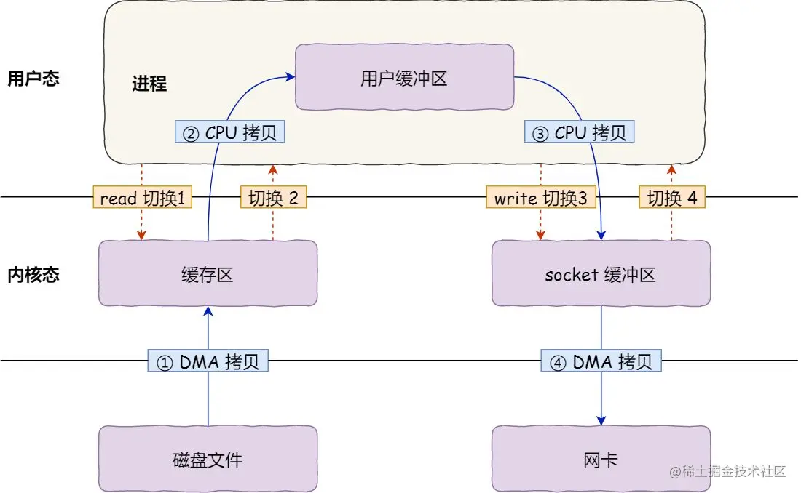
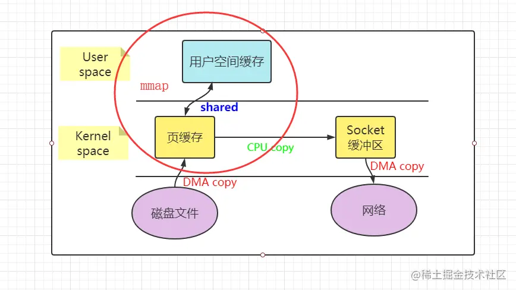
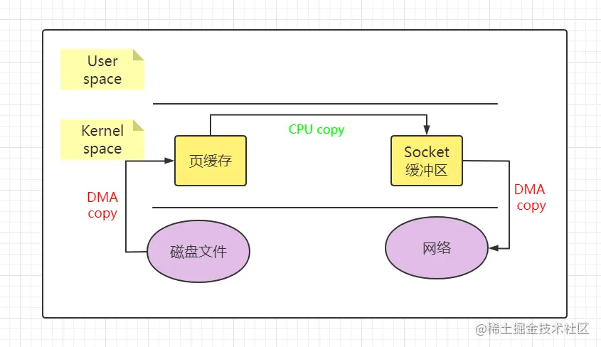
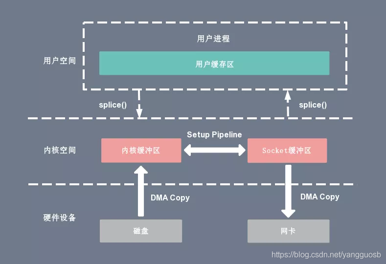

# 进程和线程

## 进程、线程和协程的区别和联系

|          | 进程                                                         | 线程                                               | 协程                                                         |
| -------- | ------------------------------------------------------------ | -------------------------------------------------- | ------------------------------------------------------------ |
| 定义     | 资源分配和拥有的基本单位                                     | 程序执行的基本单位                                 | 用户态的轻量级线程，线程内部调度的基本单位                   |
| 切换情况 | 进程CPU环境(栈、寄存器、页表和文件句柄等)的保存以及新调度的进程CPU环境的设置 | 保存和设置程序计数器、少量寄存器和栈的内容         | 先将寄存器上下文和栈保存，等切换回来的时候再进行恢复         |
| 切换者   | 操作系统                                                     | 操作系统                                           | 用户                                                         |
| 切换过程 | 用户态->内核态->用户态                                       | 用户态->内核态->用户态                             | 用户态(没有陷入内核)                                         |
| 调用栈   | 内核栈                                                       | 内核栈                                             | 用户栈                                                       |
| 拥有资源 | CPU资源、内存资源、文件资源和句柄等                          | 程序计数器、寄存器、栈和状态字                     | 拥有自己的寄存器上下文和栈                                   |
| 并发性   | 不同进程之间切换实现并发，各自占有CPU实现并行                | 一个进程内部的多个线程并发执行                     | 同一时间只能执行一个协程，而其他协程处于休眠状态，适合对任务进行分时处理 |
| 系统开销 | 切换虚拟地址空间，切换内核栈和硬件上下文，CPU高速缓存失效、页表切换，开销很大 | 切换时只需保存和设置少量寄存器内容，因此开销很小   | 直接操作栈则基本没有内核切换的开销，可以不加锁的访问全局变量，所以上下文的切换非常快 |
| 通信方面 | 进程间通信需要借助操作系统                                   | 线程间可以直接读写进程数据段(如全局变量)来进行通信 | 共享内存、消息队列                                           |

1、进程是资源调度的基本单位，运行一个可执行程序会创建一个或多个进程，进程就是运行起来的可执行程序

2、线程是程序执行的基本单位，是轻量级的进程。每个进程中都有唯一的主线程，且只能有一个，主线程和进程是相互依存的关系，主线程结束进程也会结束。多提一句：协程是用户态的轻量级线程，线程内部调度的基本单位

## 进程和线程的区别、联系

**区别**

- 调度：线程是调度的基本单位（PC，状态码，通用寄存器，线程栈及栈指针），进程是拥有资源的基本单位（打开文件，堆，静态区，代码段等）；
- 进程有自己的独立地址空间，每启动一个进程，系统就会为它分配地址空间，建立数据表来维护代码段、堆栈段和数据段，这种操作非常昂贵。而线程是共享进程中的数据的，使用相同的地址空间，因此 CPU 切换一个线程的花费远比进程要小很多，同时创建一个线程的开销也比进程要小很多。
- 并发性：一个进程内多个线程可以并发（最好和 CPU 核数相等），多个进程可以并发，需要进程间通信；
- 拥有资源： 同⼀进程内的线程共享本进程的资源（共享：堆、全局变量、静态变量等，独享：栈、寄存器、程序计数器），但是进程之间的资源是独⽴的；
- 进程切换：消耗的资源⼤。所以涉及到频繁的切换，使⽤线程要好于进程；
- 系统开销：线程创建销毁只需要处理 PC 值，状态码，通用寄存器值，线程栈及栈指针即可；进程创建和销毁需要重新分配资源及销毁 task_struct 结构。

**联系**

内核中的任务调度，实际上的调度对象是线程；而进程只是给线程提供了虚拟内存、全局变量等资源。所以，对于线程和进程，我们可以这么理解：当进程只有一个线程时，可以认为进程就等于线程；当进程拥有多个线程时，这些线程会共享相同的虚拟内存和全局变量等资源。这些资源在上下文切换时是不需要修改的。另外，线程也有自己的私有数据，比如栈和寄存器等，这些在上下文切换时也是需要保存的。

## 进程切换

进程由内核管理和调度，进程的切换只能发生在内核态。

进程的上下文切换不仅包含了虚拟内存、栈、全局变量等用户空间的资源，还包括了内核堆栈、寄存器等内核空间的资源。

为了控制进程的执行，内核必须有能力挂起在 CPU 上运行的进程，并恢复以前挂起的某个进程执行，这种过程被称为进程切换。

从一个进程到另一个进程的运行的过程，需要经过以下变化：

- 保存处理机的上下文，包括程序计数器和其他寄存器；
- 更新 PCB 信息；
- 把进程的 PCB 移入相应的队列，如就绪、在某事件阻塞等队列；
- 选择另一个进程执行，更新其 PCB；
- 更新内存管理的数据结构；
- 恢复处理机上下文。

## 上下文切换，操作系统是怎么做的上下文切换？

**上下文切换：**

就是先把前一个任务的 CPU 上下文（也就是 CPU 寄存器和程序计数器）保存起来，然后加载新任务的上下文到这些寄存器和程序计数器，最后再跳转到程序计数器所指的新位置，运行新任务。而这些保存下来的上下文，会存储在系统内核中，并在任务重新调度执行时再次加载进来。这样就能保证任务原来的状态不受影响，让任务看起来还是连续运行。

- 进程上下文切换：

    进程可以在用户空间运行，也可以在内核空间运行。**进程是由内核来管理和调度的，进程的切换只能发生在内核态**。进程的上下文不仅包括虚拟内存，栈，全局变量等用户资源空间，还有内核堆栈，寄存器等内核空间。因此进程在切换的时候，需要把用户态资源和内核态资源保存下来，而加载了下一个进程的内核态后，还需要刷新进程的虚拟内存和用户栈。

    进程上下文切换的场景：

    1. 时间片轮转技术下，该进程分配到的时间片耗尽，就会被系统挂起，切换到其他进程
    2. 进程在系统资源不足（比如内存不足）时，要等到资源满足后才可以运行，这个时候进程也会被挂起，并由系统调度其他进程运行。
    3. 当进程通过睡眠函数 sleep 这样的方法将自己主动挂起时，自然也会重新调度。
    4. 当有优先级更高的进程运行时，为了保证高优先级进程的运行，当前进程会被挂起，由高优先级进程来运行
    5. 发生硬件中断时，CPU 上的进程会被中断挂起，转而执行内核中的中断服务程序。

- 线程上下文切换：

    - 前后两个线程属于不同进程。此时，因为资源不共享，所以切换过程就跟进程上下文切换是一样。
    - 前后两个线程属于同一个进程。此时，因为虚拟内存是共享的，所以在切换时，虚拟内存这些资源就保持不动，只需要切换线程的私有数据、寄存器等不共享的数据。

- 中断上下文切换：

    为了快速响应硬件的事件,中断处理会打断进程的正常调度和执行，转而调用中断处理程序，响应设备事件。而在打断其他进程时，就需要将进程当前的状态保存下来，这样在中断结束后，进程仍然可以从原来的状态恢复运行。

    **中断上下文切换并不涉及到进程的用户态**。即便中断过程打断了一个正处在用户态的进程，也不需要保存和恢复这个进程的虚拟内存、全局变量等用户态资源。只需要关注内核资源就行，CPU寄存器，内核堆栈，硬件中断参数啥的。

## 进程间通信方式

每个进程各自有不同的用户地址空间，任何一个进程的全局变量在另一个进程中都看不到，所以进程之间要交换数据必须通过内核，内核是可以共享的。在内核中开辟一块缓冲区，进程1把数据从用户空间拷到内核缓冲区，进程2再从内核缓冲区把数据读走，内核提供的这种机制称为**进程间通信（IPC，InterProcess Communication）**

- 管道：

    是一种半双工的通信方式，数据只能单向流通，实现双向收发，需要建立两个管道。

    管道的实质就是在内核中创建一个缓冲区，管道一端的进程进入管道写数据，另一端的进程进入管道读取数据。

    - 无名管道（内存文件）：只能在具有亲缘关系的进程之间使用。进程的亲缘关系通常是指父子进程关系。

        ```cpp
        #include <unistd.h>
        int pipe(int pipefd[2]);
        ```

    - 有名管道（FIFO 文件，借助文件系统）：但是允许在没有亲缘关系的进程之间使用，管道是先进先出的通信方式。

    缺点：管道本质上是通过内核交换数据的，因此通信效率很低，不适合频繁交换数据的情况。匿名管道的周期随着进程的创建而创建，销毁而销毁。

- 消息队列：

    消息队列是保存在内核中的链表，由一个个独立的数据块组成，消息的接收方和发送方要约定具体的消息类型。向消息队列中写数据，实际上是向这个数据结构中插入一个新结点；从消息队列读数据，实际上是从这个数据结构中删除一个结点。跟管道相比，消息队列不一定按照先进先出的方式读取，也可以按照消息类型进行兑取。消息队列克服了信号传递信息少、管道只能承载无格式字节流以及缓冲区大小受限等缺点。

    `int msgget(key_t, key, int msgflg);`

    `int msgsnd(int msgid, const void *msg_ptr, size_t msg_sz, int msgflg);`

    消息队列的生命周期与内核相关，如果不显示的删除消息队列，则消息队列会一直存在。

    缺点：不能实现实时通信。数据块是有大小限制的。**消息队列通信过程中，存在用户态与内核态之间的数据拷贝开销**，因为进程写入数据到内核中的消息队列时，会发生从用户态拷贝数据到内核态的过程，同理另一进程读取内核中的消息数据时，会发生从内核态拷贝数据到用户态的过程。

- 共享内存：

    共享内存技术就是要解决用户态和内核态之间频繁发生拷贝过程的。现代操作系统对于内存管理普遍采用的是虚拟内存技术，每个进程都有自己独立的虚拟内存空间，不同进程的虚拟内存空间映射到不同的物理内存中。

    共享内存就是在内核中映射一段能被其他进程所访问的内存，这段共享内存由一个进程创建，但多个进程都可以访问。共享内存是最快的IPC方式，它是针对其他进程间通信方式运行效率低而专门设计的。共享内存是临界资源，所以需要操作时必须要保证原子性。使用信号量或者互斥锁都可以。

    `int shmget(key_t key, size_t size, int shmflg);` 

- 信号量：

    本质上是一个计数器，可以用来控制多个进程对共享资源的访问。它常作为一种锁机制，实现进程、线程的对临界区的同步及互斥访问。

    **信号量表示资源的数量。** **P 操作**会把信号量 -1，-1 之后如果信号量的值 <0，则表示资源已经被占用，进程需要阻塞等待。如果信号量 -1 后 >= 0，表明进程可以正常执行。**V 操作**跟 P 操作正好相反。

- 信号：

    用于通知接收进程某个事件已经发生，比如按下 ctrl + C 就是信号。可以在任何时刻给进程发送信号，信号是进程间通信或操作的一种异步通信机制。

- 套接字：

    适用于不同机器间进程通信，在本地也可作为两个进程通信的方式。

## 信号量和互斥量的区别

我觉得主要区别在两方面：**第一方面是所有权的概念，第二个方面是用途。**

- 先说第一个所有权。

    解铃还须系铃人，一个锁住临界区的锁必须由上锁的线程解开，因此 mutex 的功能也就限制在了构造临界区上。

    对于信号量来说，任意多线程都可以对信号量执行PV操作。

- 第二个是用途

    也就是同步和互斥的用处。

    互斥很好说了，当我占有使用权的时候别人不能进入，独占式访问某段程序和内存。

    同步就是**调度线程**，即一些线程生产一些线程消费，让生产和消费线程保持合理执行顺序。只要信号量值大于等于1，那么就可以有线程或者进程来使用。

    『同步』这个词也可以拆开看，一侧是等待数据的『事件』或者『通知』，一侧是保护数据的 『临界区』，所以同步也即**同步+互斥**。信号量可以满足这两个功能。

## 线程同步方式

线程间很多资源都是共享的，所以线程间没有像进程间那样有许多数据交换机制。**线程间通信主要目的是为了线程同步。**

- **锁机制**

    - 互斥锁。确保同一时间内只有一个线程能访问共享资源。当资源被占用时其他试图加锁的线程会进入阻塞状态。当锁释放后，哪个线程能上锁取决于内核调度。
    - 读写锁。当以写模式加锁的时候，任何其他线程不论以何种方式加锁都会处以阻塞状态。当以读模式加锁时，读状态不阻塞，但是写状态阻塞。“读模式共享，写模式互斥”
    - 自旋锁。上锁受阻时线程不阻塞而是在循环中轮询查看能否获得该锁，没有线程的切换因而没有切换开销，不过对 CPU 的霸占会导致 CPU 资源的浪费。

- **posix 信号量机制**

    信号量本质上是一个计数器，可以有 PV 操作，来控制多个进程或者线程对共享资源的访问。

    信号量 API 有两组，第一组就是 System V IPC 信号量用于进程间通信的，另外一组就是 POSIX 信号量，信号量原理都是一样的

- **条件变量**

    条件变量提供了线程间的通知机制：当某个共享数据到达某个值的时候，唤醒等待这个共享数据的线程。

## 进程调度算法

- 先来先服务（FCFS）

    非抢占式的调度算法，按照请求的顺序进行调度。有利于长作业，但不利于短作业，因为短作业必须一直等待前面的长作业执行完毕才能执行，而长作业又需要执行很长时间，造成了短作业等待时间过长。

- 短作业优先

    非抢占式的调度算法，按最短运行时间进行调度。有利于短作业，长作业可能饿死。

- 最短剩余时间优先

    最短作业优先的抢占式版本，按剩余运行时间的顺序进行调度。 当一个新的作业到达时，其整个运行时间与当前进程的剩余时间作比较。如果新的进程需要的时间更少，则挂起当前进程，运行新的进程。否则新的进程等待。

- 时间片轮转

    将所有就绪进程按 FCFS 的原则排成一个队列，每次调度时，把 CPU 时间分配给队首进程，该进程可以执行一个时间片。当时间片用完时，由计时器发出时钟中断，调度程序便停止该进程的执行，并将它送往就绪队列的末尾，同时继续把 CPU 时间分配给队首的进程。

- 优先级调度

    为每个进程分配一个优先级，按优先级进行调度。

    为了防止低优先级的进程永远等不到调度，可以随着时间的推移增加等待进程的优先级。

- 多级反馈队列

    时间片轮转调度算法和优先级调度算法的结合。
    
    多级表示有多个队列，每个队列优先级从高到低，同时优先级越高时间片越短；反馈表示如果有新的进程加入优先级高的队列时，立刻停止当前正在运行的进程，转而去运行优先级高的队列。

## 线程如何实现？

- 内核线程实现

    内核线程（Kernel-Level Thread, KLT）就是直接由操作系统内核支持的线程，内核通过操纵调度器对线程进行调度，并负责将线程的任务映射到各个处理器上。每个内核线程可以视为内核的一个分身，这种操作系统就有能力同时处理多件事情，支持多线程的内核就叫做多线程内核。

    程序一般不会直接去使用内核线程，而是去使用内核线程的一种高级接口：轻量级进程（Light Weight Process ，LWP），轻量级进程就是我们通常意义上所讲的线程，由于每个轻量级进程都由一个内核线程支持，因此只有先支持内核线程，才能有轻量级进程。

- 用户线程实现

    从广义上讲，一个线程只要不是内核线程，就可以认为是用户线程（User Thread，UT）。而狭义上的用户线程指的是完全建立在用户空间的线程库上，系统内核不能感知线程存在的实现。用户线程的建立、同步、销毁和调度完全在用户态中完成，不需要内核的帮助。使用用户线程的优势在于不需要系统内核支援，劣势也在于没有系统内核的支援，所有的线程操作都需要用户程序自己处理。线程的创建、切换和调度都是需要考虑的问题，因此不叫难。

- 用户线程加轻量级进程混合实现

    线程除了依赖内核线程实现和完全由用户程序自己实现之外，还有一种将内核线程与用户线程一起使用的实现方式。在这种混合实现下，既存在用户线程，也存在轻量级进程。

## 线程调度

- 协同式调度

    使用协同式调度的多线程系统，线程的执行时间由线程本身来控制，线程把自己的工作执行完了之后，要主动通知系统切换到另一个线程上。协同式多线程的最大好处是实现简单，不会有线程同步问题。缺点是线程执行时间不可控制，甚至如果一个线程编写有问题，一直不告知系统进行线程切换，那么程序就会一直阻塞在那里。

- 抢占式调度

    使用抢占式调度的多线程系统，每个线程将由系统来分配执行时间，线程的切换不由线程本身来决定。在这种实现线程调度的方式下，线程的执行时间是系统可控的，也不会有一个线程导致整个进程阻塞的问题，Java 使用的线程调度方式就是抢占式调度。

# 死锁

概念：由于操作系统会产生并发，那会产生一个问题，就是多个进程因为争夺资源而互相陷入等待。

产生死锁的**必要条件**

1. 互斥。某个资源只允许一个进程访问，如果已经有进程访问该资源，则其他进程就不能访问，直到该进程访问结束。
2. 占有的同时等待。一个进程占有资源的同时，还有资源未得到，需要其他进程释放该资源。
3. 不可抢占。别的进程已经占有某资源，自己不能去抢。
4. 循环等待。存在一个链条，每个进程都需要下一个进程的资源。

**避免死锁的方法**

我们要尽量避免四个条件同时产生，因此就要破坏。由于互斥条件是必须的，必须要保证的，因此从后面三条下手。

1. 破坏“占有且等待条件”。

    - 所有进程在开始运行之前，一次性申请到所有所需要的资源。
    - 进程用完的资源释放掉，然后再去请求新的资源，提高利用率。

2. 破坏“不可抢占”条件。

    当进程提出在得到一些资源时候不被满足的情况下，必须释放自己已经保存的资源。

3. 破坏“循环等待”。

    实现资源有序分配策略，所有进程申请资源必须按照顺序执行。

`trylock()`

# 内存

## 内存空间的堆和栈的区别是什么？

栈是由操作系统自动分配的，用于存放函数参数值，局部变量。存储在栈中的数据的生命周期随着函数的执行结束而结束。栈的内存生长方向与堆相反，由高到低，按照变量定义的先后顺序入栈。

堆是由用户自己分配的。如果用户不回收，程序结束后由操作系统自动回收。堆的内存地址生长方向与栈相反，由低到高。

**堆上分配内存的过程：**

操作系统有一个记录空闲内存地址的链表，当系统收到程序的开辟内存申请时候，会遍历该链表，寻找第一个空间大于所申请内存空间的节点。接着把该节点从空闲链表中删除，同时将该空间分配出去给程序使用。同时大多数系统会在内存空间中的首地址记录此次分配的大小，这样 delete 才能正确释放内存空间。由于找到的节点所对应的内存大小不一定正好等于申请内存的大小，OS 会自动的将多余的部分放入空闲链表。

## 虚拟内存

**虚拟内存的基本思想是每个程序都拥有自己的地址空间，这些空间被分割成多个块儿。每一块儿被称作一页或者页面。每一个页面有连续的地址范围。这些页面被映射到物理内存，但是并不是一个程序的所有的页面都必须在内存中才能运行**。当程序引用到一部分在物理内存中的地址空间时，由硬件立刻执行映射。当程序引用到一部分不在物理内存中的地址空间时，由操作系统负责将缺失部分装入物理内存并重新执行指令。

**虚拟内存** 使得应用程序认为它拥有连续的可用的内存（一个连续完整的地址空间），而实际上，它通常是被分隔成多个物理内存碎片，还有部分暂时存储在外部磁盘存储器上，在需要时进行数据交换。与没有使用虚拟内存技术的系统相比，使用这种技术的系统使得大型程序的编写变得更容易，对真正的物理内存（例如RAM）的使用也更有效率。

## 内存映射(mmap)

**内存映射：**mmap 是一种内存映射文件的方法，即将一个文件或者其它对象映射到进程的地址空间，实现文件磁盘地址和进程虚拟地址空间中一段虚拟地址的一一对映关系。实现这样的映射关系后，进程就可以采用指针的方式读写操作这一段内存，而系统会自动回写脏页面到对应的文件磁盘上，即完成了对文件的操作而不必再调用 read,write 等系统调用函数。相反，内核空间对这段区域的修改也直接反映用户空间，从而可以实现不同进程间的文件共享。

**mmap 和常规文件操作的区别**

常规文件的读操作：

1. 进程发起读文件请求；
2. 内核查找文件描述符，定位到内核已打开的文件信息，找到文件的 innode；
3. 查看文件页是否在缓存中，如果存在就直接返回这个页面；
4. 不存在，则缺页中断，需要定位到该文件的磁盘地址处，将数据从磁盘复制到页缓存中，发起页面读写过程，将页缓存中的数据发送给用户。

常规文件需要先将文件页从磁盘拷贝到页缓存中，由于页缓存处在内核空间，不能被用户进程直接寻址，所以还需要将页缓存中数据页再次拷贝到内存对应的用户空间中。这样，通过了两次数据拷贝过程，才能完成进程对文件内容的获取任务。

而使用 mmap 操作文件中，创建新的虚拟内存区域和建立文件磁盘地址和虚拟内存区域映射这两步，没有任何文件拷贝操作。而之后访问数据时发现内存中并无数据而发起的缺页异常过程，可以通过已经建立好的映射关系，只使用一次数据拷贝，就从磁盘中将数据传入内存的用户空间中，供进程使用。

## 内存映射（mmap）和共享内存，区别？

1. 共享内存可以直接创建，内存映射需要磁盘文件（匿名映射除外）

2. 共享内存效率更高

3. 内存。

    共享内存，所有的进程操作的是同一块共享内存。

    内存映射，每个进程在自己的虚拟地址空间中有一个独立的内存。

4. 数据安全

    进程突然退出时，共享内存还存在，内存映射区消失

    运行进程的电脑死机，宕机时。在共享内存中的数据会消失。内存映射区的数据 ，由于磁盘文件中的数据还在，所以内存映射区的数据还存在。

5. 生命周期

    内存映射区：进程退出，内存映射区销毁

    共享内存：进程退出，共享内存还在，标记删除（所有的关联的进程数为0），或者关机 如果一个进程退出，会自动和共享内存进行取消关联。

# Cache

Cache 存储器，是位于 CPU 和主存储器 DRAM 之间的一块高速缓冲存储器，规模较小，但是速度很快，通常由SRAM（静态存储器）组成。Cache 的功能是提高 CPU 数据输入输出的速率。Cache 容量小但速度快，内存速度较低但容量大，通过优化调度算法，可以让系统的性能大大改善，感觉就像是有了主存储器的内存，又有了 Cache 的访问速度。

## 工作方式

CPU 在访问存储器的时候，会同时把虚拟地发送给 MMU（内存管理单元）中的 TLB（快表）以及 Cache，CPU 会在 TLB 中查找最终的 RPN（Real Page Number），也就是真实的物理页面，如果找到了，就会返回相应的物理地址。同时，CPU 通过 cache 编码地址中的 Index，也可以很快找到相应的 Cache line 组，但是这个 cache line 中存储的数据不一定是 CPU 所需要的，需要进一步检查，前面我们说了，如果 TLB 命中后，会返回一个真实的物理地址，将 cache line 中存放的地址和这个转换出来的物理地址进行比较，如果相同并且状态位匹配，那么就会发生cache 命中。如果 cache miss，那么 CPU 就需要重新从存储器中获取数据，然后再将其存放在 cache line 中。

## 多级 Cache 存储结构

Cache 的速度在一定程度上同样影响着系统的性能。一般情况下 cache 的速度可以达到 1ns，几乎可以和 CPU 寄存器速度媲美。但是，这就满足了人们对性能的追求了吗？并没有。当 cache 中没有缓存我们想要的数据的时候，依然需要漫长的等待从主存中 load 数据。为了进一步提升性能，引入多级 cache。前面提到的 cache，称为 L1 cache（第一级 cache）。我们在 L1 cache 后面连接 L2 cache，在 L2 cache 和主存之间连接 L3 cache。等级越高，速度越慢，容量越大。 但是速度和主存相比而言，依然很快。

# 写时拷贝底层原理

在 Linux 系统中，调用 fork 系统调用创建子进程时，并不会把父进程所有占用的内存页复制一份，而是与父进程共用相同的内存页，而当子进程或者父进程对内存页进行修改时才会进行复制 —— 这就是著名的写时拷贝机制。如果有多个调用者同时请求相同资源（如内存或磁盘上的数据存储），他们会共同获取相同的指针指向相同的资源，直到某个调用者试图修改资源的内容时，系统才会真正复制一份专用副本（private copy）给该调用者，而其他调用者所见到的最初的资源仍然保持不变。

传统的 fork 系统调用直接把所有资源复制给新创建的进程，这种实现过于简单并且效率低下，如果父进程中有很多数据的话依次复制个子进程，那么 fork 函数肯定是非常慢的。因此使用写时拷贝会快很多。

**原理**

首先要了解一下内存共享机制。不同进程的虚拟内存地址映射到相同的物理内存地址，那么就实现了共享内存的机制。我们可以用用这种思想来实现写时拷贝。fork() 之后，kernel 把父进程中所有的内存页的权限都设为 read-only，然后子进程的地址空间指向父进程。当父子进程都只读内存时，相安无事。当其中某个进程写内存时，CPU 硬件检测到内存页是 read-only 的，于是触发页异常中断（page-fault），陷入 kernel 的一个中断例程。中断例程中，kernel 就会把触发的异常的页复制一份，于是父子进程各自持有独立的一份。这样父进程和子进程都有了属于自己独立的页。

子进程可以执行 exec() 来做自己想要的功能。

# 页面置换算法

**缺页中断：**一个进程所有地址空间里的页面不必全部常驻内存，在执行一条指令时，如果发现他要访问的页没有在内存中（即存在位为0），那么停止该指令的执行，并产生一个页不存在的异常，对应的故障处理程序可通过从物理内存加载该页的方法来排除故障，之后，原先引起的异常的指令就可以继续执行，而不再产生异常。

进程运行时，若其访问的页面不在内存而需将其调入，但内存已无空闲空间时，就需要从内存中调出一页程序或数据，送入磁盘的对换区。选择调出页面的算法就称为页面置换算法。

- 最佳页面置换算法（*OPT*）

    最佳页面置换算法基本思路是，置换在「未来」最长时间不访问的页面。所以，该算法实现需要计算内存中每个逻辑页面的「下一次」访问时间，然后比较，选择未来最长时间不访问的页面。这很理想，但是实际系统中无法实现，因为程序访问页面时是动态的，我们是无法预知每个页面在「下一次」访问前的等待时间。所以，最佳页面置换算法作用是为了衡量你的算法的效率，你的算法效率越接近该算法的效率，那么说明你的算法是高效的。

- 先进先出置换算法（*FIFO*）

    选择在内存驻留时间很长的页面进行中置换

- 最近最久未使用的置换算法（*LRU*）

    发生缺页时，选择最长时间没有被访问的页面进行置换，也就是说，该算法假设已经很久没有使用的页面很有可能在未来较长的一段时间内仍然不会被使用。

    虽然 LRU 在理论上是可以实现的，但代价很高。为了完全实现 LRU，需要在内存中维护一个所有页面的链表，最近最多使用的页面在表头，最近最少使用的页面在表尾。困难的是，在每次访问内存时都必须要更新「整个链表」。在链表中找到一个页面，删除它，然后把它移动到表头是一个非常费时的操作。所以，LRU 虽然看上去不错，但是由于开销比较大，实际应用中比较少使用。

- 时钟页面置换算法（*Lock*）

    把所有的页面都保存在一个类似钟面的「环形链表」中，一个表针指向最老的页面。

    当发生缺页中断时，算法首先检查表针指向的页面：

    - 如果它的访问位位是 0 就淘汰该页面，并把新的页面插入这个位置，然后把表针前移一个位置；
    - 如果访问位是 1 就清除访问位，并把表针前移一个位置，重复这个过程直到找到了一个访问位为 0 的页面为止；

- 最不常用置换算法（*LFU*）

    当发生缺页中断时，选择「访问次数」最少的那个页面，并将其淘汰。

    要增加一个计数器来实现，这个硬件成本是比较高的，另外如果要对这个计数器查找哪个页面访问次数最小，查找链表本身，如果链表长度很大，是非常耗时的，效率不高。

# Linux惊群效应

**定义：**惊群效应（thundering herd）是指多进程（多线程）在同时阻塞等待同一个事件的时候（休眠状态），如果等待的这个事件发生，那么他就会唤醒等待的所有进程（或者线程），但是最终却只能有一个进程（线程）获得这个时间的“控制权”，对该事件进行处理，而其他进程（线程）获取“控制权”失败，只能重新进入休眠状态，这种现象和性能浪费就叫做惊群效应。

**危害：**

1. Linux 内核对用户进程（线程）频繁地做无效的调度、上下文切换等使系统性能大打折扣。上下文切换（context switch）过高会导致 cpu 像个搬运工，频繁地在寄存器和运行队列之间奔波，更多的时间花在了进程（线程）切换，而不是在真正工作的进程（线程）上面。直接的消耗包括 cpu 寄存器要保存和加载（例如程序计数器）、系统调度器的代码需要执行。间接的消耗在于多核 cache 之间的共享数据。
2. 为了确保只有一个进程（线程）得到资源，需要对资源操作进行加锁保护，加大了系统的开销。目前一些常见的服务器软件有的是通过锁机制解决的，比如 Nginx（它的锁机制是默认开启的，可以关闭）；还有些认为惊群对系统性能影响不大，没有去处理，比如 lighttpd

**Linux 解决方案之 Accept**

Linux 2.6 版本之前，监听同一个 socket 的进程会挂在同一个等待队列上，当请求到来时，会唤醒所有等待的进程。Linux 2.6 版本之后，通过引入一个标记位 WQ_FLAG_EXCLUSIVE，解决掉了 Accept 惊群效应。

# 什么是虚假唤醒？

一般来说我们要在等待wait的时候用while循环。因为会产生虚假唤醒。

pthread 的条件变量等待 `pthread_cond_wait` 是使用阻塞的系统调用实现的（比如 Linux 上的 `futex`），这些阻塞的系统调用在进程被信号中断后，通常会中止阻塞、直接返回 EINTR 错误。同样是阻塞系统调用，你从 `read` 拿到 EINTR 错误后可以直接决定重试，因为这通常不影响它本身的语义。而条件变量等待则不能，因为本线程拿到 EINTR 错误和重新调用 `futex` 等待之间，可能别的线程已经通过 `pthread_cond_signal` 或者 `pthread_cond_broadcast`发过通知了。所以，虚假唤醒的一个可能性是条件变量的等待被信号中断。

在多核处理器下，pthread_cond_signal可能会激活多于一个线程（阻塞在条件变量上的线程）。结果是，当一个线程调用pthread_cond_signal()后，因为多个线程都被唤醒了，很可能其中一个唤醒的线程，先一步改变的condition. 此时另一个线程的condition已经不满足，因此需要加Where再次判断。这种效应成为”**虚假唤醒**”(spurious wakeup)。所以我们把判断条件从if改成while，pthread_cond_wait中的while()不仅仅在等待条件变量**前**检查条件变量，实际上在等待条件变量**后**也检查条件变量。

# 几种典型的锁

**读写锁**

- 多个读者可以同时进行读
- 写者必须互斥（只允许一个写者写，也不能读者写者同时进行）
- 写者优先于读者（一旦有写者，则后续读者必须等待，唤醒时优先考虑写者）

**互斥锁**

一次只能一个线程拥有互斥锁，其他线程只有等待

互斥锁是在抢锁失败的情况下主动放弃CPU进入睡眠状态直到锁的状态改变时再唤醒，而操作系统负责线程调度，为了实现锁的状态发生改变时唤醒阻塞的线程或者进程，需要把锁交给操作系统管理，所以互斥锁在加锁操作时涉及上下文的切换。互斥锁实际的效率还是可以让人接受的，加锁的时间大概100ns左右，而实际上互斥锁的一种可能的实现是先自旋一段时间，当自旋的时间超过阀值之后再将线程投入睡眠中，因此在并发运算中使用互斥锁（每次占用锁的时间很短）的效果可能不亚于使用自旋锁

**条件变量**

互斥锁一个明显的缺点是他只有两种状态：锁定和非锁定。而条件变量通过允许线程阻塞和等待另一个线程发送信号的方法弥补了互斥锁的不足，他常和互斥锁一起使用，以免出现竞态条件。当条件不满足时，线程往往解开相应的互斥锁并阻塞线程然后等待条件发生变化。一旦其他的某个线程改变了条件变量，他将通知相应的条件变量唤醒一个或多个正被此条件变量阻塞的线程。总的来说**互斥锁是线程间互斥的机制，条件变量则是同步机制。**

**自旋锁**

如果进线程无法取得锁，进线程不会立刻放弃CPU时间片，而是一直循环尝试获取锁，直到获取为止。如果别的线程长时期占有锁，那么自旋就是在浪费CPU做无用功，但是自旋锁一般应用于加锁时间很短的场景，这个时候效率比较高。

# Linux 零拷贝技术

零拷贝是一种 I/O 操作优化技术，可以快速高效地将数据从文件系统移动到网络接口，而不需要将其从内核空间复制到用户空间，其在 FTP 或 HTTP 等协议中可以显著提升性能。

如果服务端要提供文件传输的功能，我们能想到的最简单的方式是：将磁盘上的文件读取出来，然后通过网络协议发送给客户端。传统 I/O 的工作方式是，数据读取和写入是从用户空间到内核空间的复制，而内核空间的数据是通过操作系统层面的 I/O 接口从磁盘读取或写入。



这个过程中，服务器读从磁盘读取文件的时候，发生一次系统调用，产生用户态到内核态的转换，将磁盘文件拷贝到内核的内存中。然后将位于内核内存中的文件数据拷贝到用户的缓冲区中。用户应用缓冲区需要将这些数据发送到 socket 缓冲区中，进行一次用户态到内核态的转换，复制这些数据。此时这些数据在内核的 socket 的缓冲区中，在进行一次拷贝放到网卡上发送出去。一共进行了四次拷贝，四次内核和用户态的切换

**mmap/wirte 方式**



**sendfile 方式**



使用 sendfile 后，没有用户空间的参与，一切操作都在内核中进行。但是还是需要1次拷贝

**splice 方式**



CPU 在内核空间的 read buffer 和 socket buffer 之间建立了管道（pipeline）直接把数据传过去了，不需要 CPU 复制了。

# Ubuntu 开机时系统做了什么

- 加载 BIOS（基本输入输出系统）。通电时首先读取 ROM，ROM 里面的程序叫 BIOS，BIOS 首先硬件自检，查看硬件能否工作，然后 BIOS 把权限交给启动程序，用来对启动设备进行排序，依次启动。
- 读取 MBR。BIOS 首先把控制权交给存储设备，系统会读取该设备的前512个字节，如果最后两个字节时 0x55 和 0xAA 表示可以启动，然后把控制权交给下一个设备，存储设备最前面512个叫**主引导记录（MBR）**，由三个部分组成： ①1-446字节，调用操作系统的机器码；②447-510字节，分区表；③511-512字节，主引导记录签名（0x55和0xAA）。
- Bootloader。 Boot Loader 就是在操作系统内核运行之前运行的一段小程序。通过这段小程序，我们可以初始化硬件设备、建立内存空间的映射图，从而将系统的软硬件环境带到一个合适的状态，以便为最终调用操作系统内核做好一切准备。Boot Loader 有若干种，其中 Grub、Lilo 和 spfdisk 是常见的 Loader。Linux 环境中，目前最流行的启动管理器是 Grub。
- 加载内核。内核加载后，接着开始操作系统初始化，根据进程的优先级启动进程，这时候 linux 操作系统已经可以运行了。
- 用户层 init 根据 inittab 文件来设定运行等级。
