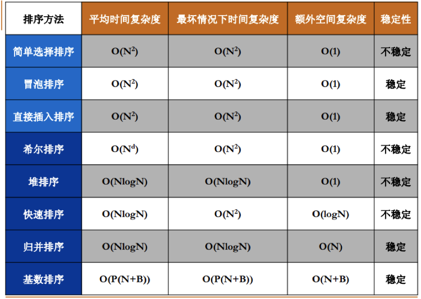

# 排序算法比较



## 快排

```cpp
void quick_sort(int q[], int l, int r) {
    if (l >= r) return;
    int i = l - 1, j = r + 1, x = q[(l+r)>>1];
    while (i < j) {
        do i++; while (q[i] < x);
        do j--; while (q[j] > x);
        if (i < j) swap(q[i], q[j]);
    }
    quick_sort(q, l, j), quick_sort(q, j + 1, r);
}
```

## 归并排序

```cpp
void merge_sort(int l, int r) {
    if (l >= r) return;
    // 确定分界点
    int mid = (l + r) / 2;
    // 递归处理
    merge_sort(l, mid), merge_sort(mid + 1, r);
    // 归并的过程，合二为一的过程
    int k = 0, i = l, j = mid + 1;
    while (i <= mid && j <= r) {
        if (q[i] <= q[j]) temp[k++] = q[i++];
        else temp[k++] = q[j++];
    }
    while (i <= mid) temp[k++] = q[i++];
    while (j <= r) temp[k++] = q[j++];
    // 搬回q[]
    for (i = l, k = 0; i <= r; i++, k++) q[i] = temp[k];
}
```

## 堆排序

```c++
// 小根堆
// h[N]存储堆中的值, h[1]是堆顶，x的左儿子是2x, 右儿子是2x + 1
int h[N], cnt;

void down(int u) {
    int t = u;
    if (u * 2 <= cnt && h[u*2] < h[t]) t = u * 2;
    if (u * 2 + 1 <= cnt && h[u*2+1] < h[t]) t = u * 2 + 1;
    if (u != t) {
        swap(h[u], h[t]);
        down(t);
    }
}

// O(n)建堆
for (int i = n / 2; i; --i) down(i);
```

# LRU

```cpp
class LRUCache {
public:
    LRUCache(int capacity) : cap(capacity) { }  // 列表初始化
    int get(int key) {
        if (map.find(key) == map.end()) return -1;
        auto key_value = *map[key];
        cache.erase(map[key]);
        cache.push_front(key_value);
        map[key] = cache.begin();
        return key_value.second;
    }
    void put(int key, int value) {
        if (map.find(key) == map.end()) {
            if (cache.size() == cap) {
                map.erase(cache.back().first);
                cache.pop_back();
            }
        }
        else {
            cache.erase(map[key]);
        }
        cache.push_front({key, value});
        map[key] = cache.begin();
    }
private:
    int cap;
    list<pair<int, int>> cache; // 双向链表
    unordered_map<int, list<pair<int, int>>::iterator> map; //直接使用迭代器作为map的value
};
```

# 反转链表

迭代：

```c++
class Solution {
public:
    ListNode* reverseList(ListNode* head) {
        ListNode *dummy = new ListNode(-1);
        ListNode *cur = head;
        while (cur != nullptr) {
            ListNode *temp = cur->next;
            cur->next = dummy->next;
            dummy->next = cur;
            cur = temp;
        }
        return dummy->next;
    }
};
```

递归：

```c++
class Solution {
public:
    ListNode* reverseList(ListNode* head) {
        if (head == nullptr || head->next == nullptr) {
            return head;
        }
        ListNode* ret = reverseList(head->next);
        head->next->next = head;
        head->next = nullptr;
        return ret;
    }
};。
```

# 单例模式

## 懒汉式

C++11 标准中有一个特性：如果当变量在初始化的时候，并发同时进入声明语句，并发线程将会阻塞等待初始化结束。

**这是最推荐的一种单例实现方式：**

1. 通过局部静态变量的特性保证了线程安全 (C++11, GCC > 4.3, VS2015支持该特性);
2. 不需要使用共享指针，代码简洁；
3. 注意在使用的时候需要声明单例的引用 `Single&` 才能获取对象。

```cpp
#include <iostream>

class Singleton
{
public:
    ~Singleton(){
        std::cout<<"destructor called!"<<std::endl;
    }
    Singleton(const Singleton&)=delete;
    Singleton& operator=(const Singleton&)=delete;
    static Singleton& get_instance(){
        static Singleton instance;
        return instance;

    }
private:
    Singleton(){
        std::cout<<"constructor called!"<<std::endl;
    }
};

int main(int argc, char *argv[])
{
    Singleton& instance_1 = Singleton::get_instance();
    Singleton& instance_2 = Singleton::get_instance();
    return 0;
}
```

使用锁、共享指针实现的懒汉式单例模式

- 基于 shared_ptr, 用了 C++ 比较倡导的 RAII思想，用对象管理资源,当 shared_ptr 析构的时候，new 出来的对象也会被 delete掉。以此避免内存泄漏。
- 加了锁，使用互斥量来达到线程安全。这里使用了两个 if 判断语句的技术称为**双检锁**；好处是，只有判断指针为空的时候才加锁，避免每次调用 get_instance的方法都加锁，锁的开销毕竟还是有点大的。

不足之处在于： 使用智能指针会要求用户也得使用智能指针，非必要不应该提出这种约束; 使用锁也有开销; 同时代码量也增多了，实现上我们希望越简单越好。

```cpp
#include <iostream>
#include <memory> // shared_ptr
#include <mutex>  // mutex

// version 2:
// with problems below fixed:
// 1. thread is safe now
// 2. memory doesn't leak

class Singleton {
public:
    typedef std::shared_ptr<Singleton> Ptr;
    ~Singleton() {
        std::cout << "destructor called!" << std::endl;
    }
    Singleton(Singleton&) = delete;
    Singleton& operator=(const Singleton&) = delete;
    static Ptr get_instance() {

        // "double checked lock"
        if (m_instance_ptr == nullptr) {
            std::lock_guard<std::mutex> lk(m_mutex);
            if (m_instance_ptr == nullptr) {
                m_instance_ptr = std::shared_ptr<Singleton>(new Singleton);
            }
        }
        return m_instance_ptr;
    }

private:
    Singleton() {
        std::cout << "constructor called!" << std::endl;
    }
    static Ptr m_instance_ptr;
    static std::mutex m_mutex;
};

// initialization static variables out of class
Singleton::Ptr Singleton::m_instance_ptr = nullptr;
std::mutex Singleton::m_mutex;
```

## 饿汉式

```cpp
// 饿汉实现 /
class Singleton
{
public:
    // 获取单实例
    static Singleton* GetInstance();
    // 释放单实例，进程退出时调用
    static void deleteInstance();
    // 打印实例地址
    void Print();

private:
    // 将其构造和析构成为私有的, 禁止外部构造和析构
    Singleton();
    ~Singleton();

    // 将其拷贝构造和赋值构造成为私有函数, 禁止外部拷贝和赋值
    Singleton(const Singleton &signal);
    const Singleton &operator=(const Singleton &signal);

private:
    // 唯一单实例对象指针
    static Singleton *g_pSingleton;
};

// 代码一运行就初始化创建实例 ，本身就线程安全
Singleton* Singleton::g_pSingleton = new (std::nothrow) Singleton;

Singleton* Singleton::GetInstance()
{
    return g_pSingleton;
}

void Singleton::deleteInstance()
{
    if (g_pSingleton)
    {
    
        delete g_pSingleton;
        g_pSingleton = NULL;
    }
}

void Singleton::Print()
{
    std::cout << "我的实例内存地址是:" << this << std::endl;
}

Singleton::Singleton()
{
    std::cout << "构造函数" << std::endl;
}

Singleton::~Singleton()
{
    std::cout << "析构函数" << std::endl;
}
// 饿汉实现 /
```

