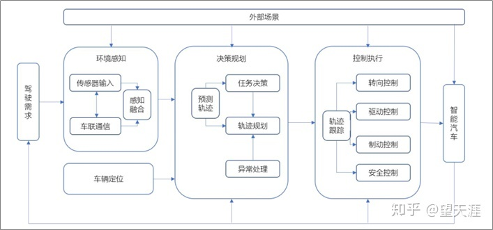
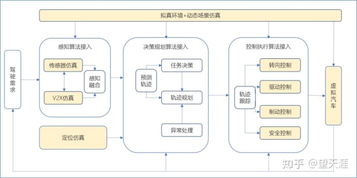
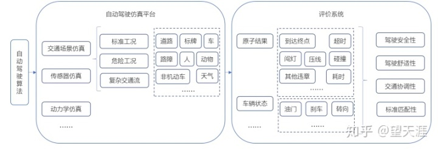
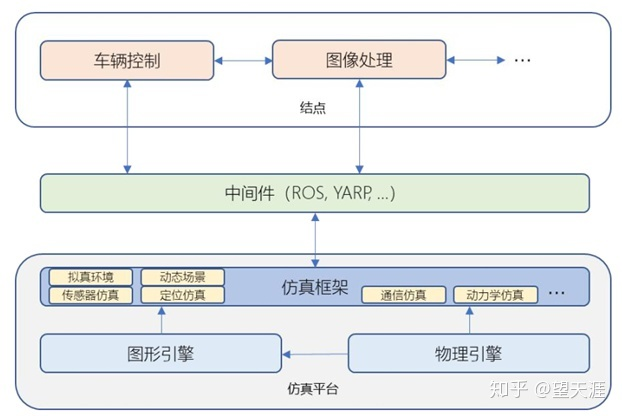

# 自动驾驶

## 基本定义

- 自动驾驶汽车是通过搭载先进的车载传感器、控制器和数据处理器、执行机构等装置，借助车联网、5G 和 V2X 等现代移动通信与网络技术实现交通参与物与彼此间的互换与共享，从而具备在复杂环境下的传感感知、决策规划、控制执行等功能。
- 驾驶系统基于环境感知技术对车辆周围环境进行感知，并根据感知所获得的信息，通过车载中心电脑自主控制车辆的转向和速度，使车辆能够安全可靠地行驶，并达到预定目的地。

自动驾驶车辆的整个工作流程是：

- 首先，是通过雷达、激光雷达、摄像头、车载网联系统等对外界的环境进行感知识别；

- 然后，在融合多方面感知信息的基础上，通过智能算法学习外界场景信息，预测场景中交通参与者的轨迹，规划车辆运行轨迹，实现车辆拟人化控制融入交通流中；

- 最后跟踪决策规划的轨迹目标，控制车辆的油门、刹车和转向等驾驶动作，调节车辆行驶速度、位置和方向等状态，以保证汽车的安全性、操纵性和稳定性。

## 基本架构

自动驾驶的关键技术是环境感知技术和车辆控制技术，其中**环境感知技术**是无人驾驶汽车行驶的**基础**，**车辆控制技术**是无人驾驶汽车行驶的**核心**，包括决策规划和控制执行两个环节，这两项技术相辅相成共同构成自动驾驶汽车的关键技术。

## 自动驾驶仿真技术

一个完整的自动驾驶仿真平台，需要包括**静态场景还原**、**动态案例仿真**、**传感器仿真**、**车辆动力学仿真**、**并行加速计算**等功能，并能够较为容易的接入自动驾驶感知和决策控制系统；只有算法与仿真平台紧密结合，才能形成一个闭环，达到持续迭代和优化的状态。系统模块如下：

## 自动驾驶仿真测试的评价方法

### 自动驾驶仿真测试的评价体系

自动驾驶仿真测试的评价体系，主要针对的是自动驾驶整体算法的测试和评估。

### 仿真测试运行环境的条件模型

在算法接入仿真平台后，起到测试目的的关键部分是交通场景的仿真，即系统预期**运行环境的条件模型**。

运行环境条件模型（包括但不限于以下“场景”）：

- 道路属性 ：车道数、坡度、出口、路障、道路条件等；

- 交通属性：其他交通参与者的数量和速度、其他驾驶员的可能模型；

- 总体环境条件： 能见度、天气条件等；

### 自动驾驶仿真测试的评价依据及评价内容

**评价依据**

标准化交通场景确定之后，自动驾驶算法接入仿真平台即开始测试，自动驾驶测试评价的依据源于**原子结果**和**车辆状态**；

- 原子结果：自动驾驶车辆从起点出发之后所有的细微表现：如是否闯红灯，压实线，是否发生碰撞，是否达到终点；
- 车辆状态：自动驾驶车从起点出发之后到终点的全程过车中的油门、刹车、转向状态；

**评价内容**

1. 驾驶安全性： 指车辆在道路上的行驶决策和行为。自动驾驶车辆也需要遵守交通规则，必须在各种驾驶情境（不论该情境是预期内还是预期外的）为用户提供导航，确保驾驶安全性；

    - 首先是对自动驾驶模块运行可靠性的判定，类似模块是否会发生软件的致命错误、内存泄漏和数据延迟等；
    -  其次是对自动驾驶基础功能的评价。类似是否按照道路指示标志行车，是否冲撞行人，是否发生交通事故等。

2. 驾驶舒适性：指车辆在道路上行驶期间驾驶员或乘员的驾乘体验

    - 依据行驶过程记录下的油门、刹车、转向状态，评估车辆驾乘是否平稳，转弯是否平顺；
    - 利用多自由度驾驶模拟器，通过驾驶员在环，评估驾驶员的体感判定和心理感受；（体感判定包括了横摆角，顿挫感等评估体系，心理感受包括了心理安全感以及迟钝感等。）

3. 交通协调性：指车辆在道路上行驶时相对其他交通参与者的交通移动表现

    在仿真平台内，对交通协调性的评价方法是比较困难的，只能从外部交通参与者或者全局视角去分析评价它。协调性的提升，靠算法不断自我强化学习。

4. 标准匹配性 - 指按不同国家的法律法规，对自动驾驶行为作出评价。

    在仿真平台内，因为我们输出的是原子结果，通过不同的排列组合和条件筛选，可以从不同维度，按不同行业标准，对自动驾驶算法做出评价。

## 自动驾驶仿真测试的验证与精度

### 自动驾驶仿真测试系统架构

自动驾驶仿真测试平台包括虚拟场景、动态案例仿真、传感器仿真、车辆动力学仿真等独立模块，如下图所示，描述了仿真平台的典型软件架构，所以对自动驾驶仿真测试的验证与精度评估主要就是对存在于此架构内**各个模块的评估**和**对整体框架的再评估**。

