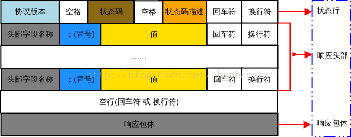
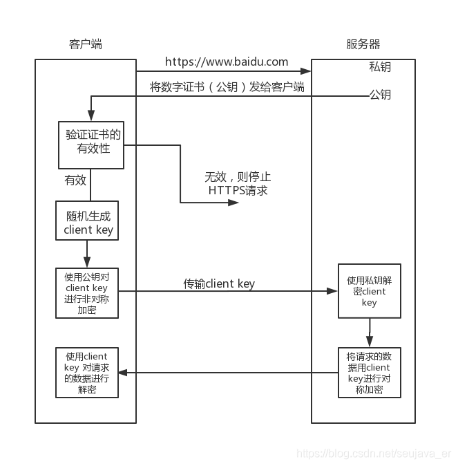

# OSI七层模型

物理层：底层数据传输，如网线、网卡标准。

数据链路层：数据的基本格式。如：MAC地址。

网络层：定义IP编址和路由功能。

传输层：端到端传输（TCP、UDP）

会话层：控制应用程序之间的会话能力；如不同软件数据分发给不同的软件

表示层：数据格式标识，基本压缩加密功能

应用层：应用软件

（TCP、IP五层模型：物理层、数据链路层、网络层、传输层、应用层）

# 应用层

## HTTP 协议

### 请求报文

HTTP 协议是以 ASCⅡ 码传输，建立在 TCP/IP 协议之上的应用层规范。 HTTP 请求报文由请求行（request line）、请求头部（header）、空行和请求数据四个部分组成，下图是请求报文的一般格式。


### 响应报文



**状态行**代替了请求行，状态行通过一个状态码来说明请求情况。

1xx: 提示信息, 表示目前是协议处理的中间状态, 还需要后续的操作
2xx: 成功, 报文已经收到并被正确处理				 
3xx: 重定向, 资源位置发生变动, 需要客户端重新发送请求
4xx: 客户端错误, 请求报文有误, 服务器无法处理
5xx: 服务器错误, 服务器在处理请求时内部发生了错误

### HTTP 的无状态性

HTTP 协议是无状态的（stateless）。也就是说，同一个客户端第二次访问同一个服务器上面的页面时，服务器无法得知这个客户端曾经访问过，服务器无法辨别不同的客户端。HTTP 的无状态性简化了服务器的设计，是服务器更容易支持大量并发的 HTTP 请求。HTTP 协议是采用请求-响应的模型。客户端向服务端发送一个请求报文，服务端以一个状态作为回应。当使用普通模式，即非 keep-alive 模式时，每个请求-应答都要重新建立一个连接，连接完成后立即断开；

## HTTP 长连接和短链接

本质上是 TCP 的长连接和短链接，HTTP 属于应用层协议，在传输层使用 TCP 协议，在网络层使用 IP 协议。

- HTTP 短连接：

    客户端和服务器之间的 TCP 连接只能为一个 HTTP 请求服务，当服务器处理完客户的一次 HTTP 请求之后就会主动将 TCP 连接关闭。此后如果客户与同一个服务器进行多次 HTTP 请求的话还需要重新建立 TCP 连接。也就是说客户的多次 HTTP 请求不能共用一个 TCP 连接。

- HTTP 长连接：

    client 向 server 发起连接，server 接受 client 连接，双方建立连接。client 与 server 完成一次读写之后，它们之间的连接并不会主动关闭，后续的读写操作会继续使用这个连接。多次 HTTP 请求共用同一个 TCP 连接。

    【关闭一些长时间没有读写事件发生的连接】

    TCP 保活机制（Keepalive）：在一段时间内连接处于非活动状态，那么服务器端将向客户端发送一个报文，如果服务端没有收到回应，则在一定时间间隔内还会继续发送。当发送次数达到阈值（保活次数）后，确认对方主机不可达，断开连接。

## HTTP 和 HTTPS 的区别

- HTTP 使用明文通信，且没有其他的保护措施，不安全。HTTPS 解决了 HTTP 不安全的缺陷，在 TCP 和 HTTP 网络层之间加入了 SSL/TLS 安全协议，使得报文能够加密传输；
- HTTP 连接建立相对简单， TCP 三次握手之后便可进行 HTTP 的报文传输。而 HTTPS 在 TCP 三次握手之后，还需进行 SSL/TLS 的握手过程，才可进入加密报文传输；
- HTTPS 协议需要向 CA 申请数字证书，来保证服务器的身份是可信的。

## HTTPS 加密算法



## TCP 的 Keepalive 和 HTTP 的 Keep-Alive 是一个东西吗

HTTP 的 Keep-Alive，是由**应用层（用户态）** 实现的，称为 HTTP 长连接；

TCP 的 Keepalive，是由 **TCP 层（内核态）** 实现的，称为 TCP 保活机制；

- HTTP 的 Keep-Alive：

    HTTP 协议采用的是请求—应答模式，即客户端发起请求，服务端会返回响应。HTTP 的 Keep-Alive 就是实现了这个功能，可以使用同一个 TCP 连接来发送和接收多个 HTTP 请求/应答，避免了连接建立和释放的开销，这个方法称为 **HTTP 长连接**。

- TCP 的 Keepalive：

    TCP 的 Keepalive 这东西其实就是 **TCP 的保活机制**，达到保活机制的触发条件，就会发送探测报文。

    - 如果对端程序是正常工作的。当 TCP 保活的探测报文发送给对端, 对端会正常响应，这样 **TCP 保活时间会被重置**，等待下一个 TCP 保活时间的到来。
    - 如果对端主机崩溃，或对端由于其他原因导致报文不可达。当 TCP 保活的探测报文发送给对端后，没有响应，连续几次，达到保活探测次数后，**TCP 会报告该 TCP 连接已经死亡**。

    TCP 保活机制可以保证双方没有数据交互的情况下，通过探测报文，确定对方的 TCP 连接是否存活。

## GET 和 POST 区别

GET 是从服务器获取指定的资源，安全且幂等的。

POST 向指定的资源提交要被处理的数据，POST 会修改服务器上的资源，不安全，且不幂等。

## 访问一个网页的过程

1. 解析 URL，提取出域名；
2. DNS 查询，将域名映射到具体的 IP 的值；
3. HTTP 是基于 TCP/IP 协议栈的，因为此需要建立 TCP 连接；
4. 浏览器发送 HTTP 请求；
5. 服务器处理请求；
6. 浏览器接受响应；
7. 关闭TCP连接

## DNS 解析过程

DNS 根据域名查询 IP 地址的过程为：浏览器缓存 --> 操作系统缓存(本地 Hosts 文件) --> 路由器缓存-->本地（ISP）域名服务器缓存 --> 根域名服务器 --> 顶级域名服务器 --> 权限域名服务器。

DNS 是应用层协议，事实上他是为其他应用层协议工作的，包括不限于 HTTP 和 SMTP 以及 FTP，用于将用户提供的主机名解析为 IP 地址。

DNS 服务器一般分三种，根 DNS 服务器，顶级 DNS 服务器，二级 DNS 服务器。

如果某个用户正在用浏览器 `mail.baidu.com` 的网址，当你敲下回车键的一瞬间：

1. 检查**浏览器缓存**中是否存在该域名与 IP 地址的映射关系，如果有则解析结束，没有则继续
2. 到**系统本地**查找映射关系，一般在 `hosts` 文件中，如果有则解析结束，否则继续
3. 到**本地域名服务器**去查询，有则结束，否则继续
4. **本地域名服务器**查询**根域名服务器**，该过程并不会返回映射关系，只会告诉你去下级服务器(顶级域名服务器)查询
5. **本地域名服务器**查询**顶级域名服务器**(即 `com` 服务器)，同样不会返回映射关系，只会引导你去二级域名服务器查询
6. **本地域名服务器**查询**二级域名服务器**(即 `baidu.com` 服务器)，引导去三级域名服务器查询
7. **本地域名服务器**查询**三级域名服务器**(即 `mail.baidu.com` 服务器)，此时已经是最后一级了，如果有则返回映射关系，则**本地域名服务器**加入自身的映射表中，方便下次查询或其他用户查找，同时返回给该用户的计算机，没有找到则网页报错
8. 如果还有下级服务器，则依此方法进行查询，直至返回映射关系或报错

# 传输层

## TCP 的特点

TCP 是面向连接的、可靠的、基于字节流的通信协议

**面向连接的：**TCP 需要一对一连接，和 UDP 不同，不支持一对多；

**可靠的：**无论网络链路状况如何，TCP 可以保证一个报文一定能到达接收端；

**字节流：**（无边界 + 有序）UDP 是面向报文的协议，通过 UDP 协议传输时，操作系统不会对消息进行拆分，组装好 UDP 头部后就交给网络层处理，每个 UDP 报文就是一个用户消息的边界；而用户使用 TCP 传输时，消息可能会被操作系统分成多个 TCP 报文，一个完整的用户消息被拆分成多个 TCP 报文进行传输，并且消息是“有序的”，当前一个没有收到时，即使先收到后面的字节，也不能扔给应用层处理，同时重复的报文会自动丢弃。

## TCP 和 UDP 的区别、适用场景

**区别**

1. 连接

    TCP：面向连接的，传输前需要建立连接；

    UDP：不需要连接，马上就可以传输数据。

2. 服务对象

    TCP 仅支持一对一的两点服务；

    UDP 支持一对一、一对多、多对多的交互通信。

3. 可靠性

    TCP 是可靠交付数据的，保证数据无丢失和按序到达；

    UDP 是尽力而为的，不保证可靠交付数据。

4. 拥塞控制、流量控制

    TCP 有拥塞控制和流量控制，保证数据传输的安全；

    UDP 没有，即使网络已经十分拥堵了，也不会影响 UDP 的发送速率。

5. 首部

    TCP 首部长度较长，会有一定的开销，首部在没有使用「选项」字段时是 `20` 个字节，如果使用了「选项」字段则会变长的。

    UDP 首部只有 `8` 个字节，并且是固定不变的，开销较小。

6. 传输方式

    TCP 是面向字节流的传输协议，消息没有边界，但保证顺序和可靠；

    UDP 是一个包一个包发送，有边界，但可能会丢包和乱序。

7. 分片

    TCP 的数据大小如果大于 MSS 大小，则会在传输层进行分片，目标主机收到后，也同样在传输层组装 TCP 数据包，如果中途丢失了一个分片，只需要传输丢失的这个分片。

    UDP 的数据大小如果大于 MTU 大小，则会在 IP 层进行分片，目标主机收到后，在 IP 层组装完数据，接着再传给传输层。

**应用场景**

TCP：

- `FTP` 文件传输；
- HTTP / HTTPS

UDP：

- 包总量少的通信，如 `DNS` 、`SNMP` 等；
- 视频、音频等多媒体通信；
- 广播通信。

## TCP 三次握手的过程

1. 开始时，服务器和客户端都处于 `CLOSD` 状态，服务器开启后，主动监听某个端口，此时服务器处于 `LISTEN` 状态；

2. 客户端希望发起连接请求，随机初始化一个序列号 x，将 TCP 头部中的 SYN 标志位置1，表示 SYN 报文，发送给服务端，TCP规定，SYN报文段（即SYN=1的报文段）不能携带数据，但**要消耗掉一个序号**。表示向服务端发起连接请求，之后客户端处于 `SYN_SENT` 状态；
3. 服务端收到客户端发来的 SYN 报文后，自己也随机初始化一个序列号 y，同时在 TCP 头部的“确认应答号”字段填入 x+1，TCP 头部中的 SYN 和 ACK 标志位都置1，这次的也不能携带数据，发送给客户端，之后服务端处于 `SYN_RCVD` 状态；
4. 客户端收到服务端报文后，还会再向服务器发送最后一个应答报文，该应答报文 TCP 头部的“确认应答号”为 y+1，最后把报文发送给服务端，这次报文可以携带客户端到服务端的数据，之后客户端处于 `ESTABLISHED` 状态；
5. 服务端收到应答报文后，也进入 `ESTABLISHED` 状态。

## 为什么需要三次握手

1. 防止“历史连接”初始化造成混乱。在两次握手的情况下，「被动发起方」没有中间状态给「主动发起方」来阻止历史连接，导致「被动发起方」可能建立一个历史连接，造成资源浪费。（客户端先发送了一个序列号为 100 的 SYN 请求报文，但是阻塞了，又发送了一个新的序列号为 200 的 SYN 请求报文，旧的连接报文先于新的连接报文到达，服务端会恢复一个 SYN + ACK 报文给客户端，客户端收到后根据上下文判断是否是一个历史连接，如果是就发送一个 RST 报文。
2. 同步双方序列号。通信双方都需要维护一个「序列号」，标识发送出去的数据包哪些已被对方收到，序列号是保证可靠顺序传输的关键，所以当客户端发送携带「初始序列号」的 SYN 报文的时候，需要服务端回一个 ACK 应答报文，表示客户端的 SYN 报文已被服务端成功接收，那当服务端发送「初始序列号」给客户端的时候，依然也要得到客户端的应答回应，这样一来一回，才能确保双方的初始序列号能被可靠的同步。
3. 避免资源浪费。四次也可以，但三次就可以做到。

## TCP 四次挥手的过程

- 客户端希望关闭连接，发送一个 FIN 报文，序列号为 x，客户端进入 `FIN_WAIT_1` 状态；

- 服务端收到后，向客户端发送 ACK 应答报文，序列号为 y，ACK 为 x + 1，接着服务端进入 `CLOSED_WAIT` 状态；

- 客户端收到 ACK 后，进入 `FIN_WAIT_2` 状态；

- 服务端处理完数据后，向客户端发送 FIN 报文，之后服务端进入 `LAST_ACK` 状态；

- 客户端收到 FIN 报文后，回一个 ACK 报文，序列号为 y + 1，之后进入 `TIME_WAIT` 状态；
- 服务端收到客户端发送的 ACK 报文后，进入 `CLOSED` 状态，至此服务端已经完成连接的关闭；
- 客户端在经过 `2MSL` 时间后，自动进入 `CLOSED` 状态，客户端也完成了连接的关闭。

## 为什么需要四次挥手

关闭连接时，客户端向服务端发送 FIN 时，仅仅表示客户端不再发送数据了但是还能接收数据。

服务器收到客户端的 FIN 报文时，先回一个 ACK 应答报文，而服务端可能还有数据需要处理和发送，等服务端不再发送数据时，才发送 FIN 报文给客户端来表示同意现在关闭连接。

从上面过程可知，服务端通常需要等待完成数据的发送和处理，所以服务端的 ACK 和 FIN 一般都会分开发送，从而比三次握手导致多了一次。

## 为什么需要 `TIME_WAIT`

客户端收到了来自服务器的带有 FIN、ACK 的结束报文段后并没有直接关闭，而是进入了 TIME_WAIT 状态。

在这个状态中客户端只有等待 2MSL(Maximum Segment Life，报文段最大生存时间)才能完全关闭。它是任何报文在网络上存在的最长时间，超过这个时间报文将被丢弃，RFC文档的建议值是2分钟。为啥有这个，因为 TCP 报文基于是 IP 协议的，而 IP 头中有一个 `TTL` 字段，是 IP 数据报可以经过的最大路由数，每经过一个处理他的路由器此值就减 1，当此值为 0 则数据报将被丢弃，同时发送 ICMP 报文通知源主机。MSL 与 TTL 的区别：MSL 的单位是时间，而 TTL 是经过路由跳数。所以 **MSL 应该要大于等于 TTL 消耗为 0 的时间**，以确保报文已被自然消亡。

1. 防止历史连接中的数据，被后面相同的四元组的连接错误接收；

    假如在客户端向服务端发送 FIN 即第一次挥手之前，服务器端发送了一个报文给客户端，但因为网络原因这个报文延迟到达了，那么如果 `TIME_WAIT` 没有或者太短，由于这个报文具有相同的四元组的旧报文，可能会和新TCP连接的新报文起冲突。这个时间足以让两个方向上的数据包都丢弃，使原来连接的数据包在网络中都自然消失，再出现的数据包一定是新建立连接产生的。

2. 保证「被动关闭连接」的一方，能被正确的关闭。如果客户端最后一次 ACK 报文在网络中丢失了，那么按照 TCP 可靠性原则，服务端（被动关闭方）会重发 FIN 报文。假设客户端没有 `TIME_WAIT` 状态，而是在发完最后一次回 ACK 报文就直接进入 `CLOSED` 状态，如果该 ACK 报文丢失了，服务端则重传的 FIN 报文，而这时客户端已经进入到关闭状态了，在收到服务端重传的 FIN 报文后，就会回 RST 报文。

## 为什么 `Time_wait` 要等待 2MSL

`MSL` 是 Maximum Segment Lifetime，**报文最大生存时间**，它是任何报文在网络上存在的最长时间，超过这个时间报文将被丢弃。

1. 为了保证客户端发送的最后一个 ACK 报文能够到达服务器端，这个报文可能会丢失，因为使处于 `LAST_ACK` 状态的服务端收不到对已发送的 FIN 报文段的确认，服务端就会重传这个 FIN 报文段, 而客户端就能在 2MSL 时间内收到这个重传的 FIN 报文段，**一来一回需要等待 2 倍的时间**。
2. 客户端在发送完最后一个 ACK 报文之后，在经过时间 2MSL，就可以使本连接持续的时间内所产生的所有报文段都从网络中消失，这样就可以使下一个连接中不会出现这种已经失效的连接请求报文段。

## 半连接队列(SYN队列)和全连接队列(accept队列)

在 TCP 三次握手的时候，Linux 内核会维护两个队列：半连接队列和全连接队列

当服务器第一次收到客户端的 SYN 之后，就会处于  SYN_RCVD 状态，此时双方还没有完全建立连接。服务器会把这种状态下请求连接放在一个队列里，我们把这种队列称之为半连接队列也叫做 SYN 队列，它的职责就是向客户端响应 SYN + ACK，并且在没有收到 ACK 包时重传直到超市。

客户端返回  ACK 报文，服务端收到后，从 SYN 队列中移除放到 accept 队列中，等待进程调用 `accept()` 把连接从 accept 队列中取出。

## 调用 `close()` 在哪一步

当客户端调用 `close()` 主动断开时，会在 FIN 报文后面放入一个文件描述符 EOF，放在服务器端读缓冲队列的最后，当接收到 EOF 时，服务器需要处理这种异常情况，表示以后不会有任何数据到达，因此服务器会返回一个 ACK 确认报文然后进入 close_wait 状态，等服务器处理完后也发送 FIN 报文同时调用 `close()`

## IP 层会分片，为什么 TCP 层还需要 MSS 呢

`MTU`：一个网络包的最大长度（IP 头部 + TCP 头部 + TCP 数据）

`MSS`：除去 IP 和 TCP 头部之后，一个网络包所能容纳的 TCP 数据的最大长度

当 IP 层有一个超过 `MTU` 大小的数据（TCP 头部 + TCP 数据）要发送，那么 IP 层就要进行分片，把数据分片成若干片，保证每一个分片都小于 `MTU`。把一份 IP 数据报进行分片以后，由目标主机的 IP 层来进行重新组装后，再交给上一层 TCP 传输层。当一个 IP 分片丢失，整个 IP 报文都需要重传。但 IP 层本身没有超时重传机制，由传输层的 TCP 负责超时和重传。

为了能达到最佳的传输效率， TCP 协议在**建立连接的时候通常要协商双方的 MSS 值**，当 TCP 层发现数据超过 MSS 时，则就先会进行分片，当然由它形成的 IP 包的长度也就不会大于 MTU ，自然也就不用 IP 分片了。

这样即使重发也是以 MSS 为单位的，不用重传所有分片。

## TCP 粘包怎么解决

出现原因：

1. 本质原因：TCP 面向字节流，数据没有确切的边界。
2. 发送方：TCP 默认使用 Nagle 算法（避免网络中有过多的小包），为了减少网络中报文段的数量。主要有两步，首先上一个分组得到确认后才能发送下一个分组。其次，收集多个小分组然后一起发送。
3. 接收方：当接收方收到数据后不会马上交到应用层去处理，因为发送方和接收方各有两个缓冲空间，接收方收到数据后会将数据放到接收方的读缓存中，用户进程从该缓冲区取数据，若下一包数据到达时前一包数据尚未被用户进程取走，则下一包数据放到系统接收缓冲区时就接到前一包数据之后，而用户进程根据预先设定的缓冲区大小从系统接收缓冲区取数据，这样就一次取到了多包数据。

解决：通过边界划分出有效的用户消息，发送方关闭 Nagle 算法

1. 固定长度的消息；
2. 特殊字符作为边界；（HTTP）
3. 自定义消息结构。

## SYN 攻击，如何防范

**SYN 攻击**：假设攻击者短时间伪造不同 IP 地址的 SYN 报文，服务端每接收到一个 SYN 报文，就进入 SYN_RCVD 状态，但服务端发送出去的 ACK + SYN 报文，无法得到未知 IP 主机的  ACK 应答，久而久之就会**占满服务端的半连接队列**，使得服务器不能为正常用户服务。

**防范：**

1. 优化主机系统设置。比如降低 SYN timeout 时间，使得主机尽快释放半连接的占用, 如果短时间内收到了某个 IP 的重复 SYN 请求，我们就认为受到了攻击。我们合理的采用防火墙设置等外部网络也可以进行拦截。

## TCP 重传机制

**超时重传**

超时重传指的是发送数据包在一定的时间周期内没有收到相应的 ACK，等待一定的时间，超时之后就认为这个数据包丢失，就会重新发送。这个等待时间被称为 RTO。

检测丢失 segment 的方法是每次发送一个 TCP segment 时候，就启动重传定时器。

**快速重传：**以数据为驱动，连续收到3个相同的 ACK，触发。

**SACK（选择性确认）：**如果开启 SACK，每一个 SACK 段记录的是已经收到的连续的包，这样发送发就知道哪些数据是已经收到了，只重传丢失的。

## TCP 流量控制

TCP不能无脑发，如果接收方处理能差，发送方还无脑发送时候，就会触发重发机制，使得网络拥塞，因此TCP提供了一种机制让发送方根据接收方的实际接受能力控制发送的数据量。

发送方和接收方都会维护一个窗口，接收方每次收到数据包，可以在发送确定报文的时候，同时告诉发送方自己的缓存区还剩余多少是空闲的，我们也把缓存区的剩余大小称之为接收窗口大小，用变量 win 来表示接收窗口的大小。发送方收到之后，便会调整自己的发送速率，也就是调整自己发送窗口的大小，当发送方收到接收窗口的大小为0时，发送方就会停止发送数据，防止出现大量丢包情况的发生。

## TCP 是如何解决窗口关闭时，潜在的死锁现象呢？

当接收方处理好数据，接受窗口 win > 0 时，接收方发个通知报文去通知发送方，告诉他可以继续发送数据了。当发送方收到窗口大于 0 的报文时，就继续发送数据。

TCP 为每个连接设有一个持续定时器，**只要 TCP 连接一方收到对方的零窗口通知，就启动持续计时器。**如果持续计时器超时，就回发送窗口探测报文，对方确认这个探测报文时，给出自己现在的接受窗口大小。

## 糊涂窗口综合症

如果接收方太忙了，来不及取走接收窗口里的数据，那么就会导致发送方的发送窗口越来越小。

解决：

- 让接收方不通告小窗口给发送方

    接收方设置策略，当窗口大小小于 `min(MSS, 缓存空间/2)`，就会通告窗口为 0，也就阻止了发送方再发送数据。

- 让发送方避免发送小数据

    Nagle 算法，延迟处理，如果两个条件都不满足，发送方就会一直囤积5数据：

    - 条件一：要等到窗口大小 >= `MSS` 或是 数据大小 >= `MSS`；
    - 条件二：收到之前发送数据的 `ack` 回包。

## TCP 拥塞控制

流量控制是防止发送的报文无脑发送填满接收方的缓存，这其中发送方和接收方不知道网络环境是如何变化的，因此当网络出现拥塞的时候，可能会导致包的传输时延增加，丢包等问题，由于重传机制，会进入恶性循环。

拥塞控制最直接的目的就是避免发送方的数据填满整个网络。

拥塞控制算法：

- 慢启动：当发送方每收到一个 ACK 确认报文，就会将拥塞窗口 CWND 的大小 +1，但不是无限增长，有一个阈值记作 ssthreash，小于这个阈值就用慢启动算法，大于等于这个阈值就启动拥塞避免算法；
- 拥塞避免：**每收到一个 ACK 时，cnwd 增加 1/cnwd**，就变成了线性增长；
- 快重传：如果当发送端接收到三个重复的确认 ACK 时，则断定分组丢失，立即重传丢失的报文段，而不必等待重传计时器超时；
- 快速恢复：
    - 当发送方连续收到三个重复确认时，就执行“乘法减小”算法，把慢开始门限减半，这是为了预防网络发生拥塞。
    - 由于发送方现在认为网络很可能没有发生拥塞，因此现在不执行慢启动算法，而是把 cwnd 值设置为慢开始门限减半后的值，然后开始执行拥塞避免算法，使拥塞窗口的线性增大。

## TCP 协议保证可靠传输的手段

- 三次握手，建立可信的传输信道

- 校验和，接收端可以检测出来数据是否异常。

- 流量控制

- 拥塞控制

- 停止等待 ARQ 协议

    它的基本原理就是每发完一个分组就停止发送，等待对方确认（回复 ACK）。如果过了一段时间（超时时间后），还是没有收到 ACK 确认，说明没有发送成功，需要重新发送，直到收到确认后再发下一个分组。在停止等待协议中，若接收方收到重复分组，就丢弃该分组，但同时还要发送确认。

- 重传机制（快速重传、超时重传）

## netstat 和 awk 结合统计 TCP 状态

```shell
netstat -n | awk '/^tcp/ {++state[$NF]} END {for(key in state) print key,"\t",state[key]}'

/^tcp/ 滤出tcp开头的记录
state[] 定义一个名为state的数组
$NF NF记录的字段数,NF = 6，$NF 表示某个字段的值，$NF也就是$6
++state[$NF] 把某个数加一，后面的遍历数组和输出
```

# 网络层

## 为什么 IP 地址和 MAC 地址缺一不可

首先要充分了解网络分层的作用。网络层使用 IP 协议将不同数据链路类型（以太网，3g，LAN）的数据报文统一成相同的形式在网络层中可以互相传播，达到任意具有 IP 地址的主机。但是数据传输总要经过底层，经过线路传输。这时候就是数据链路层起到了作用，不同链路类型所使用的协议方案都不尽相同，但是在链路层不能使用IP地址了，这时候要找到相对应的主机我就需要MAC地址的作用。

若是只使用MAC进行通信，那么一个路由表就要维护差不多2的48次方数据，大约256TB的内存，这样存储和通信效率严重降低。

## ping 的工作原理

ping 是基于 `ICMP` 协议工作，`ICMP` 是互联网控制报文协议，主要功能包括：确认 IP 包是否成功送达目标地址的、未送达的原因等。

在主机 A 执行 ping 命令向主机 B 通信的时候：

主机 A 会构建一个 **ICMP 回送请求消息数据报**，这个数据报最重要的字段是**类型和序号**，序号的作用是为了区分连续 ping 的时候发出的多个数据包。

主机 B 收到数据包：

如果 MAC 地址和本机 MAC 地址匹配则接受，构建一个**ICMP 回送应答消息**数据包。

## traceroute

作用：

1. 设置特殊的 TTL，追踪去往目的地时沿途经过的路由器；

    原理：利用 IP 包的**生存期限** 从 `1` 开始按照顺序递增的同时发送 **UDP 包**，强制接收 **ICMP 超时消息**的一种方法。

2. 故意设置不分片，从而确定路径的 MTU，用于路径 MTU 发现。

    原理：首先在发送端主机发送 `IP` 数据报时，将 `IP` 包首部的**分片禁止标志位设置为 1**。根据这个标志位，途中的路由器不会对大数据包进行分片，而是将包丢弃。随后，通过一个 ICMP 的不可达消息将**数据链路上 MTU 的值**一起给发送主机，不可达消息的类型为「**需要进行分片但设置了不分片位**」。发送主机端每次收到 ICMP 差错报文时就**减少**包的大小，以此来定位一个合适的 `MTU` 值，以便能到达目标主机。

## ARP 协议、RARP 协议

- ARP：

    主要解决 MAC 和 IP 地址之间的问题。确定了 IP 地址之后可以向对应 IP 地址的主机发送数据报，但是在底层数据要通过数据链路进行传输，必须知道每个 IP 地址对应的 MAC 地址才行。

    主机广播发送 ARP 请求，包中包含想要知道的 MAC 地址的主机 IP 地址，收到 IP 地址匹配的主机，将自己的 MAC 地址放入 ARP 响应包中返回给主机。

- RARP：将 ARP 反过来，从 MAC 地址定位到 IP 地址的协议。主要用于无法获取 IP 地址的设备，比如嵌入式设备。

## DHCP 协议

通过 DHCP 协议动态获取 IP 地址。

过程：

- 客户端发起 **DHCP 发送报文**，UDP广播通信，源 IP 地址 0.0.0.0；
- DHCP 服务器收到后，用 **DHCP 提供报文**响应，仍是广播；
- 客户端收到一个或多个 **DHCP 提供报文**后，选择一个服务器，发送 **DHCP 请求报文响应**；
- 服务端用 **DHCP ACK 报文**对 **DHCP 请求报文**进行响应。

## NAT 协议

解决的问题：IPv4 的地址是非常紧缺的，在前面我们也提到可以通过无分类地址来减缓 IPv4 地址耗尽的速度，但是互联网的用户增速是非常惊人的，所以 IPv4 地址依然有被耗尽的危险。

IP 地址 + 端口号一起进行转换，网络地址与端口转换 NAPT

由 NAT 路由器负责