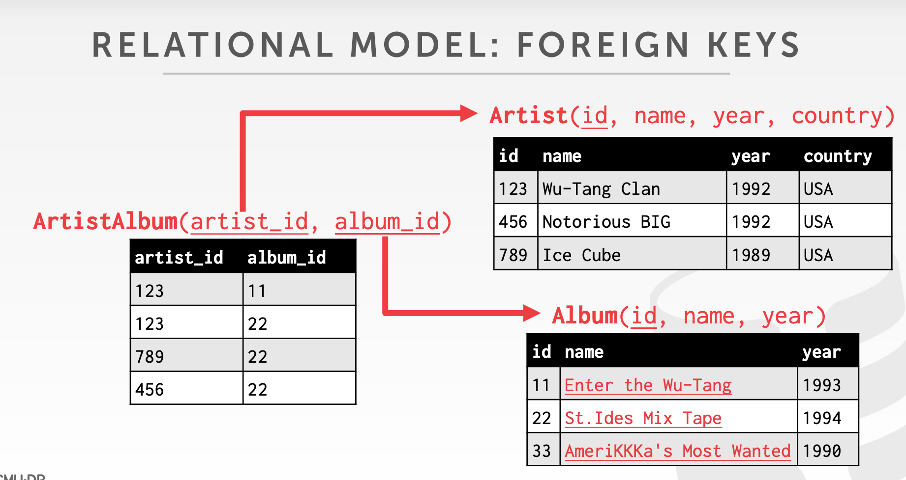

# 01 Relational Model & Relational Algebra

## 数据模型

在逻辑层中，我们通常需要对所需存储的数据进行建模。如今，市面上有的数据模型包括：

- Relational => 大部分 DBMS 属于关系型，也是本课讨论的重点
- NoSQL:
    - Key/Value
    - Graph
    - Document
    - Column-family
- Array/Matrix

## Rational Model

### Relation & Tuple

每个 Relation 都是一个无序集合（unordered set），集合中的元素称为 tuple，每个 tuple 由一组属性构成，这些属性在逻辑上通常有内在联系。

### Primary Keys 主键

primary key 在一个 Relation 中唯一确定一个 tuple，如果你不指定，有些 DBMSs 会自动帮你生成 primary key(MySQL : `AUTO_INCREMENT`)。

### Foreign Keys 外键

foreign key 唯一确定另一个 relation 中的一个 tuple，或者使用额外的一张表记录：

## Relational Algebra

从 relation 中查询和修改 tuples 的一些基本操作，包括：

- Select
- Projection
- Union
- Intersection
- Difference
- Product
- Join
- Observation

# 02 Intermediate SQL

