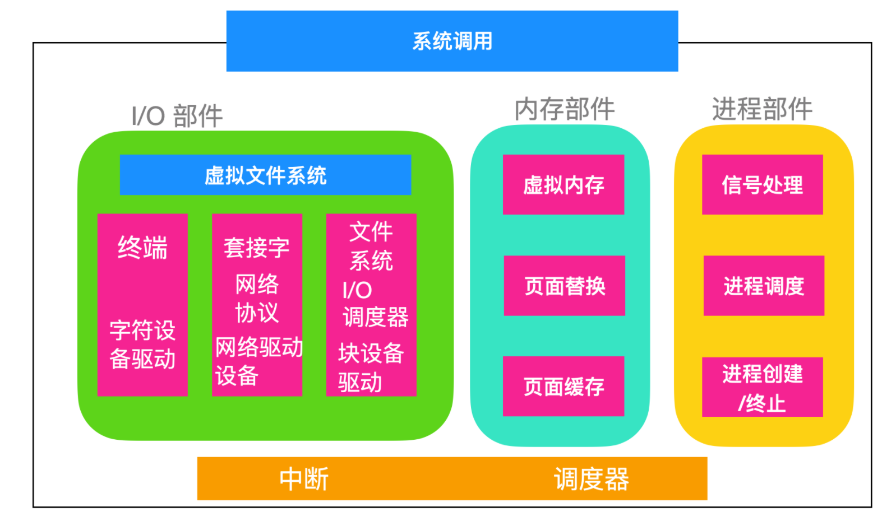

# 简介

## Linux 接口

应用程序发起系统调用把参数放在寄存器中(有时候放在栈中)，并发出 `trap` 系统陷入指令切换用户态至内核态。因为不能直接在 C 中编写 trap 指令，因此 C 提供了一个库，库中的函数对应着系统调用。有些函数是使用汇编编写的，但是能够从 C 中调用。每个函数首先把参数放在合适的位置然后执行系统调用指令。因此如果你想要执行 read 系统调用的话，C 程序会调用 read 函数库来执行。这里顺便提一下，是由 POSIX 指定的库接口而不是系统调用接口。也就是说，POSIX 会告诉一个标准系统应该提供哪些库过程，它们的参数是什么，它们必须做什么以及它们必须返回什么结果。

除了操作系统和系统调用库外，Linux 操作系统还要提供一些标准程序，比如文本编辑器、编译器、文件操作工具等。直接和用户打交道的是上面这些应用程序。因此我们可以说 Linux 具有三种不同的接口：**系统调用接口、库函数接口和应用程序接口**

## Linux 组成部分

- **引导程序(Bootloader)**：引导程序是管理计算机启动过程的软件，对于大多数用户而言，只是弹出一个屏幕，但其实内部操作系统做了很多事情
- **内核(Kernel)**：内核是操作系统的核心，负责管理 CPU、内存和外围设备等。
- **初始化系统(Init System)**：这是一个引导用户空间并负责控制守护程序的子系统。一旦从引导加载程序移交了初始引导，它就是用于管理引导过程的初始化系统。
- **后台进程(Daemon)**：后台进程顾名思义就是在后台运行的程序，比如打印、声音、调度等，它们可以在引导过程中启动，也可以在登录桌面后启动
- **图形服务器(Graphical server)**：这是在监视器上显示图形的子系统。通常将其称为 X 服务器或 X。
- **桌面环境(Desktop environment)**：这是用户与之实际交互的部分，有很多桌面环境可供选择，每个桌面环境都包含内置应用程序，比如文件管理器、Web 浏览器、游戏等
- **应用程序(Applications)**：桌面环境不提供完整的应用程序，就像 Windows 和 macOS 一样，Linux 提供了成千上万个可以轻松找到并安装的高质量软件。

## Linux 内核结构

Linux 的内核结构如下所示

内核直接坐落在硬件上，主要作用是与 I/O 进行交互、内存管理和控制 CPU 访问。中断是与设备交互的主要方式。中断出现时调度器就会发挥作用。

I/O 部分负责与设备进行交互以及执行网络和存储 I/O 操作的内核部分，