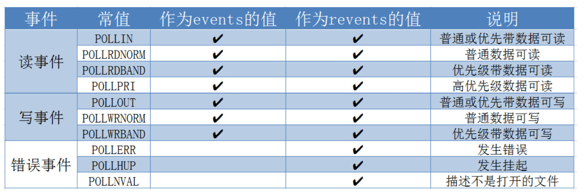

# 多进程编程

## 进程概述

>进程是正在运行的程序的实例。是一个具有一定独立功能的程序关于某个数据集合的一次运行活动。它是操作系统动态执行的基本单元，在传统的操作系统中，进程既是基本的分配单元，也是基本的执行单元。

## 创建进程

系统允许一个进程创建新进程，新进程即为子进程，子进程还可以创建新的子进程，形成进程树结构模型。

```c
#include <sys/types.h> 
#include <unistd.h> 
pid_t fork(void);
```

该函数每次调用都返回两次，在父进程中返回子进程的 PID，在子进程中返回0。该返回值是判断进程是父进程还是子进程的重要依据。

函数调用失败返回 -1，失败的原因可能是：

- 当前系统的进程数已经达到了系统规定的上限，这时 errno 的值被设置为 EAGAIN
- 系统内存不足，这时 errno 的值被设置为 ENOMEM

`fork` 函数复制当前进程，在内核进程表中创建一个新的进程表项。进程表中有很多和原进程相同，比如堆指针、栈指针、标志寄存器的值，也有不同的，子进程PPID 被设置为父进程的 PID。

子进程的代码和父进程完全相同，同时还会复制父进程的数据（堆、栈、静态数据），只有在任一进程（父进程或子进程）对数据执行了写操作时，复制才会发生（copy on write）。在此之前，以只读的方式共享

## exec 系列系统调用

> 作用：根据指定的文件名找到可执行文件，并用它来取代调用进程的内容，换句话说，就是在调用进程内部执行一个可执行文件。
>
> exec 函数族的函数执行成功后不会返回，因为调用进程的实体，包括代码段，数据段和堆栈等都已经被新的内容取代，只留下进程 ID 等一些表面上的信息仍保持原样，只有调用失败，才会返回 -1.

```c
#include <unistd.h>

int execl(const char *path, const char *arg, ...);
/*
参数：
	path 需要执行的文件路径或名称（推荐使用绝对路径）
	arg 执行可执行程序文件需要的参数列表
		第一个参数一般没什么作用，是执行程序的名称
		从第二个参数开始为程序执行所需的参数列表
		最后以 NULL 结尾
*/
int execlp(const char *file, const char *arg, ...);
// file为文件名，会到环境变量中查找制定的可执行文件
int execle(const char *path, const char *arg, 
           .../*, (char *) NULL, char * const envp[] */);
int execv(const char *path, char *const argv[]);
int execvp(const char *file, char *const argv[]);
int execvpe(const char *file, char *const argv[], char *const envp[]);
int execve(const char *filename, char *const argv[], char *const envp[]); // Linux 系统函数
/*
	l(list) 		参数地址列表，以空指针结尾
	v(vector) 		存有各参数地址的指针数组的地址
	p(path)			按 PATH 环境变量指定的目录搜索可执行文件
	e(environment)  存有环境变量字符串地址的指针数组的地址
*/
```

## 进程控制

### 进程退出

```c
#include <stdlib.h> 
void exit(int status);

#include <unistd.h> 
void _exit(int status); // unix 系统函数
```

status 参数：进程退出时的状态信息。父进程回收子进程资源时可以获取到。


### 孤儿进程

> - 父进程运行结束，但子进程还在运行（未运行结束），这样的子进程就称为孤儿进程（Orphan Process）。
>
> - 每当出现一个孤儿进程的时候，内核就把孤儿进程的父进程设置为 init ，而 init 进程会循环地 wait() 它的已经退出的子进程。这样，当一个孤儿进程凄凉地结束了其生命周期的时候。

### 僵尸进程

> - 每个进程结束之后, 都会释放自己地址空间中的用户区数据，内核区的 PCB 没有办法自己释放掉，需要父进程去释放。
>
> - 进程终止时，父进程尚未回收，子进程残留资源（PCB）存放于内核中，变成僵尸（Zombie）进程。
>
> - 僵尸进程不能被 kill -9 杀死，这样就会导致一个问题，如果父进程不调用 `wait()` 或 `waitpid()` 的话，那么保留的那段信息就不会释放，占据着内核的资源，这是不能被容许的。

### 进程回收

> - 在每个进程退出的时候，内核释放该进程所有的资源、包括打开的文件、占用的内存等。但是仍然为其保留一定的信息，这些信息主要主要指进程控制块PCB的信息（包括进程号、退出状态、运行时间等）。
> - 父进程可以通过调用 wait 或 waitpid 得到它的退出状态同时彻底清除掉这个进程。
> - wait() 和 waitpid() 函数的功能一样，区别在于，wait() 函数会阻塞，waitpid() 可以设置不阻塞，waitpid() 还可以指定等待哪个子进程结束。(一次 wait 或 waitpid 只能清理一个子进程)

#### wait 函数

```c
#include <sys/types.h>
#include <sys/wait.h>
pid_t wait(int *wstatus);
```

- 功能：等待任意一个子进程结束，如果任意一个子进程结束了，此函数会回收子进程的资源。
- 参数：
    - `int *wstatus` 进程退出时的状态信息，传入的是一个int类型的地址，传出参数。
- 返回值：
    - 成功：返回被回收的子进程的id
    - 失败：-1（所有子进程都结束，调用函数失败）

> 调用wait函数的进程会被挂起（阻塞），直到它的一个子进程退出或者收到一个不能被忽略的信号时才被唤醒（相当于继续往下执行）
>
> 如果没有子进程了，函数立刻返回，返回-1；如果子进程都已经结束了，也会立即返回，返回-1.

退出信息相关的宏：

- WIFEXITED(status) 非0，进程正常退出
- WEXITSTATUS(status) 如果上宏为真，获取进程退出的状态（exit的参数）
- WIFSIGNALED(status) 非0，进程异常终止
- WTERMSIG(status) 如果上宏为真，获取使进程终止的信号编号
- WIFSTOPPED(status) 非0，进程处于暂停状态
- WSTOPSIG(status) 如果上宏为真，获取使进程暂停的信号的编号
- WIFCONTINUED(status) 非0，进程暂停后已经继续运行

#### waitpid 函数

```c
#include <sys/types.h>
#include <sys/wait.h>
pid_t waitpid(pid_t pid, int *wstatus, int options);
```

- 功能：回收指定进程号的子进程，可以设置是否阻塞
- 参数：
    - pid 
        - `pid > 0` 某个子进程的pid
        - `pid = 0` 回收当前进程组的所有子进程
        - `pid = -1` 回收所有的子进程，相当于 wait()
        - `pid < -1` 某个进程组的组id的绝对值，回收指定进程组中的子进程
    - options
        - 0 阻塞
        - WNOHANG 非阻塞
- 返回值：
    - `> 0` 返回子进程的id
    - `= 0` options = WNOHANG, 表示还有子进程活着
    - `= -1` 错误，或者没有子进程了

## 进程间通信

> 进程是一个独立的资源分配单元，不同进程（这里所说的进程通常指的是用户进程）之间的资源是独立的，没有关联，不能在一个进程中直接访问另一个进程的资源。
>
> 进程间通信的目的：
>
> - 数据传输：一个进程需要将它的数据发送给另一个进程。
> - 通知事件：一个进程需要向另一个或一组进程发送消息，通知它（它们）发生了某种事件（如进程终止时要通知父进程）。
> - 资源共享：多个进程之间共享同样的资源。为了做到这一点，需要内核提供互斥和同步机制。
> - 进程控制：有些进程希望完全控制另一个进程的执行（如 Debug 进程），此时控制进程希望能够拦截另一个进程的所有陷入和异常，并能够及时知道它的状态改变。

Linux 进程间通信的方式：


## 匿名管道

> 管道也叫无名（匿名）管道，它是是 UNIX 系统 IPC（进程间通信）的最古老形式，所有的 UNIX 系统都支持这种通信机制。

### 特点：

- 管道其实是一个在内核内存中维护的缓冲器，这个缓冲器的存储能力是有限的，不同的操作系统大小不一定相同。
- 管道拥有文件的特质：读操作、写操作，匿名管道没有文件实体，有名管道有文件实体，但不存储数据。可以按照操作文件的方式对管道进行操作。
- 一个管道是一个字节流，使用管道时不存在消息或者消息边界的概念，从管道读取数据的进程可以读取任意大小的数据块，而不管写入进程写入管道的数据块的大小是多少。
- 在管道中的数据的传递方向是单向的，一端用于写入，一端用于读取，管道是半双工的。
- 从管道读数据是一次性操作，数据一旦被读走，它就从管道中被抛弃，释放空间以便写更多的数据，在管道中无法使用 lseek() 来随机的访问数据。
- 匿名管道只能在有公共祖先的过程（父进程和子进程、兄弟进程、具有亲缘关系）之间使用

### 创建匿名管道

```c
#include <unistd.h>
int pipe(int pipefd[2]);
```

- 功能：创建一个匿名管道，用于进程间通信
- 参数：int pipefd[2] 这个数组是一个传出参数。
    - pipefd[0] 对应管道读端
    - pipefd[1] 对应的是管道的写端
- 返回值：
    - 成功 0
    - 失败 -1

管道默认是阻塞的：如果管道中没有数据，read 阻塞，如果管道满了，write 阻塞

```c
#include <unistd.h>
// 查看管道缓冲大小的函数
long fpathconf(int fd, int name);
```

### 管道读写特点

读管道：

- 管道中有数据：read 返回实际读到的字节数。
- 管道中无数据：
    - 写端被全部关闭，read 返回 0（相当于读到文件的末尾）
    - 写端没有完全关闭，read 阻塞等待

写管道：

- 管道读端全部被关闭，进程异常终止（进程收到 SIGPIPE 信号）
- 读端没有全部关闭：
    - 管道已满，write 阻塞
    - 管道没满，write 将数据写入，返回实际写入的字节数

## 有名管道

> - 匿名管道，由于没有名字，只能用于亲缘关系的进程间通信。为了克服这个缺点，提出了有名管道（FIFO），也叫命名管道、FIFO文件。
> - 有名管道（FIFO）不同于匿名管道之处在于它提供了一个路径名与之关联，以 FIFO 的文件形式存在于文件系统中，并且其打开方式与打开一个普通文件是一样的，这样即使与 FIFO 的创建进程不存在亲缘关系的进程，只要可以访问该路径，就能够彼此通过 FIFO 相互通信，因此，通过 FIFO 不相关的进程也能交换数据。
> - 一旦打开了 FIFO，就能在它上面使用与操作匿名管道和其他文件的系统调用一样的 I/O系统调用了（如read()、write()和close()）。与管道一样，FIFO 也有一个写入端和读取端，并且从管道中读取数据的顺序与写入的顺序是一样的。FIFO 的名称也由此而来：先入先出。

有名管道（FIFO)和匿名管道（pipe）有一些特点是相同的，不一样的地方在于：

- FIFO 在文件系统中作为一个特殊文件存在，但 FIFO 中的内容却存放在内存中。
- 当使用 FIFO 的进程退出后，FIFO 文件将继续保存在文件系统中以便以后使用。
- FIFO 有名字，不相关的进程可以通过打开有名管道进行通信。

### 创建有名管道

```c
#include <sys/types.h>
#include <sys/stat.h>
int mkfifo(const char *pathname, mode_t mode);
/*
	pathname 管道名称的路径
	mode 文件权限
*/
```

有名管道的注意事项：

1. 一个为只读而打开一个管道的进程会阻塞，直到另外一个进程为只写打开管道
2. 一个为只写而打开一个管道的进程会阻塞，直到另外一个进程为只读打开管道

读管道：

- 管道中有数据：read 返回实际读到的字节数。
- 管道中无数据：
    - 写端被全部关闭，read 返回0（相当于读到文件的末尾）
    - 写端没有完全关闭，read 阻塞等待

写管道：

- 管道读端全部被关闭，进程异常终止（进程收到 SIGPIPE 信号）
- 读端没有全部关闭：
    - 管道已满，write 阻塞
    - 管道没满，write 将数据写入，返回实际写入的字节数

## 内存映射

> 内存映射（Memory-mapped I/O）是将磁盘文件的数据映射到内存，用户通过修改内存就能修改磁盘文件。


```c
#include <sys/mman.h>
// 将一个文件或设备的数据映射到内存中
void *mmap(void *addr, size_t length, int prot, int flags, int fd, off_t offset);
/*
参数：
	void *addr : NULL，由内存指定
	length : 映射数据的长度，不能为0.（文件的长度）
	prot : 对申请的内存映射区的操作权限
		PROT_EXEC 可执行的权限
		PROT_READ 读权限
		PROT_WRITE 写权限
		PROT_NONE 没有权限
		要操作映射内存，必须要有读权限
		PROT_READ | PROT_WRITE
	flags : 
		MAP_SHARED 映射区的数据会自动和磁盘文件进行同步，进程间通信必须要设置
		MAP_PRIVATE 不同步，内存映射区的数据改变，对原来文件不会修改，会重新创建一个新的文件（copy on write）
	fd : 需要映射的那个文件的文件描述符
		通过open得到，open的是一个磁盘文件（文件大小不能为0，且指定的权限不能喝prot参数有冲突）
	offset : 偏移量，一般不用，必须制定的是 4k 的整数倍，0表示不偏移
返回值：
	失败返回 MAP_FAILED, (void *) -1
*/

// 释放内存映射
int munmap(void *addr, size_t length);
/*
参数：
	addr : 要释放的内存的首地址
	length : 要释放的内存大小，要和 mmap 函数中的 length 参数值一样
*/
```

使用内存映射实现进程间通信：

1. 有关系的进程（父子进程）

    - 创建内存映射区
    - 再创建子进程
    - 父子进程共享创建的内存映射区

2. 没有关系的进程间通信

    - 准备一个大小不是0的磁盘文件

    - 进程1 通过磁盘文件创建内存映射区（得到一个操作这块内存的指针）

    - 进程2 通过磁盘文件创建内存映射区（得到一个操作这块内存的指针）
    - 使用内存映射区通信

内存映射区通信，是非阻塞的

## 信号

### 概述

> 信号是 Linux 进程间通信的最古老的方式之一，是事件发生时对进程的通知机制有时也 称之为软件中断，它是在软件层次上对中断机制的一种模拟，是一种异步通信的方式。信号可以导致一个正在运行的进程被另一个正在运行的异步进程中断，转而处理某一个突发事件。

信号的目的：

- 让进程知道已经发生了一个特定的事情
- 强迫进程执行它自己代码中的信号处理程序

### 常用信号一览

| 编号 | 信号名称 |                           对应事件                           | 默认动作 |
| :--: | :------: | :----------------------------------------------------------: | :------: |
|  2   |  SIGTNT  | 用户按下`<Ctrl+c>`组合键，用户终端向正在运行的由该终端启动的程序发出此信号 |   Term   |
|  3   | SIGQUIT  | 用户按下`<Ctrl+\>`组合键产生，用户终端向正在运行中的由该终端启动的程序发出此信号 |   Core   |
|  9   | SIGKILL  |         无条件终止进程，该信号不能被忽略，处理和阻塞         |   Term   |
|  11  | SIGSEGV  |              指示进程进行了无效内存访问(段错误)              |   Core   |
|  13  | SIGPIPE  |            Broken pipe向一个没有读端的管道写数据             |   Term   |
|  17  | SIGCHLD  |              子进程结束时，父进程会收到这个信号              |   Ign    |
|  18  | SIGCONT  |                如果进程已停止，则使其继续运行                |   Cont   |
|  19  | SIGSTOP  |          停止进程的执行，信号不能被忽略，处理和阻塞          |   Stop   |

信号的5种默认处理动作

- Term 终止进程
- Ign 当前进程忽略掉这个信号
- Core 终止进程，并生成一个 Core 文件
- Stop 暂停当前进程
- Cont 继续执行当前被暂停的进程

### 信号相关函数

```c
#include <sys/types.h>
#include <signal.h>

int kill(pid_t pid, int sig);
```

- **功能：给一个进程或进程组 pid，发送信号 sig**
- 参数：
    - pid
        - `> 0` 将信号发送给指定进程
        - `= 0` 将信号发送给当前的进程组
        - `= -1` 将信号发送给每一个有权限接收这个信号的进程
        - `< -1` 这个 pid = 某个进程组的 ID 取反
    - sig 需要发送的信号的编号或者宏值，0表示不发送任何信号

``` C
int raise(int sig);
```

- **功能：给当前进程发送信号**
- 参数：
    - sig 要发送的信号

```c
void abort(void)
```

- **功能：发送 SIGABRT 信号给当前的进程，杀死当前进程**

    `kill(getpid(), SIGABRT);`

```c
unsigned int alarm(unsigned int seconds);
```

- **功能：设置定时器。**函数调用开始倒计时，当倒计时为0时，函数会给当前进程发送一个信号：SIGALRM

    SIGALARM 默认终止当前进程，每一个进程都有且只有唯一一个定时器。

- 参数：

    - `seconds` 倒计时时长，单位为秒，如果参数为0，定时器无效（不进行倒计时）

        取消一个定时器：`alarm(0)`

- 返回值：

    - 之前没有定时器返回0
    - 之前有定时器，返回之前的定时器剩余的时间

```c
int setitimer(int which, const struct itimerval *new_val, const struct itimerval *old_val);
```

- **功能：设置定时器**，可以替代 alarm 函数，精度微妙，可以实现周期性定时

- 参数：

    - which 定时器以什么时间计时

        - ITIMER_REAL 真实时间，时间到达，发送 SIGALRM
        - ITIMER_VIRTUAL 用户时间，时间到达，发送 SIGVALRM
        - ITIMER_PROF 以该进程在用户态和内核态下的所消耗的时间来计算，时间到达，发送 SIGPROF

    - `const struct itimerval *new_val` 设置定时器的属性

        ```c
        struct itimerval {      			// 定时器的结构体
        	struct timeval it_interval;  	// 每个阶段的时间，间隔时间
        	struct timeval it_value;     	// 延迟多长时间执行定时器
        };
        
        struct timeval {        // 时间的结构体
            time_t      tv_sec;     //  秒数     
        	suseconds_t tv_usec;    //  微秒    
        };
        ```

        - `const struct itimerval *old_val` 记录上一次定时的时间参数，一般不使用，指定`NULL`

```c
#include <signal.h>
typedef void (*sighandler_t)(int);
sighandler_t signal(int signum, sighandler_t handler);
```

- **功能：设置某个信号的捕捉行为**（尽量避免使用，使用`sigaction`函数）
- 参数：
    - signum 要捕捉的信号
    - handler 捕捉到信号要如何处理
        - SIG_TGN 忽略信号
        - SIG_DFL 使用信号默认的行为
        - 回调函数 这个函数时内核调用，捕捉到信号后如何去处理函数
- 返回值：
    - 成功，返回上一次注册的信号处理函数的地址，第一次调用返回 NULL
    - 失败返回SIG_ERR，设置错误号

SIGKILL SIGSTOP 不能被捕捉，不能被忽略

### SIGCHLD 信号

SIGCHLD 信号产生的条件：

- 子进程终止
- 子进程接收到 SIGSTOP 信号停止
- 子进程处于停止态，接收到 SIGCONT 后唤醒

以上三种条件都会给父进程发送 SIGCHLD 信号，父进程默认会忽略该信号，可以用 SIGCHLD 解决多进程编程中的僵尸进程的问题

## 信号集

> 许多信号相关的系统调用都需要能表示一组不同的信号，多个信号可使用一个称之为信号集的数据结构来表示，其系统数据类型为 `sigset_t`。

在 PCB 中有两个非常重要的信号集。一个称之为“阻塞信号集”，另一个称之为“未决信号集”。这两个信号集都是内核使用位图机制来实现的。但操作系统不允许我 们直接对这两个信号集进行位操作。而需自定义另外一个集合，借助信号集操作函数来对 PCB 中的这两个信号集进行修改。

- "未决"是一种状态，指的是从信号的产生到信号被处理前的这一段时间

- “阻塞”是一个开关动作，指的是阻止信号被处理，但不是阻止信号产生。

    信号的阻塞就是让系统暂时保留信号留待以后发送。由于另外有办法让系统忽略信号，所以一般情况下信号的阻塞只是暂时的，只是为了防止信号打断敏感的操作。

### 信号集相关的函数

```c
int sigemptyset(sigset_t *set);
```

- 功能：清空信号集中的数据，将信号集的所有标志位置为0
- 参数：
    - `set` 传出参数，需要操作的信号集
- 返回值：成功返回0，失败返回-1

```c
int sigfillset(sigset_t *set);
```

- 功能：将信号集中的所有的标志位置为1
- 参数：
    - `set` 传出参数，需要操作的信号集
- 返回值：成功返回0，失败返回-1

```c
int sigaddset(sigset_t *set, int signum);
```

- 功能：设置信号集中的某一个信号对应的标志位为1，表示阻塞这个信号
- 参数：
    - `set` 传出参数，需要操作的信号集
    - `signum` 需要设置阻塞的信号
- 返回值：成功返回0，失败返回-1

```c
int sigdelset(sigset_t *set, int signum);
```

- 功能：设置信号集中的某一个信号对应的标志位为0，表示不阻塞这个信号
- 参数：
    - `set` 传出参数，需要操作的信号集
    - `signum` 需要设置不阻塞的那个信号
- 返回值：成功返回0，失败返回-1

```c
int sigismember(const sigset_t *set, int signum);
```

- 功能：判断某个信号是否阻塞
- 参数：
    - `set` 需要操作的信号集
    - `signum` 需要判断的那个信号
- 返回值
    - 1 signum 被阻塞
    - 0 signum 不阻塞
    - -1 失败

```c
int sigprocmask(int how, const sigset_t *set, sigset_t *oldset);
```

- 功能：将自定义信号集中的数据设置到内核中（设置阻塞，解除阻塞，替换）
- 参数：
    - how 如何对内核阻塞信号集进行处理
        - SIG_BLOCK 将用户设置的阻塞信号集添加到内核中，内核中原来的数据不变，和set信号集并集
        - SIG_UNOLOCK 根据用户设置的数据，对内核中的数据进行解除阻塞，新的信号集时其当前值和~set信号集交集
        - SIG_SETMASK 覆盖内核中原来的值为 set
    - set 已经初始化好的用户自定义的信号集
    - oldset 保存设置之前的内核中的阻塞信号集的状态，可以时 NULL
- 返回值：成功返回0，失败返回-1
    - 设置错误号：EFAULT、EINVAL

```c
int sigpending(sigset_t *set);
```

- 功能：获取内核中的未决信号集
- 参数：
    - set 传出参数，保存的事内核中的未决信号集中的信息

### 信号捕捉

```c
int sigaction(int signum, const struct sigaction *act,
                            struct sigaction *oldact);
```

- 功能：检查或者改变信号的处理（信号捕捉）
- 参数：
    - signum 需要捕捉的信号的编号或者宏值（信号的名称）
    - act 捕捉到信号之后的处理动作
    - oldact 上一次对信号捕捉相关的设置，一般不使用，传递`NULL`
- 返回值：成功返回0，失败返回-1

```c
struct sigaction {
    void (*sa_handler)(int); // 函数指针，指向的函数就是信号捕捉到之后的处理函数
	void (*sa_sigaction)(int, siginfo_t *, void *); // 不常用
	sigset_t sa_mask; // 临时阻塞信号集，在信号捕捉函数执行过程中，临时阻塞某些信号。
	int sa_flags;
    // 使用哪一个信号处理对捕捉到的信号进行处理
    // 这个值可以是0，表示使用 sa_handler ,也可以是 SA_SIGINFO 表示使用 sa_sigaction
    void (*sa_restorer)(void); // 被废弃掉了
};
```

## 共享内存

> 共享内存允许两个或者多个进程共享物理内存的同一块区域（通常被称为段）。由于一个共享内存段会称为一个进程用户空间的一部分，因此这种 IPC 机制无需内核介入。所有需要做的就是让一个进程将数据复制进共享内存中，并且这部分数据会对其他所有共享同一个段的进程可用。

### 共享内存相关的函数

```c
#include <sys/ipc.h>
#include <sys/shm.h>
int shmget(key_t key, size_t size, int shmflg);
```

- 功能：创建一个新的共享内存端，或者获取一个既有的共享内存段的表示。新创建的内存段中的数据都会被初始化为0
- 参数：
    - key key_t 类型是一个整形，通过这个找到或者创建一个共享内存。（16进制，非0值）
    - size 共享内存的大小
    - shmflg 共享内存的属性
        - 创建： IPC_CREAT
        - 判断共享内存是否存在：IPC_EXCL，需要和 IPC_CREAT 一起使用
- 返回值：
    - 失败：返回-1，设置错误号
    - 成功：大于0的值，返回共享内存的引用的ID，后面操作共享内存都是通过这个值。

```c
void *shmat(int shmid, const void *shmaddr, int shmflg);
```

- 功能：和当前进程进行关联
- 参数：
    - shmid 共享内存标识（ID），由 shmget 返回值获取
    - shmaddr 申请共享内存的起始地址，指定 NULL（由内核指定）
    - shmflg 共享内存的操作
        - 读：SHM_RDONLY，必须要有读权限
        - 读写：0
- 返回值：
    - 成功：返回共享内存的起始地址
    - 失败：-1

```c
int shmdt(const void *shmaddr);
```

- 功能：解除当前进程和共享内存的关联
- 参数：
    - shmaddr 共享内存的首地址
- 返回值：
    - 成功 0
    - 失败 -1

```c
int shmctl(int shmid, int cmd, struct shmid_ds *buf);
```

- 功能：对共享内存进行删除操作，共享内存删除才会消失，创建共享内存的进程被销毁了，对共享内存无影响
- 参数：
    - shnmid 共享内存的 ID
    - cmd 要做的操作
        - IPC_STAT：获取共享内存的当前状态
        - IPC_SET：设置共享内存的状态
        - IPC_RMID：标记共享内存被销毁
    - buf 需要设置或者获取的共享内存的属性信息
        - IPC_STAT：buf 存储数据
        - IPC_SET：buf 中需要初始化数据，设置到内核中
        - IPC_RMID：传递 NULL
- 返回值：
    - 成功 返回值取决于 cmd 参数
    - 失败 返回-1

```c
key_t ftok(const char *pathname, int proj_id);
```

- 功能：根据指定的路径名和和 int 值，生成一个共享的 key
- 参数：
    - pathname 指定一个存在的路径
    - proj_id 这个系统调用只会使用其中的1个字节（范围：0～255，一般指定一个字符 'a'）

### 共享内存操作命令

- ipcs 用法
    - ipcs -a 打印当前系统中所有的进程间通信方式的信息
    - ipcs -m 打印出使用共享内存进行进程间通信的信息
    - ipcs -q 打印出使用消息队列进行进程间通信的信息
    - ipcs -s 打印出使用信号进行进程间通信的信息
- ipcrm 用法
    - ipcrm -M shmkey 移除用 shmkey 创建的共享内存段
    - ipcrm -m shmid 移除用 shmid 标识的共享内存段
    - ipcrm -Q msgkey 移除用 msgkey 创建的消息队列
    - ipcrm -q msqid 移除用 msqid 标识的消息队列
    - ipcrm -s semkey 移除用 semkey 创建的信号
    - ipcrm -s semid 移除用 semid 标识的信号

### 共享内存和内存映射的区别

1. 共享内存可以直接闯将，内存映射需要磁盘文件（匿名映射除外）
2. 共享内存效率更高
3. 内存：
    - 所有的进程操作的是同一块共享内存
    - 内存映射，每个进程在自己的虚拟地址空间中有一块独立的内存
4. 数据安全：
    - 进程突然退出
        - 共享内存还存在
        - 内存映射区消失
    - 运行进程的电脑宕机
        - 数据存在共享内存中，没有了
        - 内存映射区的数据还存在
5. 生命周期：
    - 内存映射区：进程退出，内存映射区销毁
    - 共享内存：进程退出，共享呢你存还在，标记删除（所有关联的进程数为0）或者关机。如果一个进程退出，会自动和共享内存进行取消关联

## 守护进程

> 守护进程（Daemon Process），也就是通常说的 Daemon 进程（精灵进程），是 Linux 中的后台服务进程。它是一个生存期较长的进程，通常独立于控制终端并且周期性地执行某种任务或等待处理某些发生的事件。一般采用以 d 结尾的名字。

守护进程特征：

- 生命周期很长，守护进程会在系统启动的时候被创建并一直运行直至系统被关闭。
- 它在后台运行并且不拥有控制终端。没有控制终端确保了内核永远不会为守护进程自动生成任何控制信号以及终端相关的信号（如 SIGINT、SIGQUIT）

# 多线程编程

## 创建线程

```cpp
#include <pthread.h>
int pthread_create(pthread_t *thread, const pthread_attr_t *attr,
                  void *(*start_rountine)(void *), void *arg);
```

- 功能：创建一个子线程

- 参数：
    - `thread` 传出参数，线程创建成功后，子线程的线程ID被写到该变量
    - `attr` 设置线程的属性，默认值 NULL
    - `start_rountine` 函数指针，子线程需要处理的逻辑代码
    - `arg` 给第三个参数使用传参
- 返回值：
    - 成功返回0
    - 失败返回错误号，获取错误号的信息：`char *strerror(int errnum)`

```cpp
pthread_t pthread_self(void)
```

- 功能：获取当前线程的线程ID

## 终止线程

```cpp
void pthread_exit(void *retval);
```

- 功能：终止一个线程，在哪个线程中调用，就终止哪个线程（主线程退出，不会影响其他线程）
- 参数：
    - `retval` 需要传递一个指针，作为一个返回值，可以在 `pthread_join()` 中获取到

```cpp
int pthread_equal(pthread_t t1, pthread_t t2);
```

- 功能：比较两个线程ID是否相等（不同操作系统，`phread_t`类型实现不一样，有的是无符号长整形，有的使用结构体实现）

## 连接已终止的线程

```cpp
int pthread_join(pthread_t thread, void **retval);
```

- 功能：和一个已经终止的线程连接
    - 回收子线程的资源
    - 阻塞函数，调用一次只能回收一个子线程
    - 一般在主线程中使用
- 参数：
    - `thread` 需要回收的子线程的ID
    - `retval` 接收子线程退出时的返回值
- 返回值：
    - 0 成功
    - 非0 失败，返回错误号

## 线程的分离

```cpp
int pthread_detach(pthread_t thread);
```

- 功能：分离一个线程，被分离的线程在终止时，会自动释放资源返回给系统（不需要主线程区释放）
    - 不能多次分离
    - 不能`pthread_join`一个已经分离的线程

## 线程取消

```cpp
int pthread_cancel(pthread_t thread);
```

- 功能：取消线程（让线程中止）
    - 调用函数并不是立马中止，而是子线程执行到一个==取消点==（系统规定好的一些系统调用，可以认为是用户区到内核区的切换），线程才会终止

## 线程属性

```cpp
#include <pthread.h>

int pthread_attr_init(pthread_attr_t *attr);
// 初始化线程属性变量
int pthread_attr_destroy(pthread_attr_t *attr);
// 释放线程属性的资源
int pthread_attr_getdetachstate(const pthread_attr_t *attr, int *detachstate);
// 获取线程分离的状态属性
int pthread_attr_setdetachstate(pthread_attr_t *attr, int detachstate);
// 设置线程分离的状态属性
```

`detachstate` 线程的脱离状态：

- `PTHREAD_CREATE_DETACHED` 使调用线程脱离
- `PTHREAD_CREATE_JOINABLE` 线程可以被回收的

## 线程同步

线程的主要优势是，能够通过全局变量来共享信息，但必须确保多个线程不会同时修改统一变量，或者某一线程不会读取正在由其他线程修改的变量。

临界区是指访问某一共享资源的代码片段，并且这段代码的执行应该为原子操作，同时访问同一共享资源的其他线程不应终端该片段的执行。

线程同步：即当有一个线程在对内存进行操作时，其他线程都不可以对这个内存地址进行操作，直到该线程完成操作，其他线程才能对该内存地址进行操作，而其他线程则处于等待状态。

## 互斥量

- 为避免线程更新共享变量时出现问题，可以使用互斥量（mutex 是 mutual exclusion 的缩写）来确保同时仅有一个线程可以访问某项共享资源。可以使用互斥量来保证对任意共享资源的原子访问。

- 互斥量有两种状态：已锁定（locked）和未锁定（unlocked）。任何时候，至多只有一个线程可以锁定该互斥量。试图对已经锁定的某一互斥量再次加锁，将可能阻塞线程或者报错失败，具体取决于加锁时使用的方法。

- 一旦线程锁定互斥量，随即成为该互斥量的所有者，只有所有者才能给互斥量解锁。一般情况下，对每一共享资源（可能由多个相关变量组成）会使用不同的互斥量，每一线程在访问同一资源时将采用如下协议：

    - 针对共享资源锁定互斥量
    - 访问共享资源
    - 对互斥量解锁

- 如果多个线程试图执行这一块代码（一个临界区），事实上只有一个线程能够持有该互斥量（其他线程将遭到阻塞），即同时只有一个线程能够进入这段代码区域，如下图所示：

    

    互斥量的类型 `pthread_mutex_t`

```c
int pthread_mutex_init(pthread_mutex_t *restrict mutex, const pthread_mutexattr_t *restrict attr);
// pthread_mutex_t *restrict mutex = xxx;
// pthread_mutex_t *mutex1 = mutex; 错误，由于restrict，无法操作
```

- 参数：
    - `mutex` 需要初始化的互斥量变量
    - `attr` 互斥量相关的属性，`NULL`
- `restrict` C语言修饰符，被修饰的指针不能由另外一个指针进行操作

```c
int pthread_mutex_destroy(pthread_mutex_t *mutex);
// 释放互斥量的资源，释放一个已加锁的互斥锁将会有不可预料的后果
int pthread_mutex_lock(pthread_mutex_t *mutex);
// 加锁，阻塞的，如果有一个线程加锁了，其他线程只能阻塞等待
int pthread_mutex_trylock(pthread_mutex_t *mutex);
// 尝试加锁，如果加锁失败，不会阻塞，会直接返回
int pthread_mutex_unlock(pthread_mutex_t *mutex);
// 解锁
```

## 死锁

- 有时，一个线程需要同时访问两个或更多不同的共享资源，而每个资源又都由不同的互斥量管理。当超过一个线程加锁同一组互斥量时，就有可能发生死锁。
- 两个或两个以上的进程在执行过程中，==因争夺共享资源而造成的一种互相等待的现象==，若无外力作用，它们都将无法推进下去。此时称系统处于死锁状态或系统产生了死锁。
- 死锁可能发生的情况：
    - **忘记释放锁**
    - **重复加锁**
    - **多线程多锁，抢占锁资源**


## 读写锁

- 当线程已有互斥锁，但线程只想读访问共享资源，而其他几个线程也想读取这个共享资源，由于互斥锁的排他性，其他线程无法获取锁，无法读取资源，但多个线程同时读访问共享资源并不会导致问题
- 对数据的读写操作中，更多的是读操作，例如对数据库数据的读写应用，为了满足能够允许多个读出，但只允许一个写入的需求，线程提供了读写锁来实现
- 读写锁特点：
    - 如果有其它线程读数据，则允许其它线程执行读操作，但不允许写操作。
    - 如果有其它线程写数据，则其它线程都不允许读、写操作。（其他线程都是阻塞的）
    - 写是独占的，优先级高

读写锁的类型 `pthread_rwlock_t`

```c
int pthread_rwlock_init(pthread_rwlock_t *restrict rwlock,
           			const pthread_rwlockattr_t *restrict attr);
int pthread_rwlock_destroy(pthread_rwlock_t *rwlock);
int pthread_rwlock_rdlock(pthread_rwlock_t *rwlock);
int pthread_rwlock_tryrdlock(pthread_rwlock_t *rwlock);
int pthread_rwlock_wrlock(pthread_rwlock_t *rwlock);
int pthread_rwlock_trywrlock(pthread_rwlock_t *rwlock);
int pthread_rwlock_unlock(pthread_rwlock_t *rwlock);
```

## 条件变量

互斥锁是用于同步线程对共享数据的访问，条件变量是用于线程之间同步分享数据的值。

条件变量提供了一种线程间的通知机制：当某个共享数据达到某个值时候，唤醒等待某个共享数据的线程。

条件变量的类型 `pthread_cond_t`

```c
int pthread_cond_init(pthread_cond_t *restrict cond, const pthread_condattr_t *restrict attr);
int pthread_cond_destroy(pthread_cond_t *cond);
int pthread_cond_wait(pthread_cond_t *restrict cond, pthread_mutex_t *restrict mutex);
// 等待，调用了该函数，线程会阻塞。(当这个函数调用阻塞的时候，会对互斥锁进行解锁，当不阻塞的，继续向下执行，会重新加锁)
int pthread_cond_timedwait(pthread_cond_t *restrict cond, pthread_mutex_t *restrict mutex, 
                           const struct timespec *restrict abstime);
// 等待多长时间，调用了这个函数，线程会阻塞，直到指定的时间结束。
int pthread_cond_signal(pthread_cond_t *cond);
// 唤醒一个或者多个等待的线程
int pthread_cond_broadcast(pthread_cond_t *cond);
// 以广播的方式唤醒所有的等待的线程
```

调用`pthread_cond_wait`前，需要确保互斥锁`mutex`已加锁，`pthread_cond_wait`执行时，首先把调用线程放入条件变量的等待队列中，然后将`mutex`解锁。当`pthread_cond_wait`函数成功返回时，互斥锁`mutex`会再次被锁上

## 信号量

信号量的类型 `sem_t`

```c
#include <semaphore.h>
int sem_init(sem_t *sem, int pshared, unsigned int value);
```

- 功能：初始化信号量
- 参数：
    - `sem` 信号量地址
    - `pshared` 信号量类型（0在线程间，非0在进程间）
    - `value` 信号量中的值

```c
int sem_destroy(sem_t *sem);
// 释放资源
int sem_wait(sem_t *sem);
// 对信号量加锁，调用一次信号量值减1，如果为0，则阻塞
int sem_trywait(sem_t *sem);
int sem_timedwait(sem_t *sem, const struct timespec *abs_timeout);
int sem_post(sem_t *sem);
// 对信号量解锁，调用一次对信号量的值加1
int sem_getvalue(sem_t *sem, int *sval);
```

# socket 通信基础

## socket 简介

> 所谓 socket（套接字），就是对网络中不同主机上的应用进程之间进行==双向通信的端点的抽象==。一个套接字就是网络上进程通信的一端，提供了应用层进程利用网络协议交换数据的机制。从所处的地位来讲，==套接字上联应用进程，下联网络协议栈==，是应用程序通过网络协议进行通信的接口，是应用程序与网络协议根进行交互的接口。
>
> socket 可以看成是两个网络应用程序进行通信时，各自通信连接中的端点，这是一个逻辑上的概念。它是网络环境中进程间通信的 API，也是可以被命名和寻址的通信端点，使用中的每一个套接字都有其类型和一个与之相连进程。通信时其中一个网络应用程序将要传输的一段信息写入它所在主机的 socket 中，该 socket 通过与网络接口卡（NIC）相连的传输介质将这段信息送到另外一台主机的 socket 中，使对方能够接收到这段信息。socket 是由 IP 地址和端口结合的，提供向应用层进程传送数据包的机制。
>
> socket 本身有“插座”的意思，在 Linux 环境下，用于表示进程间网络通信的特殊文件类型。==本质为内核借助缓冲区形成的伪文件==。既然是文件，那么理所当然的，我们可以使用文件描述符引用套接字。与管道类似的，Linux 系统将其封装成文件的目的是为了统一接口，使得读写套接字和读写文件的操作一致。==区别是管道主要应用于本地进程间通信，而套接字多应用于网络进程间数据的传递。==

## 字节序

### 介绍

> 现代 CPU 的累加器一次都能装载（至少）4 字节（这里考虑 32 位机），即一个整数。那么这 4 字节在内存中排列的顺序将影响它被累加器装载成的整数的值，这就是字节序问题。在各种计算机体系结构中，对于字节、字等的存储机制有所不同，因而引发了计算机通信领域中一个很重要的问题，即通信双方交流的信息单元（比特、字节、字、双字等等）应该以什么样的顺序进行传送。==如果不达成一致的规则，通信双方将无法进行正确的编码/译码从而导致通信失败。==

**字节序，就是大于一个字节类型的数据在内存中的存放顺序（一个字节不需要考虑）**

字节序分为==大端字节序（Big-Endian）==和==小端字节序（Little-Endian）==。大端字节序是指一个整数的最高位字节（23 ~ 31 bit）存储在内存的低地址处，低位字节（0 ~ 7 bit）存储在内存的高地址处；小端字节序则是指整数的高位字节存储在内存的高地址处，而低位字节则存储在内存的低地址处。

### 举例

- 小端字节序（高位存高地址）：

    0x 01 02 03 04

    内存方向 ------------>

    内存低位 ------------> 内存高位

    04 03 02 01

- 大端字节序（高位存低地址）：

    0x 01 02 03 04

    内存方向 ------------>

    内存低位 ------------> 内存高位

    01 02 03 04

### 字节序转换函数

> 当格式化的数据在两台使用不同字节序的主机之间直接传递时，接收端会发生错误。
>
> 解决问题的方法是：==发送端总是把要发送的数据转换成大端字节序数据后再发送==，而接收端知道对方传送过来的数据总是采用大端字节序，所以接收端可以根据自身采用的字节序决定是否对接收到的数据进行转换（小端机转换，大端机不转换）。

#### **网络字节序（大端）**

是 TCP/IP 中规定好的一种数据表示格式，它与具体的 CPU 类型、操作系统等无关，从而可以保证数据在不同主机之间传输时能够被正确解释，==网络字节顺序采用大端排序方式==。

BSD Socket提供了封装好的转换接口，方便程序员使用。包括从主机字节序到网络字节序的转换函数：`htons`、`htonl`；从网络字节序到主机字节序的转换函数：`ntohs`、`ntohl`。

```c
h  	- host 主机，主机字节序 
to 	- 转换成什么
n  	- network 网络字节序 
s  	- short		unsigned short 
l  	- long 		unsigned int
```

```c
#include <arpa/inet.h>
// 转换端口
uint16_t htons(uint16_t hostshort); // 主机字节序 - 网络字节序 
uint16_t ntohs(uint16_t netshort); // 网络字节序 - 主机字节序
// 转IP
uint32_t htonl(uint32_t hostlong); // 主机字节序 - 网络字节序 
uint32_t ntohl(uint32_t netlong); // 网络字节序 - 主机字节序
```

## socket 地址

> socket 地址其实是一个结构体，封装端口号和IP等信息。后面的socket相关的api中需要使用到这个 socket 地址。
>
> 客户端  ->  服务器（IP, Port）

### 通用 socket 地址

```c
#include <bits/socket.h> 
struct sockaddr {
    sa_family_t sa_family; 
    char sa_data[14];
};
typedef unsigned short int sa_family_t;
```

`sa_family` 成员是地址族类型（`sa_family_t`）的变量，与协议族类型（protocol family）对应。

|  协议族  |  地址族  |       描述        |
| :------: | :------: | :---------------: |
| PF_UNIX  | AF_UNIX  | UNIX 本地域描述符 |
| PF_INET  | AF_INET  |  TCP/IPv4 协议族  |
| PF_INET6 | AF_INET6 |  TCP/IPv6 协议族  |

宏 PF_* 和 AF_* 都定义在` bits/socket.h `头文件中，且后者与前者有完全相同的值，所以二者通常混用。

`sa_data` 成员用于存放 socket 地址值，不同协议族的地址值有不同的含义和长度

14 字节的`sa_data`无法容纳多数协议族的地址值，因此定义了下面新的通用的 socket 地址结构体

```cpp
#include <bits/socket.h>
struct sockaddr_storage 
{
    sa_family_t sa_family; 	// 地址族类型
    unsigned long int __ss_align; // 用于内存对齐
    char __ss_padding[ 128 - sizeof(__ss_align) ]; 
};
typedef unsigned short int sa_family_t;
```

### ==专用 socket 地址==

TCP/IP 协议族有`sockaddr_in`（主要使用）和`sockaddr_in6`两个专用的 socket 地址结构体，它们分别用于 IPv4 和 IPv6：

```c
#include <netinet/in.h> 
struct sockaddr_in
{
   sa_family_t sin_family;     /* 地址族类型 */ 
   in_port_t sin_port;         /* 端口号 */
   struct in_addr sin_addr;    /* IPv4地址 */ 
   /* Pad to size of `struct sockaddr'. */
   unsigned char sin_zero[sizeof (struct sockaddr) - __SOCKADDR_COMMON_SIZE - 
              sizeof (in_port_t) - sizeof (struct in_addr)];
};  
struct in_addr 
{
   in_addr_t s_addr; 	/* IPv4地址，用网络字节序表示 */
};
struct sockaddr_in6 
{
   sa_family_t sin6_family;
   in_port_t sin6_port; /* Transport layer port # */ 
   uint32_t sin6_flowinfo; /* IPv6 flow information */ 
   struct in6_addr sin6_addr; /* IPv6 address */
   uint32_t sin6_scope_id; /* IPv6 scope-id */ 
};
typedef unsigned short  uint16_t;
typedef unsigned int    uint32_t;
typedef uint16_t in_port_t;
typedef uint32_t in_addr_t;
#define __SOCKADDR_COMMON_SIZE (sizeof (unsigned short int))
```

所有专用 socket 地址（以及 sockaddr_storage）类型的变量在实际使用时都需要转化为通用 socket 地址类型 sockaddr（强制转化即可），因为所有 socket 编程接口使用的地址参数类型都是 sockaddr。

## IP 地址转换

- 字符串ip - 整数

- 主机、网络字节序的转换

通常，人们习惯用可读性好的字符串来表示 IP 地址，比如用点分十进制字符串表示 IPv4 地址，以及用十六进制字符串表示 IPv6 地址。但编程中我们需要先把它们转化为整数（二进制数）方能使用。而记录日志时则相反，我们要把整数表示的 IP 地址转化为可读的字符串。

```cpp
#include <arpa/inet.h>
in_addr_t inet_addr(const char *cp);
int inet_aton(const char *cp, struct in_addr *inp); 
char *inet_ntoa(struct in_addr in);
```

`inet_addr` 将点分十进制字符串表示的 IPv4 地址转化为网络字节序整数表示的 IPv4 地址；

`inet_aton` 同上，但将转化的结果存储于参数 `inp` 指向的地址结构中；

`int_ntoa` 将用网络字节序整数表示的 IPv4 地址转化为点分十进制字符串表示的 IPv4 地址。

==现在常用更新后函数：==

```cpp
#include <arpa/inet.h>
// p:点分十进制的IP字符串，n:表示network，网络字节序的整数
// 将字符串表示的 IP 地址，转换为网络字节序整数表示的 IP 地址
int inet_pton(int af, const char *src, void *dst);
/*
	af  : 地址族：AF_INET  AF_INET6 
   	src : 需要转换的点分十进制的IP字符串 
   	dst : 转换后的结果保存在这个里面
*/

// 将网络字节序的整数，转换成点分十进制的IP地址字符串
const char *inet_ntop(int af, const void *src, char *dst, socklen_t size); 
/*
	af   : 地址族：AF_INET  AF_INET6
   	src  : 要转换的ip的整数的地址
   	dst  : 转换成IP地址字符串保存的地方 
   	size : 第三个参数的大小（数组的大小）
	返回值: 返回转换后的数据的地址（字符串），和 dst 是一样的
*/
```

## TCP 通信流程


服务器端（被动连接的角色）：

1. 创建一个用于监听的套接字
    1. 监听：监听有客户端的连接
    2. 套接字：这个套接字其实就是一个文件描述符
2. 将这个监听文件描述符和本地的IP和端口绑定（IP和端口就是服务器的地址信息）
    1. 客户端连接服务器的时候使用的就是这个IP和端口
3. 设置监听，监听的fd开始工作
4. 阻塞等待，当有客户端发起连接，解除阻塞，接受客户端的连接，会得到一个和客户端通信的套接字（fd）
5. 通信。接收数据、发送数据
6. 通信结束，断开连接

客户端
1. 创建一个用于通信的套接字（fd）
2. 连接服务器，需要指定连接的服务器的 IP 和 端口
3. 连接成功了，客户端可以直接和服务器通信 （接收数据，发送数据）
4. 通信结束，断开连接

## socket 函数

### 创建 socket

```c
#include <sys/types.h>       
#include <sys/socket.h>
#include <arpa/inet.h> // 包含了这个头文件，上面两个就可以省略
```

```c
int socket(int domain, int type, int protocol);
```

- 功能：创建一个套接字
- 参数：
    - `domin` 协议族
        - `AF_INET` ipv4 
        - `AF_INET6` ipv6
        - `AF_UNIX, AF_LOCAL` 本地套接字通信（进程间通信）
    - `type` 通信过程中使用的协议类型
        - `SOCK_STREAM` 流式协议
        - `SOCK_DGRAM` 报式协议
    - `protocol` 具体的一个协议。一般写0
        - `SOCK_STREAM` 流式协议默认使用   TCP
        - `SOCK_DGRAM` 报式协议默认使用    UDP
    - 返回值：
        - 成功返回文件描述符，操作的就是内核缓冲区
        - 失败返回 -1

### 命名 socket

```c
int bind(int sockfd, const struct sockaddr *addr, socklen_t addrlen); // 命名socket
```

- 功能：绑定，将 fd 和本地 IP + 端口 进行绑定
- 参数：
    - `sockfd` 通过socket函数得到的文件描述符
    - `addr ` 需要绑定的socket地址，这个地址封装了ip和端口号的信息
    - `addrlen ` 第二个参数结构体占的内存大小

### 监听 socket

```c
int listen(int sockfd, int backlog);    // /proc/sys/net/core/somaxconn
```

- 功能：监听 socket 上的连接
- 参数：
    - `sockfd` 通过socket函数得到的文件描述符
    - `backlog` 未连接的和已经连接的和的最大值，典型值是5

### 接受连接

```c 
int accept(int sockfd, struct sockaddr *addr, socklen_t *addrlen);
```

- 功能：服务器端接收客户端连接，默认是一个阻塞的函数，==阻塞等待客户端连接==
- 参数：
    - `sockfd` 用于监听的文件描述符
    - `addr ` 传出参数，记录了连接成功后客户端的地址信息（ip，port）
    - `addrlen ` 第二个参数结构体占的内存大小
- 返回值：
    - 成功返回用于通信的文件描述符
    - 失败返回 -1

### 发起连接

```c
int connect(int sockfd, const struct sockaddr *addr, socklen_t addrlen);
```

- 功能：客户端连接服务器
- 参数：
    - `sockfd` 用于通信的文件描述符
    - `addr ` 客户端要连接的服务器的地址信息
    - `addrlen ` 第二个参数结构体占的内存大小
- 返回值：
    - 成功 0
    - 失败 -1

### 关闭连接

```c
#include <unistd.h>
int close(int fd);
```

`fd`是待关闭的`socket`，但`close`系统并非是关闭连接，而是将 fd 的引用计数减1，当 fd 的引用计数为0时，才真正关闭连接，多进程程序中，一次 fork 系统调用默认使父进程中的 socket 的引用计数加1，因此必须在父进程和子进程中都对该 socket 进行 close 调用。

如果无论如何都要终止连接，可以使用如下操作：

```c
#include <sys/socket.h>
int shutdown(int fd, int howto);
```

|    可选值    | 含义                                                         |
| :----------: | ------------------------------------------------------------ |
|  SHUT_RD(0)  | 关闭 sockfd 上读这一半。应用程序不能再针对socket文件描述符执行读操作，并且该 socket 接收缓存区的数据都被丢弃。 |
|  SHUT_WR(1)  | 关闭 sockfd 上写这一半。sockfd 的发送缓冲区中的数据会在真正关闭连接之前全部发送出去，应用程序不可再对该 socket 文件描述符执行写操作。这种情况下，连接处于半关闭状态 |
| SHUT_RDWR(2) | 同时关闭 sockfd 上的读和写                                   |

在多进程中如果一个进程调用了 `shutdown(sfd, SHUT_RDWR)` 后，其它的进程将无法进行通信。 
但如果一个进程 close(sfd) 将不会影响到其它进程。

### 数据读写

```c
ssize_t write(int fd, const void *buf, size_t count); // 写数据
ssize_t read(int fd, void *buf, size_t count); // 读数据
```

## TCP 三次握手


第一次握手：

1. 客户端将 SYN 标志位置1
2. 生成一个随机的32位的序号 seq = J，这个序号是后边可以携带的数据（数据大小）

第二次握手：

1. 服务器端接收客户端的连接：ACK = 1
2. 服务器回发一个确认序号：ack = 客户端序号 + 数据长度 + SYN / FIN (按一个字节算)
3. 服务器端回向客户端发送连接请求：SYN = 1
4. 服务器会生成一个随机序号：seq = K

第三次握手：

1. 客户端应答服务器的连接请求：ACK = 1
2. 客户端回复收到了服务器端的数据：ack = 服务端序号 + 数据长度 + SYN / FIN (按一个字节算)

## TCP 四次挥手


四次挥手发生在断开连接时，在程序中当调用了`close()`会使用 TCP 协议进行四次挥手。

客户端和服务端都可以主动发起断开连接，谁先调用`close()`谁就可以发起。

## TCP 通信并发

要实现 TCP 通信服务器处理并发的任务，使用多线程或多进程解决。

思路：

- 一个父进程，多个子进程；
- 父进程负责等待并接收客户端的连接；
- 子进程：完成通信，接受一个客户端连接，就创建一个子进程用于通信

## 端口复用

> 端口复用最常用的用途是:
>
> - 防止服务器重启时之前绑定的端口还未释放 
> - 程序突然退出而系统没有释放端口

```c
#include <sys/types.h> 
#include <sys/socket.h>
// 设置套接字属性（不仅可以设置端口复用）
int setsockopt(int sockfd, int level, int optname, const void *optval, socklen_t optlen);
```

- 参数：
    - `sockfd` 指向一个打开的套接字文件描述符
    - `level` 级别 `SOL_SOCKET` （端口复用的级别）
    - `optname` 选项名称 `SO_REUSEADDR` `SO_REUSEPORT`
    - `optval` 端口复用的值，1 可以复用，0不可以复用
    - `optlen` optval 的大小

端口复用设置在服务器绑定之前。

## I/O 复用

==I/O 多路复用使得程序能同时监听多个文件描述符==，能够提高程序的性能，Linux 下实现 I/O 多路复用的系统调用主要有 `select`、`poll` 和 `epoll`。

### select

>主旨思想：
>
>1. 首先要构造一个关于文件描述符的列表，将要监听的文件描述符添加到该列表中。
>2. 调用一个系统函数，监听该列表中的文件描述符，直到这些描述符中的一个或者多个进行 I/O 操作时，该函数才返回。
>    1. 这个函数是阻塞的
>    2. 函数对文件描述符的检测的操作是由内核完成的
>3. 在返回时，它会告诉进程有多少（哪些）描述符要进行I/O操作。

```c
#include <sys/time.h> 
#include <sys/types.h> 
#include <unistd.h> 
#include <sys/select.h>
int select(int nfds, fd_set *readfds, fd_set *writefds, 
          fd_set *exceptfds, struct timeval *timeout);
// sizeof(fd_set) = 128     1024
```

参数：

- nfds 委托内核检测的最大文件描述符的值 + 1
- readfds 要检测的文件描述符的读的集合，委托内核检测哪些文件描述符的读的属性
    - 检测读操作
    - 对应的是对方发送来的数据，（读是被动的接收数据，检测的是读缓冲区
    - 是一个传入传出参数
- write 要检测的文件描述符的写的集合，委托内核检测哪些文件描述符的写的属性
    - 委托内核检测写缓冲区是不是还可以写数据（不满的就可以写）
- exceptfds 检测发生异常的文件描述符的集合
- timeout 设置超时的时间

```c
struct timeval {
long    tv_sec;         /* seconds */ 
long    tv_usec;        /* microseconds */
};
/*
 	NULL : 永久阻塞，直到检测到了文件描述符有变化
	tv_sec = 0 tv_usec = 0，    不阻塞
	tv_sec > 0 tv_usec > 0，    阻塞对应的时间
*/
```

返回值：

- -1 失败
- 大于 0 (n) 检测的集合中有 n 个文件描述符发生了变化

```c
// 将参数文件描述符fd对应的标志位设置为0
void FD_CLR(int fd, fd_set *set);
// 判断fd对应的标志位是0还是1
// 返回值:fd对应的标志位的值：0 返回0，1，返回1 
int  FD_ISSET(int fd, fd_set *set);
// 将参数文件描述符fd对应的标志位，设置为1 
void FD_SET(int fd, fd_set *set);
// fd_set一共有1024 bit, 全部初始化为0 
void FD_ZERO(fd_set *set);
```

缺点：

1. 每次调用select，都需要把fd集合从用户态拷贝到内核态，这个开销在fd很多时会很大
2. 每次调用select都需要在内核遍历传递进来的所有fd，这个开销在fd很多时会很大
3. select支持的文件描述符数量太小了，默认为1024
4. fds集合不能重用，每次都需要重置

### poll

```c
#include <poll.h> 
struct pollfd {
    int   fd;         /* 委托内核检测的文件描述符    */ 
    short events;     /* 委托内核检测文件描述符的什么事件    */ 
    short revents;    /* 文件描述符实际发生的事件    */
};

struct pollfd myfd; 
myfd.fd = 5;
myfd.events = POLLIN | POLLOUT;

int poll(struct poofd *fds, nfds_t nfds, int timeout);
```

- 参数：
   - fds 是一个struct pollfd 结构体数组，这是一个需要检测的文件描述符的集合
   - nfds 这个是第一个参数数组中最后一个有效元素的下标 + 1
   - timeout 阻塞时长
        - 0 不阻塞
        - -1 阻塞，当检测到需要检测的文件描述符有变化，解除阻塞
        - 大于0 阻塞时长
- 返回值：
   - -1 失败
   - 大于0 (n) 成功,n表示检测到集合中有n个文件描述符发生变化



### epoll

创建一个epoll实例，两个数据，一个是需要检测的文件描述符的信息（红黑树），一个是就绪列表，存放检测到数据，发送改变的文件描述符信息（双向链表）

```c
#include <sys/epoll.h>
int epoll_create(int size);
```

- 参数：
    - size 大于0即可
- 返回值：
    - -1 失败
    - 大于0 创建 epoll 实例对应的文件描述符

对`epoll`实例进行管理：添加文件描述符信息，删除信息，修改信息

```c
int epoll_ctl(int epfd, int op, int fd, struct epoll_event *event);
```

- 参数：
    - epfd `epoll`实例对应的文件描述符
    - op 要进行的操作
        - EPOLL_CTL_ADD: 注册新的 fd 到 epfd
        - EPOLL_CTL_MOD: 修改已经注册的 fd 的监听事件
        - EPOLL_CTL_DEL: 从 epfd 删除一个fd
    - fd 要检测的文件描述符
    - event 检测文件描述符什么事情
    
    ```c
    struct epoll_event {
    	uint32_t events;      /* Epoll events */ 
    	epoll_data_t data;        /* User data variable */
    };
    
    typedef union epoll_data { 
        void *ptr;
        int fd; 
        uint32_t u32; 
        uint64_t u64;
    } epoll_data_t;
    ```
    
    `events`描述事件类型，有以下几种：
    
    1. EPOLLIN：对应文件描述符可以读（包括对端 socket 正常关闭）；
    2. EPOLLOUT：对应文件描述符可以写；
    3. EPOLLPRI：对应文件描述符有紧急数据可读（有带外数据到来）；
    4. EPOLLERR：对应文件描述符发生错误；
    5. EPOLLHUP：对应文件描述符被挂断；
    6. EPOLLET：将 epoll 设置为边缘触发模式；
    7. EPOLLONESHOT：只监听一次事件，监听完这次事件后，如果还想继续监听这个 socket 的话，需要再次把这个 socket 加入 epoll 队列中。

检测函数，用于等待所监控文件描述符上有事件发生

```c
int epoll_wait(int epfd, struct epoll_event *events, int maxevents, int timeout);
```

- 参数：
    - epfd `epoll`实例对应的文件描述符
    - events 传出参数，保存了发送了变化的文件描述符的信息
    - maxevents 第二个参数结构体数组的大小
    - timeout 阻塞时间
        - 0 不阻塞
        - -1 阻塞 直到检测到fd数据发生变化，解除阻塞
        - 大于0 阻塞时长（毫秒）
    - 返回值：
        - 成功 返回文件描述符就绪的个数
        - 失败 -1

**工作模式**

**LT 模式**

> LT（level - triggered）是缺省的工作方式，并且同时支持 block 和 no-block socket。在这种做法中，内核告诉你一个文件描述符是否就绪了，然后你可以对这个就绪的 fd 进行 IO 操作。如果你不作任何操作，内核还是会继续通知你的。

假设委托内核检测读事件 -> 检测fd的读缓冲区 

​	读缓冲区有数据 -> epoll检测到了会给用户通知

- 用户不读数据，数据一直在缓冲区，epoll 会一直通知
- 用户只读了一部分数据，epoll 会通知
- 缓冲区的数据读完了，不通知

**ET 模式**

> ET（edge - triggered）是高速工作方式，只支持 no-block socket。在这种模式下，当描述符从未就绪变为就绪时，内核通过epoll告诉你。然后它会假设你知道文件描述符已经就绪，并且不会再为那个文件描述符发送更多的就绪通知，直到你做了某些操作导致那个文件描述符不再为就绪状态了。但是请注意，如果一直不对这个 fd 作 IO 操作（从而导致它再次变成未就绪），内核不会发送更多的通知（only once）。

> ET 模式在很大程度上减少了 epoll 事件被重复触发的次数，因此效率要比 LT 模式高。epoll 工作在 ET 模式的时候，必须使用非阻塞套接口，以避免由于一个文件句柄的阻塞读/阻塞写操作把处理多个文件描述符的任务饿死。

假设委托内核检测读事件 -> 检测fd的读缓冲区 

​	读缓冲区有数据 -> epoll 检测到了会给用户通知

- 用户不读数据，数据一直在缓冲区中，epoll 下次检测的时候就不通知了
- 用户只读了一部分数据，epoll 不通知
- 缓冲区的数据读完了，不通知

设置边缘触发

epoll 检测事件设置为 EPOLLET

**EPOLLONESHOT**

一个线程读取某个 socket 上的数据后开始处理，但如果处理过程中该 socket 又有新的数据可读，这时候另一个线程被唤醒，此时两个线程同时处理一个 socket

希望一个 socket 连接在任一时刻只能被一个线程所处理，通过函数 `epoll_ctl` 对该文件描述符注册 `EPOLLONESHOT` 事件，一个线程在处理 socket 时，其他线程无法处理，处理完后需要通过 `epoll_ctl` 重置 `EPOLLONESHOT` 事件。

## UDP通信


```c
#include <sys/types.h> 
#include <sys/socket.h>
ssize_t sendto(int sockfd, const void *buf, size_t len, int flags,
                     const struct sockaddr *dest_addr, socklen_t addrlen);
/*
	sockfd 通信的fd
	buf 要发送的数据
	len 发送数据的长度
	flags 0
	dest_addr 通信另一端的地址信息
	addrlen 地址内存大小
*/

ssize_t recvfrom(int sockfd, void *buf, size_t len, int flags,
                       struct sockaddr *src_addr, socklen_t *addrlen);
/*
	sockfd 通信的fd
	buf 接收数据的数组
	len 数组大小
	flags 
	src_addr 通信另一端的地址信息，不需要可以指定为NULL
	addrlen 地址内存大小
*/
```

## 广播

> 向子网中多台计算机发送消息，并且子网中所有的计算机都可以接收到发送方发送的消息，每个广播消息都包含一个特殊的IP地址，这个IP中子网内主机标志部分的二进制全部为1。
>
> - 只能在局域网中使用
> - 客户端需要绑定服务器广播使用的端口，才可以接收到广播消息

```c
// 设置广播属性的函数
int setsockopt(int sockfd, int level, int optname,const void *optval, socklen_t optlen);
/*
	sockfd : 文件描述符
   	level : SOL_SOCKET
   	optname : SO_BROADCAST
   	optval : 1表示允许广播 
   	optlen : optval的大小
*/
```

## 组播（多播）

> 单播地址标识单个 IP 接口，广播地址标识某个子网的所有 IP 接口，多播地址标识一组 IP 接口。单播和广播是寻址方案的两个极端（要么单个要么全部），多播则意在两者之间提供一种折中方案。多播数据报只应该由对它感兴趣的接口接收，也就是说由运行相应多播会话应用系统的主机上的接口接收。另外，广播一般局限于局域网内使用，而多播则既可以用于局域网，也可以跨广域网使用。
>
> - 组播既可以用于局域网，也可以用于广域网
> - 客户端需要加入多播组，才能接收到多播的数据

```c
int setsockopt(int sockfd, int level, int optname, const void *optval, socklen_t optlen);
/*
	服务器设置多播的信息:
	level IPPROTO_IP
	optname IP_MULTICAST_IF
	optval struct in_addr
*/

/*
	客户端加入到多播组：
	level IPPROTO_IP
	optname IP_ADD_MEMBERSHIP
	optval struct ip_mreq
*/

struct ip_mreq 
{
   /* IP multicast address of group. */
   struct in_addr imr_multiaddr;   // 组播的IP地址 
   /* Local IP address of interface. */
   struct in_addr imr_interface;   // 本地的IP地址 
};
typedef uint32_t in_addr_t; 
struct in_addr
{
   in_addr_t s_addr; 
};
```

## 本地套接字

作用：进程间通信

实现流程和网络套接字类似

```c
// 本地套接字通信的流程- tcp

// 服务器端流程
1. 创建监听的套接字
	int lfd = socket(AF_UNIX/AF_LOCAL, SOCK_STREAM, 0);
2. 监听的套接字绑定本地的套接字文件 -> server端 
    struct sockaddr_un addr;
    // 绑定成功之后，指定的sun_path中的套接字文件会自动生成。 
    bind(lfd, addr, len);
3. 监听
    listen(lfd, 100);
4. 等待并接受连接请求
    struct sockaddr_un cliaddr;
    int cfd = accept(lfd, &cliaddr, len); // 用于通信的文件描述符
5. 通信
    接收数据：read/recv 
    发送数据：write/send
6. 关闭连接 
    close()
    
// 客户端的流程
1. 创建通信的套接字
   int fd = socket(AF_UNIX/AF_LOCAL, SOCK_STREAM, 0);
2. 监听的套接字绑定本地的IP 端口 
   struct sockaddr_un addr;
   // 绑定成功之后，指定的sun_path中的套接字文件会自动生成。 
bind(lfd, addr, len);
3. 连接服务器
   struct sockaddr_un serveraddr;
   connect(fd, &serveraddr, sizeof(serveraddr));
4. 通信
   	接收数据：read/recv 
   	发送数据：write/send
5. 关闭连接
   close();
```

# 高性能服务器程序框架

## Linux 上的五种 I/O 模型

在处理 IO 的时候，阻塞和非阻塞都是同步 IO，只有使用了特殊的 API 才是异步 IO。


### 阻塞 blocking

调用者调用了某个函数，等待这个函数返回，期间什么也不做，不停的去检查这个函数有没有返回，必须等这个函数返回才能进行下一步动作。


### 非阻塞 non-blocking (NIO)

非阻塞等待，每隔一段时间去检测 I/O 事件是否就绪，没有就绪就可以做其他事，非阻塞 I/O 执行系统调用总是返回，不管事件是否已经发生，若事件没有发生，则返回 -1，此时可以根据 errno 区分这两种情况，对于 accept，recv 和 send，事件未发生时，errno 通常被设置成 EAGAIN。


### I/O 复用

Linux 用 select/poll/epoll 函数实现 IO 复用模型，这些函数也会使进程阻塞，但是和阻塞 IO 所不同的是这些函数可以同时阻塞多个 IO 操作。而且可以同时对多个读操作、写操作的 IO 函数进行检测。直到有数据可读或可写时，才真正调用 IO 操作函数。


### 信号驱动

Linux 用套接口进行信号驱动 IO，安装一个信号处理函数，进程继续运行并不阻塞，当IO事件就绪，进程收到SIGIO 信号，然后处理 IO 事件。


内核在第一个阶段是异步，第二个阶段是同步；与非阻塞IO的区别在于它提供了消息通知机制，不需要用户进程不断的轮询检查，减少了系统API的调用次数，提高了效率。

### 异步

Linux中，可以调用 aio_read 函数告诉内核描述字缓冲区指针和缓冲区的大小、文件偏移及通知的方式，然后立即返回，当内核将数据拷贝到缓冲区后，再通知应用程序。


## 服务器基础编程框架


模块及其功能：

- I/O 处理单元：I/O 处理单元是服务器管理客户连接的模块。它通常要完成以下工作：==等待并接受新的客户连接，接收客户数据，将服务器响应数据返回给客户端==。但是数据的收发不一定在 I/O 处理单元中执行，也可能在逻辑单元中执行，具体在何处执行取决于事件处理模式。
- 逻辑单元：==通常是一个线程或进程==。它分析并处理客户数据，然后将结果传递给 I/O 处理单元或者直接发送给客户端（具体使用哪种方式取决于事件处理模式）。服务器拥有多个逻辑单元，以实现对多个客户任务的并发处理。
- 网络存储单元：数据库、缓存和文件，但不是必须的。
- 请求队列：==单元之间的通信方式的抽象==。I/O 处理单元接收到客户请求时，需要以某种方式通知一个逻辑单元来处理该请求。同样，多个逻辑单元同时访问一个存储单元时，也需要采用某种机制来协调处理竞态条件。请求队列通常被实现为池的一部分。

## 两种高效的事件处理模式

服务器通常需要处理三类事件：I/O事件、信号、定时事件。有两种高效的事件处理模式：Reactor 模式和 Proactor，同步 I/O 模型通常用于实现 Reactor 模式，异步 I/O 模型通常用于实现 Proactor 模式。

### Reactor 模式

> 要求主线程（I/O 处理单元）只负责监听文件描述符上是否有事件发生，有的话立即通知工作线程（逻辑单元），将 socket 可读可写事件放入请求队列，交给工作线程处理。除此之外，主线程不做任何其他实质性的工作。读写数据，接受新的连接，以及处理客户请求均在工作线程中完成。

#### Reactor模式的工作流程


1. 主线程往 epoll 内核事件表中注册 socket 上的读就绪事件。
2. 主线程调用 epoll_wait 等待 socket 上有数据可读。
3. 当 socket 上有数据可读时， epoll_wait 通知主线程。主线程则将 socket 可读事件放入请求队列。
4. 睡眠在请求队列上的某个工作线程被唤醒，它从 socket 读取数据，并处理客户请求，然后往 epoll 内核事件表中注册该 socket 上的写就绪事件。
5. 当主线程调用 epoll_wait 等待 socket 可写。
6. 当 socket 可写时，epoll_wait 通知主线程。主线程将 socket 可写事件放入请求队列。
7. 睡眠在请求队列上的某个工作线程被唤醒，它往 socket 上写入服务器处理客户请求的结果。

### Proactor 模式

> Proactor 模式将所有 I/O 操作都交给主线程和内核来处理（进行读、写），工作线程仅仅负责业务逻辑。

#### Proactor 模式的工作流程：


1. 主线程调用 aio_read 函数向内核注册 socket 上的读完成事件，并告诉内核用户读缓冲区的位置，以及读操作完成时如何通知应用程序（这里以信号为例）。
2. 主线程继续处理其他逻辑。
3. 当 socket 上的数据被读入用户缓冲区后，内核将向应用程序发送一个信号，以通知应用程序数据已经可用。
4. 应用程序预先定义好的信号处理函数选择一个工作线程来处理客户请求。工作线程处理完客户请求后，调用 aio_write 函数向内核注册 socket 上的写完成事件，并告诉内核用户写缓冲区的位置，以及写操作完成时如何通知应用程序。
5. 主线程继续处理其他逻辑。
6. 当用户缓冲区的数据被写入 socket 之后，内核将向应用程序发送一个信号，以通知应用程序数据已经发送完毕。
7. 应用程序预先定义好的信号处理函数选择一个工作线程来做善后处理，比如决定是否关闭 socket。

### 模拟 Proactor 模式

> 使用同步 I/O 方式模拟出 Proactor 模式，其原理：主线程执行数据读写操作，读写完成之后，主线程向工作线程通知这一”完成事件“。那么从工作线程的角度来看，它们就直接获得了数据读写的结果，接下来要做的只是对读写的结果进行逻辑处理。

#### 模拟 Proactor 模式的工作流程


1. 主线程往 epoll 内核事件表中注册 socket 上的读就绪事件。
2. 主线程调用 epoll_wait 等待 socket 上有数据可读。
3. 当 socket 上有数据可读时，epoll_wait 通知主线程。主线程从 socket 循环读取数据，直到没有更多数据可读，然后将读取到的数据封装成一个请求对象并插入请求队列。
4. 睡眠在请求队列上的某个工作线程被唤醒，它获得请求对象并处理客户请求，然后往 epoll 内核事件表中注册 socket 上的写就绪事件。
5. 主线程调用 epoll_wait 等待 socket 可写。
6. 当 socket 可写时，epoll_wait 通知主线程。主线程往 socket 上写入服务器处理客户请求的结果。

## 线程池

> 线程池是由服务器预先创建的一组子线程，线程池中的线程数量应该和 CPU 数量差不多。线程池中的所有子线程都运行着相同的代码。当有新的任务到来时，主线程将通过某种方式选择线程池中的某一个子线程来为之服务。相比与动态的创建子线程，选择一个已经存在的子线程的代价显然要小得多。

- 主线程使用某种算法来主动选择子线程。最简单、最常用的算法是随机算法和 Round Robin（轮流选取）算法，但更优秀、更智能的算法将使任务在各个工作线程中更均匀地分配，从而减轻服务器的整体压力。
- 主线程和所有子线程通过一个共享的工作队列来同步，子线程都睡眠在该工作队列上。当有新的任务到来时，主线程将任务添加到工作队列中。这将唤醒正在等待任务的子线程，不过只有一个子线程将获得新任务的”接管权“，它可以从工作队列中取出任务并执行之，而其他子线程将继续睡眠在工作队列上。

# HTTP 报文格式

## 请求报文

HTTP 请求报文由请求行、请求头部、空行、请求数据四个部分组成

### GET

```c
GET /562f25980001b1b106000338.jpg HTTP/1.1
Host:img.mukewang.com
User-Agent:Mozilla/5.0 (Windows NT 10.0; WOW64) AppleWebKit/537.36 (KHTML, like Gecko) Chrome/51.0.2704.106 Safari/537.36
Accept:image/webp,image/*,*/*;q=0.8
Referer:http://www.imooc.com/
Accept-Encoding:gzip, deflate, sdch
Accept-Language:zh-CN,zh;q=0.8
空行
请求数据为空
```

### POST

```
POST / HTTP1.1
Host:www.wrox.com
User-Agent:Mozilla/4.0 (compatible; MSIE 6.0; Windows NT 5.1; SV1; .NET CLR 2.0.50727; .NET CLR 3.0.04506.648; .NET CLR 3.5.21022)
Content-Type:application/x-www-form-urlencoded
Content-Length:40
Connection: Keep-Alive
空行
name=Professional%20Ajax&publisher=Wiley
```

- **请求行**：用来说明请求类型,要访问的资源以及所使用的HTTP版本。

    GET 说明请求类型为 GET，/562f25980001b1b106000338.jpg(URL)为要访问的资源，该行的最后一部分说明使用的是HTTP1.1版本。

- **请求头部**：紧接着请求行（即第一行）之后的部分，用来说明服务器要使用的附加信息。

    - HOST 请求资源所在服务器的域名
    - User-Agent HTTP客户端程序的信息，该信息由你发出请求使用的浏览器来定义，并且在每个请求中自动发送等。
    - Accept 说明用户代理可处理的媒体类型。
    - Accept-Encoding 说明用户代理支持的内容编码。
    - Accept-Language 说明用户代理能够处理的自然语言集。
    - Content-Type 说明实现主体的媒体类型。
    - Content-Length 说明实现主体的大小。
    - Connection 连接管理，可以是 Keep-Alive 或 Close。

- **空行**：请求头部后面的空行是必须的即使第四部分的请求数据为空，也必须有空行。

- **请求数据**也叫主体，可以添加任意的其他数据。

## 响应报文

HTTP响应也由四个部分组成，分别是：状态行、消息报头、空行和响应正文。

```html
HTTP/1.1 200 OK
Date: Fri, 22 May 2009 06:07:21 GMT
Content-Type: text/html; charset=UTF-8
空行
<html>
    <head></head>
    <body>
        <!--body goes here-->
    </body>
</html>
```

- 状态行：由HTTP协议版本号(HTTP1.1)，状态码(200)，状态消息(OK)三部分组成。
- 消息报头：用来说明客户端要使用的一些附加信息。
    第二行和第三行为消息报头，Date:生成响应的日期和时间；Content-Type:指定了MIME类型的HTML(text/html),编码类型是UTF-8。
- 空行：消息报头后的空行时必须的。
- 响应正文，服务器返回给客户端的文本信息。空行后面的html部分为响应正文。

## 
