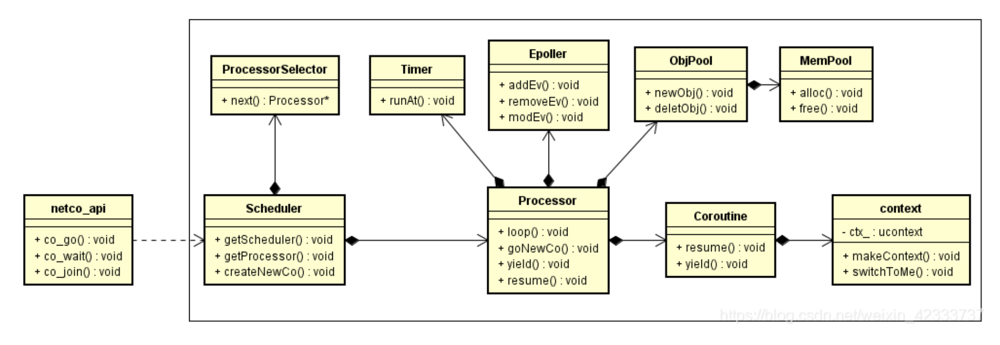

# 云风 coroutine

## 有栈协程的原理

一个程序要真正运行起来，需要两个因素：可执行代码段、数据。体现在 CPU 中，主要包含以下几个方面：

1. EIP 寄存器：用来存储 CPU 要读取指令的地址
2. ESP 寄存器：指向当前线程栈的栈顶位置
3. 其他通用寄存器的内容：包括代表函数参数的 rdi、rsi 等等。
4. 线程栈中的内存内容。

这些数据内容，我们一般将其称为 “上下文” 或者 “现场”。

有栈协程的原理，就是从线程的上下文下手，如果把线程的上下文完全改变。即：改变 EIP 寄存的内容，指向其他指令地址；改变线程栈的内存内容等等。
这样的话，当前线程运行的程序也就完全改变了，是一个全新的程序。

Linux 下提供了一套函数，叫做 ucontext 簇函数，可以用来获取和设置当前线程的上下文内容。这也是 coroutine 的核心方法。

## 协程调度器

```c
struct schedule {
	char stack[STACK_SIZE];		// 运行时栈

	ucontext_t main; 			// 主协程的上下文,方便后面协程执行完回到主协程
	int nco; 					// 当前存活的协程个数
	int cap; 					// 协程管理器的当前最大容量，即可以同时支持多少个协程。如果不够了，									  则进行扩容
	int running; 				// 正在运行的协程ID
	struct coroutine **co; 		// 一个一维数组，用于存放协程 
};
```

`coroutine_open` 负责创建并初始化一个协程调度器，`coroutine_close` 负责销毁协程调度器以及清理其管理的所有协程。

## 协程的创建

协程模型

```c
struct coroutine {
	coroutine_func func; 		// 协程所用的函数
	void *ud;  					// 协程参数
	ucontext_t ctx; 			// 协程上下文
	struct schedule * sch; 		// 该协程所属的调度器
	ptrdiff_t cap; 	 			// 已经分配的内存大小
	ptrdiff_t size; 			// 当前协程运行时栈，保存起来后的大小
	int status;					// 协程当前的状态
	char *stack; 				// 当前协程的保存起来的运行时栈
};
```

`coroutine_new` 负责创建并初始化一个新的协程对象，将该协程对象放到协程调度器中。

扩容机制：2倍扩容

无需扩容：找到一个位置，放置初始化好的协程。

这样，一个协程对象就被创建好，此时该协程的状态是 `READY`，但尚未正式执行。

`coroutine_resume` 函数会切入到指定协程中执行。当前正在执行的协程的上下文会被保存起来，同时上下文替换成新的协程，该协程的状态将被置为 `RUNNING`。

进入 `coroutine_resume` 函数的前置状态有两个 `READY` 和 `SUSPEND`，这两个状态下 `coroutine_resume` 的处理方法也是有很大不同。我们先看下协程在 READY 状态下进行 `coroutine_resume` 的流程。

## 状态转换

在 coroutine 中协程定义了四种状态，整个运行期间，也是根据这四种状态进行轮转。


### `READY` -> `RUNNING`

```c
	case COROUTINE_READY:
	    // 初始化ucontext_t结构体,将当前的上下文放到C->ctx里面
		getcontext(&C->ctx);
		// 将当前协程的运行时栈的栈顶设置为S->stack
		// 每个协程都这么设置，这就是所谓的共享栈。（注意，这里是栈顶）
		C->ctx.uc_stack.ss_sp = S->stack; 	// 设置当前协程的运行时栈（共享栈）
		C->ctx.uc_stack.ss_size = STACK_SIZE;
		C->ctx.uc_link = &S->main; // 如果协程执行完，将切换到主协程中执行
		S->running = id;
		C->status = COROUTINE_RUNNING;

		// 设置执行C->ctx函数, 并将S作为参数传进去
		uintptr_t ptr = (uintptr_t)S;
		makecontext(&C->ctx, (void (*)(void)) mainfunc, 2, (uint32_t)ptr, (uint32_t)(ptr>>32));

		// 将当前的上下文放入S->main中，并将C->ctx的上下文替换到当前上下文
		swapcontext(&S->main, &C->ctx);
		break;
```

`makecontext` 用来设置对应 `ucontext` 的执行函数，上面讲`C->ctx` 的执行函数题设置为 `mainfunc`，后面的两个参数也非常有意思，这个可以看出来是把一个指针掰成了两个 `int` 作为参数传给 `mainfunc` 了。而在 `mainfunc` 的实现可以看出来，又会把这两个 `int` 拼成了一个 `struct schedule*`。

> 这是因为 `makecontext` 的函数指针的参数是 `uint32_t` 类型，在 64 位系统下，一个 `uint32_t` 没法承载一个指针, 所以基于兼容性的考虑，才采用了这种做法。

接下来调用了 `swapcontext` 函数，这个函数比较简单，但也非常核心。作用是将当前的上下文内容放入 `S->main` 中，并将 `C->ctx` 的上下文替换到当前上下文。这样的话，将会执行新的上下文对应的程序了。在 coroutine 中, 也就是开始执行 `mainfunc` 这个函数。(`mainfunc` 是对用户提供的协程函数的封装)。

### 协程切出

调用 `coroutine_yield` 可以使当前正在运行的协程切换到主协程中运行。此时，该协程会进入 `SUSPEND` 状态，`coroutine_yield` 的具体实现依赖于两个行为：

1. 调用 `_save_stack` 将当前协程的栈保存起来。因为 coroutine 是基于共享栈的，所以协程的栈内容需要单独保存起来。
2. `swapcontext` 将当前上下文保存到当前协程的 `ucontext` 里面，同时替换当前上下文为主协程的上下文。 这样的话，当前协程会被挂起，主协程会被继续执行。

如何保存当前协程的运行时栈，是重要的问题，栈的生长方向是从高地址往低地址，只要找到栈的栈顶和栈底的地址，就可以找到整个栈的内存空间。

 `_save_stack` 是这样做的：

```c
static void _save_stack(struct coroutine *C, char *top) {
	/* 
		这个dummy很关键，是求取整个栈的关键
		这个非常经典，涉及到linux的内存分布，栈是从高地址向低地址扩展，因此
		S->stack + STACK_SIZE就是运行时栈的栈底
		dummy，此时在栈中，肯定是位于最底的位置的，即栈顶
		top - &dummy 即整个栈的容量
    */
	char dummy = 0;
	assert(top - &dummy <= STACK_SIZE);
	if (C->cap < top - &dummy) {
		free(C->stack);
		C->cap = top-&dummy;
		C->stack = malloc(C->cap);
	}
	C->size = top - &dummy;
    // 从 dummy 拷贝 size 内存到 C->stack
	memcpy(C->stack, &dummy, C->size);
}
```

`dummy` 变量是刚刚分配到栈上的，此时就处于栈的最顶端的位置。


因此整个栈的大小就是从栈底到栈顶，`S->stack + STACK_SIZE - &dummy`。

### `SUSPEND->RUNNING`

当协程被 yield 之后会进入 `SUSPEND` 阶段，对该协程调用 `coroutine_resume` 会再次切入该协程。

```c
	case COROUTINE_SUSPEND:
	    // 将协程所保存的栈的内容，拷贝到当前运行时栈中
		// 其中C->size在yield时有保存
		memcpy(S->stack + STACK_SIZE - C->size, C->stack, C->size);
		S->running = id;
		C->status = COROUTINE_RUNNING;
		swapcontext(&S->main, &C->ctx);
		break;
```

`memcpy(S->stack + STACK_SIZE - C->size, C->stack, C->size);`
我们知道，在 yield 的时候，协程的栈内容保存到了 C->stack 数组中。
这个时候，就是用 memcpy 把协程的之前保存的栈内容，重新拷贝到运行时栈里面。这里有个点，拷贝的开始位置，需要简单计算下`S->stack + STACK_SIZE - C->size` 这个位置就是之前协程的栈顶位置。

`swapcontext(&S->main, &C->ctx);` 交换上下文。这点在上文有具体描述。

## 共享栈

本质上是所有协程在运行时候都使用同一个栈空间，还有非共享栈，也就是每个协程的栈空间都是独立的，固定大小。好处是协程切换的时候，内存不用拷贝来拷贝去。坏处则是 **内存空间浪费**。

栈运行时不能随时扩容，否则指针操作时可能失效。防止栈内存不够，每个协程都要预先开一个足够的栈空间使用。共享栈则是提前开了一个足够大的栈空间 (coroutine 默认是 1M)。所有的栈运行的时候，都使用这个栈空间。

conroutine 是这么设置每个协程的运行时栈：

```c
C->ctx.uc_stack.ss_sp = S->stack;
C->ctx.uc_stack.ss_size = STACK_SIZE;
```

对协程调用 yield 的时候，该协程栈内容暂时保存起来，保存的时候需要用到多少内存就开多少，这样就减少了内存的浪费。(即_save_stack 函数的内容)。
当 resume 该协程的时候，协程之前保存的栈内容，会被重新拷贝到运行时栈中。

# 微信 libco 协程库

libco 在协程的栈空间上有不一样的地方：

1. 共享栈是可选的，如果想要使用共享栈模式，则需要用户自行创建栈空间，在 co_create 时传递给 libco。(参数 `stCoRoutineAttr_t* attr`)
2. 支持协程使用独立的栈空间，不使用共享栈模式。(默认每个协程有 128k 的栈空间)
3. libco 默认是独立的栈空间，不使用共享栈。

使用系统函数hook

系统函数 hook，简单来说，就是可以替换原有的系统函数，例如 read、write 等，将其替换为自己的逻辑。libco 目前所有关于 hook 系统函数的代码都在 `co_hook_sys_call.cpp` 中可以看到。

## 关键数据结构

### `stCoroutine_t`

这个结构就代表 libco 的协程，记录着一个协程拥有的各种资源，同一个线程上的协程共享一个`stCoRoutineEnv_t`结构，libco 协程一经创建就和创建时的那个线程绑定

```cpp
struct stCoRoutine_t
{
	stCoRoutineEnv_t *env;		// 协程的执行环境，libco的协程一旦创建后就和创建时协程绑定了
	pfn_co_routine_t pfn;		// 协程对应的函数
	void *arg;
	coctx_t ctx;				// 协程上下文（包括寄存器和栈）
    
    // 状态和状态变量
	char cStart;				// 是否开始运行
	char cEnd;					// 是否已经结束
	char cIsMain;				// 是否是主协程
	char cEnableSysHook;		// 是否要打开hook标识，默认是关闭的
	char cIsShareStack;			// 是否采用共享栈

	void *pvEnv;				// 保存系统环境变量的指针

	//char sRunStack[ 1024 * 128 ];
	stStackMem_t* stack_mem;	// 协程运行的栈内存，固定的128K的大小
    
	//save satck buffer while confilct on same stack_buffer;
	char* stack_sp; 			// 栈寄存器指向栈顶的位置
	unsigned int save_size;
	char* save_buffer;			// 单独分配的缓存区

	stCoSpec_t aSpec[1024];
};
```

### `stCoRoutineEnv_t`

运行在同一个线程的各协程是共享该结构的，是个全局性的资源

```cpp
struct stCoRoutineEnv_t
{
	stCoRoutine_t *pCallStack[ 128 ];	// 保存函数调用链的栈，一个线程最多可以创建128个协程
	int iCallStackSize;
	stCoEpoll_t *pEpoll;				// 全局性指针，被一个线程上所有协程锁共享
	//for copy stack log lastco and nextco
	stCoRoutine_t* pending_co;			// 将要切换运行的协程
	stCoRoutine_t* occupy_co;			// 占有共享栈的协程
};
```

不使用共享栈时候最后两个都是空指针。

每当启动（==resume==）一个协程时，就将它的协程控制块 `stCoRoutine_t` 结构指针保存在 `pCallStack` 的“栈顶”，表示为 `pCallStack[iCallStackSize - 1]`，然后“栈指针”iCallStackSize 加 1，最后切换 context 到待启动协程运行。当协程要让出（==yield==）CPU 时，就将它的 `stCoRoutine_t` 从 `pCallStack` 弹出，“栈指针”`iCallStackSize` 减 1，然后切换 context 到当前栈顶的协程（原来被挂起的调用者）恢复执行。

**libco 的第一个协程 yield 后，CPU 控制权交给谁？**

libco 的第一个协程，是执行 `main` 函数的协程，是一个特殊的协程。这个协程又可以称为主协程，负责协调其他协程的调度执行，自己永远不会 yield，不会主动让出 CPU。（不意味着塔一直霸占 CPU）通过 resume 其他协程就可以转移 CPU 执行权，`co_resume()` 和 `co_yield()` 都伴随着上下文切换，即 CPU 控制流的转移，当程序中第一次调用 `co_resume()` 时，CPU 执行权就从主协程转移到了 resume 目标协程上了。

**主协程何时被创建出来？**

主协程和 `stCoRoutineEnv_t` 一同被创建，住协程就是程序本身，即 `main` 函数，可以认为就是一个结构体。程序首次调用 `co_create()` 时，此函数内部回判断当前进程（线程）的 `stCoRoutineEnv_t` 是否已分配，如果未分配则分配一个，同时分配一个 `stCoRoutine_t` 结构，并将 `pCallStack[0]` 指向主协程。后续用 `co_resume()` 启动协程，会将 `resume` 的协程压入 `pCallStack` 栈。如图所示：


coroutine2 整处于栈顶，也即是说，当前正在 CPU 上 running 的协程是 coroutine2。而 coroutine2 的调用者是谁呢？是谁 resume 了 coroutine2 呢？是 coroutine1。coroutine1 则是主协程启动的，即在 main 函数里 resume 的。当 coroutine2 让出 CPU 时，只能让给 coroutine1；如果 coroutine1 再让出 CPU，那么又回到了主协程的控制流上了。

## 协程可以嵌套创建

libco 的协程可以嵌套创建，协程内部可以创建一个新的协程。libco 使用了一个栈来维护协程调用过程。模拟下这个调用栈的运行过程, 如下图所示：


图中绿色方块代表栈顶，同时也是当前正在运行的协程。

1. 当在主协程中 co_resume 到 A 协程时，当前运行的协程变更为 A，同时协程 A 入栈。
2. A 协程中 co_resume 到 B 协程，当前运行的协程变更为 B，同时协程 B 入栈。
3. 协程 B 中调用 co_yield_ct。协程 B 出栈，同时当前协程切换到协程 A。
4. 协程 A 中调用 co_yield_ct。协程 B 出栈，同时当前协程切换到主协程。

libco 的协程调用栈维护 `stCoRoutineEnv_t` 结构体中，如下：

```c
struct stCoRoutineEnv_t
{
	stCoRoutine_t *pCallStack[128];
	int iCallStackSize;
	stCoEpoll_t *pEpoll;
};
```

其中 `pCallStack` 即是协程的调用栈，从参数可以看出，libco 只能支持 128 层协程的嵌套调用，这个深度已经足够使用了。

## libco 协程的生命周期

### 创建协程(create coroutines)

```cpp
/*
* 创建一个协程对象
* 
* @param ppco - (output) 协程的地址，未初始化，需要在此函数中将其申请内存空间以及初始化工作，co_create 会为							新协程分配一个“协程控制块”，*ppco指向这个分配的协程控制快
* @param attr - (input) 协程属性，两个属性：栈大小、指向共享栈的指针
* @param pfn - (input) 协程所运行的函数
* @param arg - (input) 协程运行函数的参数（类似 pthread 传递给线程的参数）
*/
int co_create( stCoRoutine_t **ppco, const stCoRoutineAttr_t *attr, 
              pfn_co_routine_t pfn, void *arg ) {
	if( !co_get_curr_thread_env() ) {
		co_init_curr_thread_env();
	}
	stCoRoutine_t *co = co_create_env( co_get_curr_thread_env(), attr, pfn,arg );
	*ppco = co;
	return 0;
}
```

创建后并没有启动，传递的 `pfn` 函数还没有被调用，实质，这个函数内部仅仅是分配并初始化了 `stCoRoutine_t` 结构体、设置任务函数指针、分配一段“栈”内存，以及分配和初始化 coctx_t。但其实这里的栈内存都是调用 `malloc` 从进程的堆内存分配出阿里的，对协程来说这是栈，但对底层的进程来说只不过是普通的堆内存。

初始化 `stCoRoutineEnv_t` 分为两部分：

1. 为 `stCoRoutineEnv_t` 申请空间并进行初始化，设置协程调度器 `pEpoll` ；
2. 创建空的 coroutine，初始化上下文环境，将其加入该线程的协程环境中进行管理，并且将其设置为 main coroutine 用来运行线程主逻辑。

初始化完成协程环境后，调用函数 `co_create_env` 来创建具体协程，该函数初始化一个协程结构 `stCoRoutine_t`，设置该结构中的各项字段，例如运行的函数 `pfn`，运行时的栈地址等等。需要说明的就是，如果使用了非共享栈模式，则需要为该协程单独申请栈空间，否则从共享栈中申请空间。

### 启动协程(resume a coroutine)

```cpp
/*
* 继续运行协程
* @param co - (input) 要切换的协程
*/
void co_resume( stCoRoutine_t *co )
{
	stCoRoutineEnv_t *env = co->env;
	// 找到当前运行的协程, 从数组最后一位拿出当前运行的协程，如果目前没有协程，那就是主线程
	stCoRoutine_t *lpCurrRoutine = env->pCallStack[ env->iCallStackSize - 1 ];
	if( !co->cStart )
	{
		// 如果当前协程还没有开始运行，为其构建上下文（仅当协程是第一次启动时才会执行到）
		coctx_make( &co->ctx,(coctx_pfn_t)CoRoutineFunc,co, 0 );
		co->cStart = 1;
	}
	// 将待启动的协程 co 压入 pCallStack 栈
	env->pCallStack[ env->iCallStackSize++ ] = co;
	// 将当前运行的上下文保存到lpCurrRoutine中，同时将协程co的上下文替换进去
	// 执行完这一句，当前的运行环境就被替换为 co 了
	co_swap( lpCurrRoutine, co );
}

```

由于 libco 的协程是非对称协程，协程在让出 CPU 后恢复执行时，要调用 `co_resume` 这个函数去启动协程。`co_create` 只有一次，而 `co_resume` 可以暂停后恢复启动，可以多次调用。协程想要获得 CPU 的执行权用 "resume"，让出 CPU 的执行权用 "yield"。


在 libco 中协程只有两种状态：running 和 pending，创建一个协程调用 `resume()` 后就进入running 状态，之后可以通过 `yield()` 让出 CPU 进入 pending 状态，不断在这两个状态中反复，直到协程退出。

`co_swap` 的作用是将将当前正在运行的 coroutine 的上下文以及状态保存在 `lpCurrRoutine` 中，并且将 `co` 设置要运行的协程，实现协程的切换。

`co_swap` 具体完成三项工作：

1. 记录当前协程 `curr` 的运行栈的栈顶指针，通过 `char c; curr_stack_sp=&c` 实现，当下次切换回 `curr`时，可以从该栈顶指针指向的位置继续，执行完 `curr` 后可以顺利释放该栈；
2. 处理共享栈相关的操作，并且调用函数 `coctx_swap` 来完成上下文环境的切换。注意执行完 `coctx_swap` 之后，执行流程将跳到新的 coroutine 也就是 pending_co 中运行，后续的代码需要等下次切换回 `curr` 时才会执行；
3. 当下次切换回 `curr` 时，处理共享栈相关的操作。

### 协程的挂起(yield to another coroutine)

A 协程 resume 启动了 B 协程，只有当 B 协程执行 yield 操作时才会返回到 A 协程。

```cpp
/*
* 主动将当前运行的协程挂起，并恢复到上一层的协程
* @param env 协程管理器 
*/
void co_yield_env( stCoRoutineEnv_t *env )
{
	// last就是 找到上次调用co_resume(curr)的协程
	stCoRoutine_t *last = env->pCallStack[ env->iCallStackSize - 2 ];
	stCoRoutine_t *curr = env->pCallStack[ env->iCallStackSize - 1 ];	// 当前栈
	env->iCallStackSize--;
	co_swap( curr, last); 	// 把上下文当前的存储到curr中，并切换成last的上下文
}
```

`co_resume()` 函数是有明确的对象的，而且可以通过 `resume` 将 CPU 交给任意协程，但 `yield` 不同，只能 `yield` 交给当前协程的调用者，不能随意 `yield` 给任意协程，libco 中还提供了一个 `co_yield` 函数，看起来可以将 CPU 交给任意协程，但其实这是对 `co_yield_env` 加了一层封装。

同一个线程上的协程时共享一个 `stCoRoutineEnv_t` 结构的，如果尝试用 `co_yield` 给其他线程上的协程，程序就会挂掉，libco 中的协程是不支持线程间迁移。

### 协程的退出

协程的退出指协程的任务函数执行结束后发生的过程，是协程函数结束了它的生命周期。同协程挂起一样，协程退出时也应将 CPU 控制权交给它的调用者，也是通过调用 `co_yield_env()` 函数来完成的。

值得注意的是，我们调用 `co_create()`、`co_resume() `启动协程执行一次性任务，当任务结束后要记得调用 ` co_free()` 或 `co_release()` 销毁这个临时性的协程，否则将引起内存泄漏。

## 使用 libco

以 libco 提供的例子 example_echosvr.cpp 来介绍应用程序如何使用 libco 来编写服务端程序。 在 example_echosvr.cpp 的 `main` 函数中，主要执行如下几步：

1. 创建 socket，监听在本机的 1024 端口，并设置为非阻塞；
2. 主线程使用函数 `readwrite_coroutine` 创建多个读写协程，调用 `co_resume` 启动协程运行直到其挂起。
3. 主线程继续创建 socket 接收协程 accpet_co，同样调用 `co_resume` 启动协程直到其挂起；
4. 主线程调用函数 `co_eventloop` 实现事件的监听和协程的循环切换；

函数 `readwrite_coroutine` 在外层循环中将新创建的读写协程都加入到队列 `g_readwrite` 中，此时这些读写协程都没有具体与某个 socket 连接对应，可以将队列 `g_readwrite` 看成一个 coroutine pool。当加入到队列中之后，调用函数 `co_yield_ct` 函数让出 CPU，此时控制权回到主线程。

主线程中的函数 `co_eventloop` 监听网络事件，将来自于客户端新进的连接交由协程 accept_co 处理，accept_co 调用函数 `accept_routine` 接收新连接，该函数的流程如下：

1. 检查队列 `g_readwrite` 是否有空闲的读写 coroutine，如果没有，调用函数 `poll` 将该协程加入到 epoll 管理的定时器队列中，也就是 sleep(1000) 的作用；
2. 调用 `co_accept` 来接收新连接，如果接收连接失败，那么调用 `co_poll` 将服务端的 `listen_fd` 加入到 epoll 中来触发下一次连接事件；
3. 对于成功的连接，从 `g_readwrite` 中取出一个读写协程来负责处理读写；

再次回到函数 `readwrite_coroutine` 中，该函数会调用 `co_poll` 将新建立的连接的 fd 加入到 epoll 监听中，并将控制流程返回到 main 协程；当有读或者写事件发生时，epoll 会唤醒对应的 coroutine ，继续执行 `read` 函数以及 `write` 函数。

## 事件驱动与协程调度

### 主协程与协程的调度

libco 程序中都有一个主协程，即程序里首次调用 `co_create()` 显式创建第一个协程，在 example_cond.cpp 中就是主函数调用 `co_eventloop()` 的这个协程。当生产者或消费者阻塞后，CPU 将 yield 给主协程，主协程在`co_eventloop()` 函数中。`co_eventloop()` 是“调度器”的核心所在。libco 中类似 `epoll/kqueue` 这样的 I/O 事件通知机制被隐藏了起来，只需要使用普通 C 库的 `read()`、`write()` 等同步地读写数据就好，`epoll` 被隐藏在主协程的`co_eventloop()` 中。

### `epoll` 监听 fd

协程可以通过函数 `co_poll` 来将 fd 交给 Epoll 管理，待 Epoll 相应事件触发时，切换回来执行 read 或 write 操作，实现由 Epoll 管理协程的功能。`co_poll` 函数原型：

```c++
/*
* @param ctx epoll 相关的数据结构
* @param fds pollfd 结构的文件句柄 
* @param nfds fds 数组长度
* @param timeout_ms 定时器事件
*/
int co_poll(stCoEpoll_t *ctx, struct pollfd fds[], 
            nfds_t nfds, int timeout_ms)
```

libco 的事件循环同时支持 epoll 和 kqueue，libco 会在每个线程维护一个 `stCoEpoll_t` 对象（被同一个线程上的所有协程所共享。`stCoEpoll_t` 结构体中维护了事件循环需要的数据。

```cpp
struct stCoEpoll_t
{
	int iEpollFd;								// epoll 文件描述符
	static const int _EPOLL_SIZE = 1024 * 10;	// 一次 epoll_wait 最多返回的就绪事件个数
	struct stTimeout_t *pTimeout;				// 时间轮定时管理器。记录了所有的定时事件
	struct stTimeoutItemLink_t *pstTimeoutList;	// 链表头，临时存放超时事件
	struct stTimeoutItemLink_t *pstActiveList;	// epoll_wait 得到的就绪事件和定时器超时事件
	co_epoll_res *result;  				// epoll_wait 的已触发事件（epoll_wait 第二个参数的封装
};
```

`co_epoll_res` 是对 Epoll 事件数据结构的封装，也就是每次触发 Epoll 事件时的返回结果，在 Unix 和 MaxOS 下，libco 将使用 Kqueue 替代 Epoll，因此这里也保留了 kevent 数据结构。

```c++
struct co_epoll_res
{
    int size;
    struct epoll_event *events;  // for linux epoll
    struct kevent *eventlist;    // for Unix or MacOs kqueue
};
```

`co_poll` 实际是对函数 `co_poll_inner` 的封装。我们将 `co_epoll_inner` 函数的结构分为上下两半段。在上半段中，调用 `co_poll` 的协程 $C$ 将其需要监听的句柄数组 `fds` 都加入到 Epoll 管理中，并通过函数 `co_yield_env` 让出 CPU；当 main 协程的事件循环 `co_eventloop` 中触发了 $C$ 对应的监听事件时，会恢复 $C$ 的执行。此时， $C$ 将开始执行下半段，即将上半段添加的句柄 `fds` 从 epoll 中移除，清理残留的数据结构，下面的流程图简要说明了控制流的转移过程：


`co_poll` 首先在内部将传入的文件句柄数组 `fds` 转化为数据结构 `stPoll_t`，这一步主要是为了方便后续处理。该结构记录了 `iEpollFd`，`ndfs`，`fds` 数组，以及该协程需要执行的函数和参数。

> 需要注意：
>
> 1. 对于每一个 fd，为其申请一个 `stPollItem_t` 来管理对应 Epoll 事件以及记录回调参数。libco 在此做了一个小的优化，对于长度小于 2 的 `fds` 数组，直接在栈上定义相应的 `stPollItem_t` 数组，否则从堆中申请内存。这也是一种比较常见的优化，毕竟从堆中申请内存比较耗时；
> 2. 函数指针 `OnPollProcessEvent` 封装了协程的切换过程。当传入指定的 `stPollItem_t` 结构时，即可唤醒对应于该结构的 coroutine，将控制权交由其执行；

`co_poll` 的第二步，将 fd 数组全部加入 Epoll 中进行监听。协程 $C$ 将每一个 epoll_event 的 `data.ptr` 域设置为对应的 `stPollItem_t` 结构。这样当事件触发时，可以直接从对应的 `ptr` 中取出 `stPollItem_t` 结构，然后唤醒指定协程。如果还有 timout 参数，在 timeout 定时触发后，也会唤醒协程 $C$ 的执行，当整个上半段都完成后，`co_poll` 立即调用 `co_yield_env` 让出 CPU，执行流程跳转回到 main 协程中。

当执行流程再次跳回时，表明协程 $C$ 添加的读写等文件描述符已出发，可以进行读写操作了，此时 $C$ 首先将其在上半段中添加的文件描述符从 Epoll 中删除，清理残余的数据结构，再调用读写逻辑。

### 定时器

使用定时器功能，一般而言，首先向定时器中注册一个定时事件（Timer Event），在注册定时事件时需要指定这个事件在未来的触发时间，到达触发事件点后，我们会收到定时器的通知。

网络框架中的定时器可以看作是由两部分组成，第一部分是保存已注册 timer events 的数据结构，第二部分是定时通知机制。

针对第一部分，一般选用红黑树，比如 nginx；另一种就是时间轮，libco 就是采用这种数据结构。

定时器的第二部分，高精度（微秒级）的定时通知机制，一般使用 getitimer/setitimer 这类接口，放宽到毫秒级，可以直接使用  `epoll/kqueue` 这样的系统调用完成定时通知，这样网络 I/O 事件通知和定时事件通知的逻辑就统一起来了。

使用 epoll + 时间轮实现定时器的算法：

> 1. [epoll_wait] 调用 `epoll_wait()` 等待 I/O 就绪事件，最大等待时长设置为1毫秒；
> 2. [处理 I/O 就绪事件] 循环处理 `epoll_wait()` 得到的 I/O 就绪文件描述符；
> 3. [从时间轮取超时事件] 从时间轮取超时事件，放到 timeout 队列中；
> 4. [处理超时事件]如果 3 中取到的超时事件不为空，则循环处理 timeout 队列中的定时任务，否则跳到 1 继续事件循环；
> 5. 跳到 1，继续事件循环

### 挂起协程与恢复

libco 中调用 yield 的三种场景：

1. 用户程序主动调用 `co_yield_ct()`；
2. 程序调用了 `poll()` 或 `co_cond_timewait()` 陷入“阻塞”等待；
3. 程序调用 `connect(), read(), write(), recv(), send()` 等系统调用陷入“阻塞”等待。

重新 resume 启动一个协程也有三种情况：

1. 用户程序主动 yield 的情况，这种情况有赖于用户程序主动将协程 `co_resume()` 起来；
2. `poll()` 的目标文件描述符事件就绪或超时，`co_cond_timedwait()` 等到了其他协程的 `co_cond_signal()` 通知信号或等待超时；
3. `read(), write()` 等 I/O 接口成功读到或写入数据，或者读写超时。

> 针对第二种情况，生产者消费者就是一个很好的例子，程序不会主动调用 yield，也只有启动时调用了 resume。Producer 和 Consumer 是在 `poll()` 和 `co_cond_timedwait()` 函数中进行切换协程的。
>
> 先看消费者，消费者协程启动后，发现任务队列为空，调用 `co_cond_timedwait()` 函数阻塞等待，同 `pthread_cond_wait()` 是一样的，里面条件变量 `stCoCond_t` 类型内部也有一个“等待队列”。`co_cond_timedwait()` 函数内部首先将当前协程挂入条件变量的等待队列上，设置一个回调函数，回调函数适用于未来“唤醒”当前协程的。且如果 wait 的 timeout 参数大于0，那么当前执行环境的定时器上注册一个定时事件（挂到时间轮上）。
>
> 再看生产者，生产者协程启动后，向任务队列中投放一个任务，且调用 `co_cond_signal()` 通知消费者，然后调用 `poll()` 阻塞等待1000毫秒，`co_cond_signal()` 就是将条件变量的等待队列中的协程取出，挂到当前执行环境的 `pstActiveList` 中。`poll()` 函数中，首先将自己作为一个定时事件注册到定时器上，设置1秒的超时事件和一个回调函数（用于未来 resume 自己），然后调用 `co_yield_env()` 将 CPU 让给主协程。
>
> 那么主协程主要是干什么的？主要控制事件循环 `co_eventloop()` 函数，这个函数中主协程不断调用 `epoll_wait()` 函数，当有就绪的 I/O 事件就处理 I/O 事件，当有超时事件发生就处理超时事件，`pstActiveList` 队列上有活跃事件就处理活跃事件。“处理事件”就是调用其他的工作协程注册的回调函数，工作协程调用 `co_cond_timedwait()` 或 `poll()` 陷入“阻塞”等待，本质上即是通过 `co_yield_env()` 函数让出了 CPU；而主协程则负责在事件循环中“唤醒”这些“阻塞”的协程，所谓“唤醒”操作即调用工作协程注册的回调函数，这些回调内部使用 `co_resume()` 重新恢复挂起的工作协程。

> 对于第三种情况，调用 `read(), write()` 等 I/O 操作而陷入阻塞和最后恢复执行的过程，“阻塞”是在用户态实现的，libco 的协程在底层线程上是串行执行的，如果调用 `read(), write()` 使系统调用陷入真正的阻塞的话（当前线程被挂起），libco 程序就会完全停止运转。
>
> 为了避免陷入内核态阻塞，必须依靠内核提供的非阻塞 I/O 机制，将 `socket` 设置为 non-blocking 的。libco 通过 ==dlsym== 机制 hook 了各种 网络 I/O 相关的系统调用，使得用户以“同步”方式直接使用`read(), write()` 等系统调用，在 libco 中，想要使用 hook 后的系统调用，需要调用 `co_enable_hook_sys()`。

dlsym是一个计算机函数，功能是根据动态链接库操作句柄与符号，返回符号对应的地址，不但可以获取函数地址，也可以获取变量地址。

**分析改造后的 `read()`**

hook 后的函数做了4件事：

1. 将当前协程注册到定时器上，处理 `read()` 读超时事件；
2. 调用 `epoll_ctl()` 将自己注册到当前执行环境的 epoll 实例上；
3. 调用 `co_yield_env` 函数让出 CPU；
4. 如果主协程 `epoll_wait()` 得知 `read` 操作的文件描述符有可读事件发生，执行原 `read` 协程注册的回调函数将其唤醒（超时也同理），工作线程被唤醒后，调用真正的 ` read()` 系统调用。

这时候如果是正常 `epoll_wait` 得知文件描述符 I/O 就绪就会读到数据，如果是超时就会返回-1。总之，在外部使用者看来，这个 `read()` 就跟阻塞式的系统调用表现出几乎完全一致的行为了。

### `co_eventloop()`

```cpp
/*
* libco的核心调度
* 在此处调度三种事件：
* 1. 被hook的io事件，该io事件是通过co_poll_inner注册进来的
* 2. 超时事件
* 3. 用户主动使用poll的事件
* 所以，如果用户用到了三种事件，必须得配合使用co_eventloop
*
* @param ctx epoll管理器
* @param pfn 每轮事件循环的最后会调用该函数
* @param arg pfn的参数
*/
void co_eventloop( stCoEpoll_t *ctx,pfn_co_eventloop_t pfn,void *arg ) {
	if( !ctx->result ) {
		ctx->result =  co_epoll_res_alloc( stCoEpoll_t::_EPOLL_SIZE );
	}
	co_epoll_res *result = ctx->result;

	for (;;) {
        // 调用 epoll_wait() 等待 I/O 就绪事件，配合时间轮工作，timeout 设置为1ms
		int ret = co_epoll_wait( ctx->iEpollFd,result,stCoEpoll_t::_EPOLL_SIZE, 1 );
		// active 指针指向当前环境的 pstActiveList 队列，里面可能已有活跃的待处理事件
		stTimeoutItemLink_t *active = (ctx->pstActiveList);
		stTimeoutItemLink_t *timeout = (ctx->pstTimeoutList); // 处理超时事件的指针
		memset( timeout,0,sizeof(stTimeoutItemLink_t) );
		// 处理就绪的文件描述符
		for (int i=0; i<ret; i++) {
			stTimeoutItem_t *item = (stTimeoutItem_t*)result->events[i].data.ptr;
			if( item->pfnPrepare ) {
                // 如果定义了预处理回调，先做预处理
				item->pfnPrepare( item,result->events[i],active );
			} else {
                // 直接将就绪事件放入活跃队列中
				AddTail( active,item );
			}
		}

		unsigned long long now = GetTickMS();
		TakeAllTimeout( ctx->pTimeout,now,timeout );	// 取出已超时事件，放到 timeout 队列

		stTimeoutItem_t *lp = timeout->head;
		while( lp ) {
			//printf("raise timeout %p\n",lp);
			lp->bTimeout = true; // 遍历超时队列，设置事件已超时标志
			lp = lp->pNext;
		}
		// 将 timeout 队列合并到 active 队列
		Join<stTimeoutItem_t,stTimeoutItemLink_t>( active,timeout );

		lp = active->head;
		while( lp ) {
			PopHead<stTimeoutItem_t,stTimeoutItemLink_t>( active );
            if (lp->bTimeout && now < lp->ullExpireTime) {
				int ret = AddTimeout(ctx->pTimeout, lp, now);
				if (!ret) {
					lp->bTimeout = false;
					lp = active->head;
					continue;
				}
			}
			if ( lp->pfnProcess ) {
               // 遍历 active 队列，调用工作协程设置的 pfnProcess() 回调函数 resume 挂起的协程 
				lp->pfnProcess( lp );
			}
			lp = active->head;
		}
		if ( pfn ) {
			if( -1 == pfn( arg ) ) {
				break;
			}
		}

	}
}
```

# netco 协程库

## ucontext 组件

在类 System V 环境中,在头文件 `< ucontext.h >`  中定义了两个结构类型 `mcontext_t` 和 `ucontext_t` 和四个函数`getcontext(), setcontext(), makecontext(), swapcontext()` 利用它们可以在一个进程中实现用户级的线程切换。

`ucontext` 结构体：

```c++
typedef struct ucontext {
	struct ucontext *uc_link;
	sigset_t         uc_sigmask;	// 该上下文中的阻塞信号集合
	stack_t          uc_stack;		// 上下文中使用的栈
	mcontext_t       uc_mcontext;	// 上下文的特定机器表示
	...
} ucontext_t;
```

当前上下文（如：使用 `makecontext()` 创建的上下文）运行终止时会恢复 `uc_link` 指向的上下文

**四个函数：**

```c++
int getcontext(ucontext_t *ucp);
// 初始化 ucp 结构体，将当前的上下文保存到 ucp 中
```

```c++
int setcontext(const ucontext_t *ucp);
// 设置当前的上下文为 ucp
```

`setcontext` 的上下文 ucp 通过 `getcontext` 或 `makecontext` 取得，如果调用成功则不返回。

通过 `getcontext` 取得，会继续执行这个调用；

通过 `makecontext` 取得，会调用 `makecontext` 第二参数中指向的函数。

```c++
void makecontext(ucontext_t *ucp, void (*func)(), int argc, ...);
```

调用 `makecontext` 之前需要先调用 `getcontext`，然后给该上下文指定一个栈空间 `ucp->stack`，设置后继的上下文 `ucp->uc_link`。(**不设置后继上下文，不能实现切换**)

当上下文通过 `setcontext` 或者 `swapcontext` 激活后，执行 `func` 函数，`argc` 为 `func` 的参数个数，后面是 `func` 的参数序列。当 `func` 执行返回后，继承的上下文被激活，如果继承上下文为NULL时，线程退出。

```cpp
int swapcontext(ucontext_t *oucp, ucontext_t *ucp);
// 保存当前上下文到oucp结构体中，然后激活upc上下文
// 如果执行成功，getcontext返回0，setcontext和swapcontext不返回；
// 如果执行失败，getcontext,setcontext,swapcontext返回-1，并设置对应的errno.
```

## netco 框架



### context

context 类封装了 ucontext 上下文切换的操作，其他需要使用上下文切换的地方都使用 context 类，目的是将来想使用其他库的上下文切换方法是，只需要实现该类中的方法即可，主要实现了四个方法。

```c++
void makeContext(void (*func)(), Processor*, Context*);
//函数指针设置当前context的上下文入口
void makeCurContext();
//直接用当前程序状态设置当前context的上下文
void swapToMe(Context* pOldCtx);
//将当前上下文保存到oldCtx中，然后切换到当前上下文，若oldCtx为空，则直接运行
inline struct ucontext_t* getUCtx() { return &ctx_; };
//获取当前上下文的ucontext_t指针
```

### Coroutine

协程对象，主要实现协程的几个关键方法：`resume`，`yield`，实际真正的 `yield` 由 Processor 执行，这里的 `yield` 只是修改当前协程的状态。

### ObjPool 对象池

对象池主要用于创建 coroutine 实例上，对象池每次创建对象时，会先从**内存池**中取出相应大小的块，内存池与对象大小强相关的，有一个空闲链表，每次分配空间都从空间链表中取，如果空闲链表没有内容，首先会分配 `(分配次数+40)*对象大小` 的空间，然后分成一个个的块，挂到空闲链表上，这里空闲链表节点没有使用额外的空间：效仿的 stl 的二级配置器中的方法，将数据和 `next` 指针放在了一个 `union` 中。从内存池取出所需内存块后，会判断对象是否拥有 non-trivial （显式定义默认构造、拷贝构造、... ）构造函数，没有的话直接返回，有的话使用 $placement\ new$ 构造对象。

### Epoller

该类功能很简单，一个是监视 epoll 中是否有事件发生，一个是向 epoll 中添加、修改、删除监视的 fd。值得注意的是，该类并不存储任何协程对象实体，也不维护任何协程对象实体的生命期，使用的是 LT。

初始 `vector` 长度设置为 16。

设置 close-on-exec

### Timer

   定时器主要使用的 Linux 的 `timerfd_create` 创建的时钟 fd 配合一个优先队列（小根堆）实现的，原因是要求效率而没有移除协程的需求。小根堆中存放的是时间和协程对象的 pair：`std::priority_queue<std::pair<Time, Coroutine*>`。

```c++
//获取所有已经超时的需要执行的函数
void getExpiredCoroutines(std::vector<Coroutine*>& expiredCoroutines);
//在time时刻需要恢复协程pCo
void runAt(Time time, Coroutine* pCo);
//经过time毫秒恢复协程pCo
void runAfter(Time time, Coroutine* pCo);
void wakeUp();
//给timefd重新设置时间，time是绝对时间
bool resetTimeOfTimefd(Time time);
```

首先，初始化一个 `timefd_create` 一个 timefd，然后将它放入 epoll 中，如果调用 `runAt` 或 `runAfter` 时，先把新来的任务插入到小根堆中，判断是否是最近的任务，是的话调用 `resetTimeOfTimefd` 来更新时间，如果出现超时，`epoll_wait()` 会跳出阻塞，在 Processor 的主循环中首先处理的就是超时事件，方法就是与当前时间对比并取出小根堆中的协程，直到小根堆中所有任务的时间都比当前大，另外，取出来的协程会放在一个数组中，用于在 Processor 循环中执行。

  定时器还有另外一个功能，就是唤醒 `epoll_wait()`，当有新的协程加入时，实际就是通过定时器来唤醒的 processor 主循环，并执行新接受的协程。

### Processor

一个 Processor 在 netco 就对应一个线程。Processor 负责存放协程 Coroutine 实体并管理其生命周期。其成员如下：

```c++
std::queue<Coroutine*> newCoroutines_[2];
// newCoroutines_为双缓冲队列，一个队列存放新来的协程，另一个给Processor主循环用于执行新来的协程，执行完后就交换队列，每加入一个新的协程就会唤醒一次Processor主循环，以立即执行新来的协程。

std::vector<Coroutine*> actCoroutines_;
// 存放EventEpoller发现的活跃事件的队列，当epoll_wait被激活时，Processor主循环会尝试从Epoller中获取活跃的协程，存放在actCoroutine_队列中，然后依次恢复执行。

std::vector<Coroutine*> timerExpiredCo_;
// 存放超时的协程队列，当epoll_wait被激活时，Processor主循环会首先尝试从Timer中获取活跃的协程，存放在timerExpiredCo队列中，然后依次恢复执行。

std::vector<Coroutine*> removedCo_;
// 存放被移除的协程列表，要移除某一个事件会先放在该列表中，一次循环结束才会真正delete
```

执行顺序：首先执行超时的协程，然后执行新接管的协程，然后执行 epoller 中被激活的协程，最后清理 `removerdCo_` 中的协程。

### Scheduler

调度器，指协程应该运行在哪个 Processor 上，netco 中的该类为全局单例，所执行的调度也相对比较简单，其可以让用户指定协程运行在某个 Processor 上，若用户没有指定，则挑选协程数量最少的 Processor 接管新的协程。

在 libgo 和 Golang 中，scheduler 还有一个 steal 的操作，可以将一个协程从一个 Processor 中偷到另一个 Processor 中，因为其 Processor 的主循环是允许阻塞的，并且协程的运行完全由库决定。而 netco 可以让用户指定某个协程一直运行在某个 Processor 上。

### netco_api

像 Golang 一样将 Scheduler 进一步地封装成了函数接口而不是一个对象，所以只需要包含 netco_api.h，即可调用 netco 函数风格的协程接口，而无需关心任何库中的对象。

### Socket

封装了 socket 族函数

### RWMutex

RWMutex 是用于协程同步的读写锁，读锁互相不互斥而与写锁互斥，写锁与其它的均互斥。原理是类中维护了一个队列，若互斥了则将当前协程放入队列中等待另一协程解锁时的唤醒。

