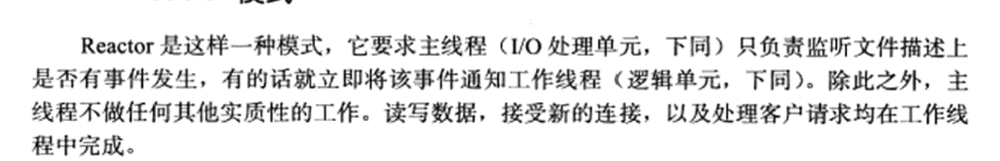
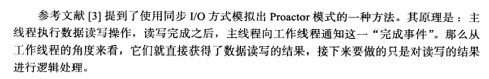

# C++

## 面向过程和面向对象的区别

面向过程是一种以过程为中心的编程思想，它首先分析出解决问题所需要的步骤，然后用函数把这些步骤一步一步实现，在使用时依次调用，是一种基础的顺序的思维方式。

面向对象把事物当作独立的对象，面向对象方法中的基础实现也包含面向过程的思想，但更关注各个对象之间的联系。

## 类的三大特性

封装、继承、多态

**封装**

把客观事物抽象为类，并且类可以把自己的数据和方法只让可信的类或者对象操作，对不可信的进行信息隐藏，C++ 中将公共的数据或方法使用public修饰，而不希望被访问的数据或方法采用private修饰。

**继承**

类的派生指的是从已有类产生新类的过程。原有的类成为基类或父类，产生的新类称为派生类或子类，子类继承基类后，可以创建子类对象来调用基类的函数，变量等。

**多态**

使用同一个接口但效果不同（重载实现编译时多态，虚函数实现运行时多态）

实现多态的方式：

覆盖（override）：子类重新定义父类的序函数。

重载（overload）：是指允许存在多个同名函数，而这些函数的参数表不同（或许参数个数不同，或许参数类型不同，或许两者都不同）

## 聊聊多态及其实现原理

多态是以封装和继承为基础实现的性质，一个形态的多种表现方式。硬要解释的话可以说是一个接口，多个功能，在用父类指针调用函数时，实际调用的是指针指向的实际类型（子类）的成员函数。

c++多态有以下几种：

1. 重载。函数重载和运算符重载，编译期。
2. 虚函数。子类的多态性，运行期。
3. 模板，类模板，函数模板。编译期

## 虚函数底层实现原理

**编译器中主要用虚表指针（vptr）和虚函数表（vtbl）来实现的**

当调用一个对象对应的函数时，通过对象内存中的 vptr 找到一个虚函数表（注意这虚函数表既不在堆上，也不再栈上）。虚函数表内部是一个函数指针数组，记录的是该类各个虚函数的首地址。然后调用对象所拥有的函数。

## 纯虚函数作用

定义纯虚函数是为了实现一个接口，起到一个规范的作用，规范继承这个类的程序员必须实现这个函数。纯虚函数的意义在于，让所有的类对象（主要是派生类对象）都可以执行纯虚函数的动作，但基类无法为纯虚函数提供一个合理的缺省实现。所以类纯虚函数的声明就是在告诉子类的设计者，“你必须提供一个纯虚函数的实现，但我不知道你会怎样实现它”。

有纯虚函数的类叫做抽象基类，对于抽象类来说，C++是不允许它去实例化对象的。也就是说，抽象类无法实例化对象。

## 构造函数可以是虚函数吗

当类中声明虚函数时，编译器会在类中生成一个虚函数表（vtbl），虚函数表是一个存储成员函数指针的数据结构。

虚函数表是由编译器自动生成与维护的，virtual成员函数会被编译器放入虚函数表中，当存在虚函数时，每个对象都有一个指向虚函数的指针（vptr指针）。在实现多态的过程中，父类和派生类都有vptr指针。

vptr的初始化：当对象在创建时，由编译器对vptr指针进行初始化。在定义子类对象时，vptr先指向父类的虚函数表，在父类构造完成之后，子类的vptr才指向自己的虚函数表。

如果构造函数是虚函数，那么调用构造函数就需要去找vptr，而此时vptr还没有初始化。

## 析构函数定义为虚函数

**为了防止内存泄漏。**具体地说，如果派生类中申请了内存空间，并在其析构函数中对这些内存空间进行释放。假设基类中采用的是非虚析构函数，当删除基类指针指向的派生类对象时就不会触发动态绑定，因而只会调用基类的析构函数，而不会调用派生类的析构函数。那么在这种情况下，派生类中申请的空间就得不到释放从而产生内存泄漏。

所以，为了防止这种情况的发生，C++中基类的析构函数应采用virtual虚析构函数。

## 强制类型转换方式（4种）

1. const_cast

    修改常量指针和常量引用为非常量

2. static_cast

    用于类层次结构中基类（父类）和派生类（子类）之间指针或引用的转换。注意：进行上行转换（把派生类的指针或引用转换成基类表示）是安全的；进行下行转换（把基类指针或引用转换成派生类表示）时，由于没有动态类型检查，所以是不安全的。

    基本的数据类型之间的转换

3. dynamic_cast

    主要用于继承关系的派生类和基类之间的转换

4. reinterpret_cast

    改变指针或引用的类型6

## 深浅拷贝

浅拷贝

浅拷贝只是拷贝一个指针，并没有新开辟一个地址，拷贝的指针和原来的指针指向同一块地址，如果原来的指针所指向的资源释放了，那么再释放浅拷贝的指针的资源就会出现错误。

深拷贝

深拷贝不仅拷贝值，还开辟出一块新的空间用来存放新的值，即使原先的对象被析构掉，释放内存了也不会影响到深拷贝得到的值。在自己实现拷贝赋值的时候，如果有指针变量的话是需要自己实现深拷贝的。

## 静态成员与普通成员的区别

- 生命周期

静态成员变量从类被加载开始到类被卸载，一直存在；

普通成员变量只有在类创建对象后才开始存在，对象结束，它的生命期结束；

- 共享方式

静态成员变量是全类共享；普通成员变量是每个对象单独享用的；

- 定义位置

普通成员变量存储在栈或堆中，而静态成员变量存储在静态全局区；

- 初始化位置

普通成员变量在类中初始化；静态成员变量在类外初始化；

- 默认实参

## 命名空间的作用

可以由用户命名的作用域，用于处理程序中常见的同名冲突。

## C++ 内存分区

**栈**：在执行函数时，函数内局部变量的存储单元都可以在栈上创建，函数执行结束时这些存储单元自动被释放。栈内存分配运算内置于处理器的指令集中，效率很高，但是分配的内存容量有限

**堆**：就是那些由 `new`分配的内存块，他们的释放编译器不去管，由我们的应用程序去控制，一般一个`new`就要对应一个 `delete`。如果程序员没有释放掉，那么在程序结束后，操作系统会自动回收

**自由存储区**：如果说堆是操作系统维护的一块内存，那么自由存储区就是C++中通过new和delete动态分配和释放对象的抽象概念。需要注意的是，自由存储区和堆比较像，但不等价。

**全局/静态存储区**：全局变量和静态变量被分配到同一块内存中，在以前的C语言中，全局变量和静态变量又分为初始化的和未初始化的，在C++里面没有这个区分了，它们共同占用同一块内存区，在该区定义的变量若没有初始化，则会被自动初始化，例如int型变量自动初始为0

**常量存储区**：这是一块比较特殊的存储区，这里面存放的是常量，不允许修改

## 谈一谈new/delete和malloc/free的区别和联系

联系：

都用于申请动态内存和释放动态内存

区别：

- malloc/free 是 C++/C 语言标准库函数，而 new/delte 是 C++ 的运算符。malloc 仅仅只分配内存，而不会进行初始化类成员的工作，new 不止分配内存，而且还是调用类的构造函数。

- new操作符申请内存的时候不需要指定内存块的大小，编译器会自动根据类型信息来计算，malloc需要显示的指出内存的大小。
- new 运算符从自由存储区上为对象动态分配内存空间。（new 所申请的内存区域也是在堆上），malloc 从堆上动态分配内存。

> 自由存储区和堆之间的相关问题:
>
> 在 C++ 中内存分为5个区，分别是堆、栈、自由存储区、全局/静态存储区、常量区。
>
> 堆和自由存储区都是 C++ 语言中的两块动态存储区域。但是我从这两块存储区申请的方式是有别的。比如对于自由存储区，必须用new和delete来存储和释放，对于堆中的内存必须用 malloc 和 free 来存储和释放。
>
> 堆是c语言和操作系统中的术语，是操作系统所维护的一块特殊的内存空间，提供了动态分配内存的功能。而自由存储区是c++这门语言自定义的一个抽象概念。因此c++也是使用堆来实现自由存储的，operator new的源码中也用的malloc和free来实现自由存储的。
>
> 总结：堆是一个物理概念，操作系统实实在在给你的东西。而自由存储区是一个逻辑概念。

## new[] 和 delete[]

如果 new 和 delete[] 使用，delete的时候会找前4个字节，看要释放的内存有多大。但是使用 new 导致没有设备区部分4个字节用来存放数组长度，这样会导致这4个字节是未定义的，因此会调用不定次的 delete。同时比如说其实地址为A，应该从A开始释放，现在会从A-4开始释放。

如果 new[] 和 delete 一起使用，程序会认为这是一个对象占用的空间，而不是数组，因此就析构一次。同时释放的是new[] 中表示长度的前4个字节的地址，应该从A-4开始释放，如果不从头释放的话回出问题。

## new和delete的实现原理， delete是如何知道释放内存的大小的？

1、 new简单类型直接调用operator new分配内存；

而对于复杂结构，先调用operator new分配内存，然后在分配的内存上调用构造函数；

对于简单类型，new[]计算好大小后调用operator new；

对于复杂数据结构，new[]先调用operator new[]分配内存，然后在p的前四个字节写入数组大小n，然后调用n次构造函数，针对复杂类型，new[]会额外存储数组大小；

① new表达式调用一个名为operator new(operator new[])函数，分配一块足够大的、原始的、未命名的内存空间；

② 编译器运行相应的构造函数以构造这些对象，并为其传入初始值；

③ 对象被分配了空间并构造完成，返回一个指向该对象的指针。

2、 delete简单数据类型默认只是调用free函数；复杂数据类型先调用析构函数再调用operator delete；针对简单类型，delete和delete[]等同。假设指针p指向new[]分配的内存。因为要4字节存储数组大小，实际分配的内存地址为[p-4]，系统记录的也是这个地址。delete[]实际释放的就是p-4指向的内存。而delete会直接释放p指向的内存，这个内存根本没有被系统记录，所以会崩溃。

3、 需要在 new [] 一个对象数组时，需要保存数组的维度，C++ 的做法是在分配数组空间时多分配了 4 个字节的大小，专门保存数组的大小，在 delete [] 时就可以取出这个保存的数，就知道了需要调用析构函数多少次了。

## 堆和栈空间

|              | 堆                                                           | 栈                                                           |
| ------------ | ------------------------------------------------------------ | ------------------------------------------------------------ |
| 管理方式     | 自己申请和释放                                               | 由系统自动分配                                               |
| 内存管理机制 | 系统有一个记录空闲内存地址的链表，当系统收到程序申请时，遍历该链表，寻找第一个空间大于申请空间的堆结点，删除空闲结点链表中的该结点，并将该结点空间分配给程序。 | 只要栈的剩余空间大于所申请空间，系统为程序提供内存，否则报异常提示栈溢出。 |
| 空间大小     | 不连续的内存区域，空间灵活                                   | 连续的内存区域，操作系统预先设定好                           |
| 碎片问题     | 频繁new/delete会造成大量碎片                                 | 不会产生碎片                                                 |
| 分配效率     | 效率比栈低很多                                               | 栈是其系统提供的数据结构，计算机在底层对栈提供支持，分配专门 寄存器存放栈地址，栈操作有专门指令。 |

## RAII 理解与使用

资源获取就初始化，是一种资源管理技术。

使用资源需要遵循的三个步骤：

1. 获取资源
2. 使用资源
3. 释放资源

在构造函数中申请分配资源，在析构函数中释放资源。因为C++的语言机制保证了，当一个对象创建的时候，自动调用构造函数，当对象超出作用域的时候会自动调用析构函数。所以，在RAII的指导下，我们应该使用类来管理资源，将资源和对象的生命周期绑定。**RAII的核心思想是将资源或者状态与对象的生命周期绑定，通过C++的语言机制，实现资源和状态的安全管理,智能指针是RAII最好的例子**（使用智能指针，可以实现自动的内存管理，再也不需要担心忘记delete造成的内存泄漏。）

# C++ 11

## 智能指针实现原理

智能指针是一个类，用于存储指向动态分配对象的指针，负责自动释放动态分配的对象，防止内存泄漏。动态分配的资源交给类去管理，当类对象生命周期结束时，自动调用析构函数释放资源。

**shared_ptr**

实现原理：采用引用计数器的方法，允许多个智能指针指向同一个对象，每当多一个指针指向该对象时，指向该对象的所有智能指针内部的引用计数加1，每当减少一个智能指针指向对象时，引用计数会减1，当计数为0的时候会自动的释放动态分配的资源。

- 智能指针将一个计数器与类指向的对象相关联，引用计数器跟踪共有多少个类对象共享同一指针
- 每次创建类的新对象时，初始化指针并将引用计数置为1
- 当对象作为另一对象的副本而创建时，拷贝构造函数拷贝指针并增加与之相应的引用计数
- 对一个对象进行赋值时，赋值操作符减少左操作数所指对象的引用计数（如果引用计数为减至0，则删除对象），并增加右操作数所指对象的引用计数
- 调用析构函数时，构造函数减少引用计数（如果引用计数减至0，则删除基础对象）

**unique_ptr**

unique_ptr 采用的是独享所有权语义，一个非空的 unique_ptr 总是拥有它所指向的资源。转移一个 unique_ptr 将会把所有权全部从源指针转移给目标指针，源指针被置空。

unique_ptr不支持普通的拷贝和赋值操作，不能用在STL标准容器中；局部变量的返回值除外（因为编译器知道要返回的对象将要被销毁）；如果你拷贝一个unique_ptr，那么拷贝结束后，这两个unique_ptr都会指向相同的资源，造成在结束时对同一内存指针多次释放而导致程序崩溃。

**weak_ptr**

弱引用。 引用计数有一个问题就是互相引用形成环（环形引用），这样两个指针指向的内存都无法释放。需要使用weak_ptr 打破环形引用。weak_ptr 是一个弱引用，它是为了配合 shared_ptr 而引入的一种智能指针，它指向一个由 shared_ptr 管理的对象而不影响所指对象的生命周期，也就是说，它只引用，不计数。如果一块内存被 shared_ptr 和 weak_ptr 同时引用，当所有 shared_ptr 析构了之后，不管还有没有 weak_ptr 引用该内存，内存也会被释放。所以weak_ptr 不保证它指向的内存一定是有效的（使用之前使用函数 lock() 检查 weak_ptr 是否为空指针）

## 智能指针出现循环引用怎么解决？

弱指针用于专门解决shared_ptr循环引用的问题，weak_ptr不会修改引用计数，即其存在与否并不影响对象的引用计数器。循环引用就是：两个对象互相使用一个shared_ptr成员变量指向对方。弱引用并不对对象的内存进行管理，在功能上类似于普通指针，然而一个比较大的区别是，弱引用能检测到所管理的对象是否已经被释放，从而避免访问非法内存。

## lambda 表达式

lambda表达式定义了一个匿名函数，并且可以捕获一定范围内的变量。lambda表达式的语法形式简单归纳如下：

```
[capture](params) opt -> ret {body;};
```

其中`capture`是捕获列表，`params`是参数列表，`opt`是函数选项，`ret`是返回值类型，`body`是函数体。

1. 捕获列表[]: 捕获一定范围内的变量

2. 参数列表(): 和普通函数的参数列表一样，如果没有参数参数列表可以省略不写。

    ```c++
    auto f = [](){return 1;}	// 没有参数, 参数列表为空
    auto f = []{return 1;}		// 没有参数, 参数列表省略不写
    ```

3. opt 选项， `不需要可以省略`

    - mutable: 可以修改按值传递进来的拷贝（注意是能修改拷贝，而不是值本身）
    - exception: 指定函数抛出的异常，如抛出整数类型的异常，可以使用throw();

4. 返回值类型：在C++11中，lambda表达式的返回值是通过返回值后置语法来定义的。

5. 函数体：函数的实现，这部分不能省略，但函数体可以为空。

## 左值引用和右值引用

在C++11中所有的值必属于左值、右值两者之一，右值又可以细分为纯右值、将亡值。在C++11中可以取地址的、有名字的就是左值，反之，不能取地址的、没有名字的就是右值（将亡值或纯右值）。

左值引用：传统的C++中引用被称为左值引用

右值引用：C++11中增加了右值引用，右值引用关联到右值时，右值被存储到特定位置，右值引用指向该特定位置，也就是说，右值虽然无法获取地址，但是右值引用是可以获取地址的，该地址表示临时对象的存储位置

右值引用特点：

- 通过右值引用的声明，右值又“重获新生”，其生命周期与右值引用类型变量的生命周期一样长，只要该变量还活着，该右值临时量将会一直存活下去
- 右值引用独立于左值和右值。意思是右值引用类型的变量可能是左值也可能是右值
- T&& t在发生自动类型推断的时候，它是左值还是右值取决于它的初始化。

# STL

## STL常用容器详解

string

vector 序列式容器，和 array 相似，但 array 占用的是静态空间，一旦配置了就不能改变大小，遇到空间不足需要自行开辟更大的空间，vector 使用的是动态空间配置，维护一块**连续的线性空间**，在空间不足时，可以自动扩展空间容纳新元素，做到按需供给。其在扩充空间的过程中仍然需要经历：**重新配置空间，移动数据，释放原空间**等操作。动态扩容规则：与编译器有关，1.5或2倍。

deque 相比vector是单向开口（尾部）的连续线性空间，deque 则是一种双向开口的连续线性空间，deque 和 vector 的最大差异一个是 deque 运行在常数时间内对头端进行元素操作，二是 deque 没有容量的概念，它是动态地以分段连续空间组合而成，可以随时增加一段新的空间并链接起来。

queue

stack

list

set / unordered_set 红黑树实现

map / unordered_map

## 排序算法

### 冒泡

冒泡排序是一种简单的排序算法。它重复地走访过要排序的数列，一次比较两个元素，如果它们的顺序错误就把它们交换过来。走访数列的工作是重复地进行直到没有再需要交换，也就是说该数列已经排序完成。

从头部开始，进行两两排序，根据用大小交换位置，最后将大的数据元素交换到数组的尾部，成为有序序列的一部分，下一次再次重复这个过程直到所有的元素都排好序

O(n^2)

### 插入排序

1. 把待排序的数组分成已排序和未排序两部分，初始的时候把第一个元素认为是已排好序的。
2. 从第二个元素开始，在已排好序的子数组中寻找到该元素合适的位置并插入该位置。
3. 重复上述过程直到最后一个元素被插入有序子数组中。

### 归并排序

分治

### 快排

1. 从数列中挑出一个元素，称为"基准"（pivot），
2. 重新排序数列，所有比基准值小的元素摆放在基准前面，所有比基准值大的元素摆在基准后面（相同的数可以到任何一边）。在这个分区结束之后，该基准就处于数列的中间位置。这个称为分区（partition）操作。
3. 递归地（recursively）把小于基准值元素的子数列和大于基准值元素的子数列排序。

## 红黑树与二叉搜索树

二叉搜索树：任一节点所有的左子树小于当前的节点值，右子树大于当前节点值

## 红黑树与平衡二叉树

AVL：改进版本的二叉搜索树，可以有效减少二叉搜索树的深度

红黑树是一种特殊的平衡二叉树，追求大致平衡，每次插入最多只需要三次旋转就能达到平衡，平衡二叉树实现麻烦。

特点：

- 树中所有节点非红即黑。
- 根节点必为黑节点。
- 红节点的子节点必为黑（黑节点子节点可为黑）。
- 从根到NULL的任何路径上黑结点数相同。

## 哈希冲突的解决方案

拉链法：每个表格维护一个链表，如果hash函数计算出的格子相同，则按顺序存在这个链表中

开放寻址法：使用hash函数计算出的位置如果已经有元素占用了，则向后依次寻找，找到表尾则回到表头，直到找到一个空位

## STL 容器是否线程安全

不是线程安全的，对于顺序容器如 vector，在并发读的情况下，由于有潜在的内存重新申请和对象复制的问题，有可能会导致迭代器失效。

解决：

- 加锁
- 固定 vector 大小，避免动态扩容


# 项目

## 项目介绍

项目是为了学习 Linux 网络编程的基础知识，服务器对浏览器发送的 HTTP 请求进行解析处理，处理完成后给客户返回图片或文字资源，服务器后端使用 socket 进行网络通信，利用 I/O 多路复用来处理并发请求，使用线程池技术来提高服务器的性能，事件处理模型使用 Reactor 和 模拟 Proactor 实现，并发模式使用的是半同步/半反应堆模式。

使用了一个主线程和四个工作线程，主线程将任务添加到线程池，使用 epoll 作 I/O 多路复用的实现方式，epoll 使用 EPOLLONESHOT 保证一个 socket 在任意时刻只能被一个线程处理，同时 epoll 的触发模式选择了 ET 模式，ET 模式要高效很多，不会被同一事件触发多次，每次读都必须循环读取直到 EAGIN 错误，确保处理完。

> **项目架构:**
>
> - 主线程：
>     1. 在主线程中，epoll监听套接字，处理新客户的连接请求，或者是已连接客户的写请求
>     2. 将写请求封装成一个request_data对象，这个对象包括文件描述符，发送的报文，数据的处理函数等
>     3. 设置request_data中的timer为NULL，表示处理完一个request_data就delete，所以默认是短连接。如果报文解析到长链接，则会在后面补上timer时间。然后将request_data对象放在线程池的任务队列中等待工作线程的处理
>     4. 主线程还有一个while循环，利用最小堆管理定时器节点，删除超时事件。
> - 工作线程：
>     1. 工作变量使用封装好的同步机制类从任务队列中取出任务，利用request_data自己的处理函数分析http报文，发送http响应
>     2. 如果分析到报文里面有keep_alive选项，则不会销毁request_data对象，而是清空对象中的消息保留下来。
>     3. keep-alive长连接不是永久保留的，而是设置了一个定时器（也就是keep-alive中的timer成员）超时，超出时间以后，就把他关闭掉，这里超时时间设定为500ms。然后加入到最小堆中。
>     4. 最后由于一开始fd是EPOLLNOESHOT模式，还需要再epoll ctl设置一下fd的状态，使得他可以再次被监听。

## 概况

- epoll ET
- mysql（业务部分）
- 数据库连接池
- 线程池
- 日志
- 定时器
- 事件处理模式：Reactor 模式
- 读写缓冲区


## 特点

- 使用 epoll I/O复用 + 非阻塞 I/O + 边缘触发(ET) 实现高并发处理请求，事件处理模式使用的是 Reactor模式

- 线程池提高并发，降低频繁创建线程的开销

    线程池的实现模型就是半同步/半反应堆的。有三个类，任务类，任务队列类，线程池类。

- RAII 手法封装线程同步机制

- epoll 使用 EPOLLONESHOT 保证一个 socket 连接在任意时刻都只被一个线程处理

    EPOLLONESHOT事件(保证线程安全)

    即使**使用 ET 模式**，一个socket 上的某个事件还是可能被触发多次。这在并发程序中就会引起一个 问题。**比如一个线程在读取完某个 socket 上的数据后开始处理这些数据，而在数据的处理过程中该 socket 上又有新数据可读（EPOLLIN 再次被触发）**，此时另外一个线程被唤醒来读取这些新的数据。于是就出现了两个线程同时操作一个 socket 的局面。一个socket连接在任一时刻都只被一个线程处理，可以使用 epoll 的 EPOLLONESHOT 事件实现。

    对于注册了 EPOLLONESHOT 事件的文件描述符，**操作系统最多触发其上注册的一个可读、可写或者异常事件，且只触发一次**，**除非我们使用 epoll_ctl 函数重置该文件描述符上注册的 EPOLLONESHOT 事件**。这样，当一个线程在处理某个 socket 时，其他线程是不可能有机会操作该 socket 的。但反过来思考，注册了 EPOLLONESHOT 事件的 socket 一旦被某个线程处理完毕，**该线程就应该立即重置这个 socket 上的 EPOLLONESHOT 事件，以确保这个 socket 下一次可读时，其 EPOLLIN 事件能被触发**，进而让其他工作线程有机会继续处理这个 socket。

- 状态机解析 HTTP 请求，目前支持 HTTP GET、POST

- 添加定时器处理非活动连接，使用最小堆结构管理定时器

## 实现基于TCP/IP的客户端服务端

- **TCP服务端默认函数调用顺序**
    1. socket() 创建套接字
    2. bind() 分配套接字地址
    3. listen() 等待连接请求状态
    4. accpet() 允许连接
    5. read()/write() 交换数据
    6. close() 断开连接
- **TCP客户端默认函数调用顺序**
    1. socket() 创建套接字
    2. connect() 请求连接
    3. read()/write() 交换数据
    4. close() 断开连接

## 事件处理模式

Reactor



Proactor

异步IO模型，所有I/O操作都交给主线程和内核处理

模拟proactor



## 为什么使用epoll

**select原理概述：**

1. 从用户空间拷贝fd_set到内核空间；
2. 遍历所有fd，只要有事件触发，系统调用返回，将fd_set从内核空间拷贝到用户空间，回到用户态，用户就可以对相关的fd作进一步的读或者写操作了。

**epoll原理概述：**

1. 调用epoll_create

    1. 内核帮我们在epoll文件系统里建了个file结点；
    2. 在内核cache里建了个红黑树用于存储以后epoll_ctl传来的socket；
    3. 建立一个list链表，用于存储准备就绪的事件。

2. 调用epoll_ctl

    1. 把socket放到epoll文件系统里file对象对应的红黑树上；
    2. 给内核中断处理程序注册一个回调函数，告诉内核，如果这个句柄的中断到了，就把它放到准备就绪list链表里。

3. 调用epoll_wait

    观察list链表里有没有数据。有数据就返回，没有数据就sleep，等到timeout时间到后即使链表没数据也返回。而且，通常情况下即使我们要监控百万计的句柄，大多一次也只返回很少量的准备就绪句柄而已，所以，epoll_wait仅需要从内核态copy少量的句柄到用户态而已。

**select缺点:**

1. 最大并发数限制：使用32个整数的32位，即32*32=1024来标识fd，虽然可修改，但是有以下第二点的瓶颈；
2. 效率低：每次都会线性扫描整个fd_set，集合越大速度越慢；
3. 内核/用户空间内存拷贝问题。

**epoll的提升：**

1. 本身没有最大并发连接的限制，仅受系统中进程能打开的最大文件数目限制；
2. 效率提升：只有活跃的socket才会主动的去调用callback函数；
3. 省去不必要的内存拷贝：epoll通过内核与用户空间mmap同一块内存实现。

## Why ET

如果采用EPOLL LT模式的话，系统中一旦有大量你不需要读写的就绪文件描述符，它们每次调用epoll_wait都会返回，这样会大大降低处理程序检索自己关心的就绪文件描述符的效率.。而采用EPOLLET这种边缘触发模式的话，当被监控的文件描述符上有可读写事件发生时，epoll_wait()会通知处理程序去读写。如果这次没有把数据全部读写完(如读写缓冲区太小)，那么下次调用epoll_wait()时，它不会通知你，也就是它只会通知你一次，直到该文件描述符上出现第二次可读写事件才会通知你！！！这种模式比水平触发效率高，系统不会充斥大量你不关心的就绪文件描述符。减少epoll_wait的调用次数，系统调用开销是很大的

## 线程同步

同一个线程内部，指令按照先后顺序执行；但不同线程之间的指令很难说清楚是哪一个先执行，在并发情况下，指令执行的先后顺序由内核决定。

如果运行的结果依赖于不同线程执行的先后的话，那么就会形成竞争条件，在这样的情况下，计算的结果很难预知，所以应该尽量避免竞争条件的形成。

**方法**

- 互斥锁
- 条件变量
- 读写锁
- 信号量

## 半同步/半反应堆模式

是一种高效的并发模式（半同步/半异步模式）的实现方式，另一种并发模式是领导者/追随者模式。

- 同步线程：按照同步方式运行的线程
    - 优点：逻辑简单
    - 缺点：效率相对较低、实时性较差
- 异步线程：按照异步方式运行的线程
    - 优点：执行效率高、实时性强
    - 缺点：程序复杂、难以调试、不适合大量并发。

异步线程只有一个，由主线程充当，负责监听所有 socket 上的事件，如果有新的连接请求，主线接受得到新的连接 socket，往 epoll 内核事件中注册 socket 上的读写事件，如果连接上有读写事件，主线程将该连接 socket 插入请求队列。所有工作线程（同步线程）睡眠在请求队列上，当有任务到来，通过竞争的方式获得任务管理权。

- Reactor 模式：工作线程自己从 socket 上读取客户请求和往 socket 中写入服务器应答
- 模拟 Proactor 事件处理模式：主线程完成数据的读写，主线程将应用程序数据、任务类型等信息封装成一个任务对象，然后插入请求队列；工作线程从请求队列中取得任务对象后，直接处理即可，不需要读写操作。

## 线程池

创建线程的开销很大，操作系统需要发生系统调用，陷入内核，调用内核API创建线程，为线程分配资源等。如果在一个IO频繁的服务器上每次来创建线程的话，效率会很慢。

### 为什么要使用线程池？

①降低资源消耗。通过重复利用已创建的线程，降低线程创建和销毁造成的消耗。（调用内核需要发生系统调用）

②提高响应速度。当任务到达时，任务可以不需要等到线程创建就能立即执行。

③增加线程的可管理型。线程是稀缺资源，使用线程池可以进行统一分配，调优和监控。

### 框架

1. 服务器启动：初始化线程池
2. 端口事件请求加入任务请求队列
3. 工作线程从请求队列中拿出一个任务进行处理
4. 任务处理完毕返回线程池，返回2

主线程和工作线程之间通过一个共享的工作队列来同步，工作线程睡眠在工作队列上。当有新的任务到来时，主线程将新的任务添加到工作队列中。这将唤醒正在等待任务的工作线程，不过只有一个工作线程会获得新任务的”接管权”，他可以从工作队列中取出任务并执行。而其他的工作线程则继续睡眠在工作队列上。

### 实现

线程池有三个类：任务类、任务队列、线程池

主要组成部分：

1. 任务队列，存储需要分配的任务，用队列实现

2. 工作线程。

    工作线程不停地读取任务队列，读取里面的任务并处理。

    如果队列为空，工作线程将会被阻塞，条件变量

    队列不为空，唤醒线程，工作

3. 管理线程。

    周期性的对任务队列中的任务数量以及处于忙碌状态的工作线程个数进行检测，当任务过多就适当创建一些新线程，当任务过少就销毁一些线程。

## 数据库连接池

数据库连接是一种关键的、有限的、昂贵的资源。怎样清空不活跃的用户是需要解决的问题。数据库连接池初始化后需要创建一定量数据库连接放到连接池中。数据库连接池有最大连接数与最小连接数。不论数据库连接是否使用，连接池都将**一直保持最小连接数的连接**。连接池的达到最大数据库连接数量时，再有新的连接则会被加入到等待队列中。

### 设计思路

- 容器：对连续内存没有要求，要求头尾插入删除时间复杂度低即可。list容器即符合要求。所以通过list容器存放空闲的连接。
- 线程锁：对容器进行读取放回操作时，加锁保证安全性。
- 获取连接：
    - 有空闲连接：直接拿。
    - 无空闲连接：
        - 未达到上限：自己创建。
        - 达到上限：阻塞等待。
- 释放连接：放回容器中
- 销毁：关闭连接、释放连接池中的对象

## 单例模式怎么实现线程安全 

> 定义：单例模式是创建型设计模式，指的是在系统的生命周期中只能产生一个实例(对象)，确保该类的唯一性。
>
> 一般遇到的写进程池类、日志类、数据池（用来缓存数据的结构，在一处写多出读或者多处写多处读）的话都会用到单例模式。

实现：全局只有一个实例，不能通过 new 调用构造函数来创建对象，将构造函数定义为 static。静态成员函数属于整个类，在类实例化就已经分配了空间，类的非静态成员函数在类实例化后才能有内存空间。

特点：

1. 全局只有一个实例，用static特性实现，构造函数设为私有
2. 通过公有接口获得实例
3. 线程安全
4. 禁止拷贝和赋值

单例模式分为懒汉式和饿汉式，两者之间的区别在于创建实例的时间不同：懒汉式指系统运行中，实例并不存在，只有当需要使用该实例时，才会去创建并使用实例(这种方式要考虑线程安全)。饿汉式指系统一运行，就初始化创建实例，当需要时，直接调用即可。（本身就线程安全，没有多线程的问题）

**日志系统的运行机制**

- 日志文件
    - 局部变量的懒汉模式获取实例
    - 生成日志文件，并判断同步和异步写入方式
- 同步
    - 判断是否分文件
    - 直接格式化输出内容，将信息写入日志文件
- 异步
    - 判断是否分文件
    - 格式化输出内容，将内容写入阻塞队列，创建一个写线程，从阻塞队列取出内容写入日志文件

实现线程安全：加锁、使用函数内的局部静态对象（C++11 之后就是线程安全的）

```cpp
class single{
private:
    single(){}
    ~single(){}
public:
    static single* getinstance();
};
single* single::getinstance(){
    static single obj;
    return &obj;
}
```

## HTTP报文处理流程

- 浏览器端发出http连接请求，主线程创建http对象接收请求并将所有数据读入对应buffer，将该对象插入任务队列，工作线程从任务队列中取出一个任务进行处理。
- 工作线程取出任务后，调用process_read函数，通过主、从状态机对请求报文进行解析。
- 解析完之后，跳转do_request函数生成响应报文，通过process_write写入buffer，返回给浏览器端。

## HTTP报文解析流程

- 各个工作线程通过process函数对任务进行处理，调用process_read函数和process_write函数分别完成报文解析和报文响应两个任务。在解析的过程中我们是用主从状态机，根据特定的状态执行对应的逻辑代码。

- 对于请求报文来说。从宏观逻辑上将，从状态机负责读取报文的一行，主状态机负责对改行数据进行解析，主状态机内部调用从状态机，从状态机驱动主状态机前进读取下面的数据。

    从状态机逻辑是这样的。要知道在HTTP报文中，每一行的数据由\r\n作为结束字符，空行则是仅仅是字符\r\n。因此，可以通过查找\r\n将报文拆解成单独的行进行解析，项目中便是利用了这一点。从浏览器发过来的数据存放在缓冲区buffer中，从状态机读取buffer中的数据，将每行数据末尾的\r\n置为\0\0，并更新从状态机在buffer中读取的位置m_checked_idx，以此来驱动主状态机解析。

    主状态机逻辑如下。主状态机有三个函数分别是

    1. parse_request_line函数解析请求行——对应主状态机状态CHECK_STATE_REQUESTLINE
    2. parse_headers函数解析请求头部信息——对应主状态机状态CHECK_STATE_HEADER
    3. parse_content函数解析消息体——对应主状态机状态CHECK_STATE_CONTENT

    主状态机的初始状态为CHECK_STATE_REQUESTLINE，调用parse_request_line函数解析请求行，获得请求方法、目标URL及HTTP版本号，解析完成后主状态机的状态变为CHECK_STATE_HEADER。接着调用parse_headers函数解析请求头部信息，判断是空行还是请求头，若是空行，进而判断content-length是否为0，如果不是0，表明是POST请求，则状态转移到CHECK_STATE_CONTENT，否则说明是GET请求，则报文解析结束。CHECK_STATE_CONTENT仅用于解析POST请求，调用parse_content函数解析消息体。

- 生成响应报文和发送数据。服务器子线程调用`process_write`完成响应报文，随后注册`epollout`事件。服务器主线程检测写事件，并调用`http_conn::write`函数将响应报文发送给浏览器端。

## 为什么使用状态机

①传统应用程序的控制流程基本是按顺序执行的：遵循事先设定的逻辑，从头到尾地执行。如果我们想实现不同状态对应不同的逻辑，就需要跳转代码，可能会造成逻辑混乱不清晰。每个状态都有一系列的转移，每个转移与输入和另一状态相关。当输入进来，如果它与当前状态的某个转移相匹配，机器转换为所指的状态，然后执行相应的代码。

②http引用层协议个字段都由一些特殊的字符分割，很容易可以联想到在编译原理中构造词法分析器时使用的有限状态自动机，将对于不同字段的识别过程设置为不同的状态，每当识别到分割字符时，就改变当前状态。这样将整个报文首部逐字符扫描一遍后，就可以解析出每个字段了。

## 定时器怎么设计的？

定时器处理非活动连接模块，主要分为两部分，其一为定时方法与信号通知流程，其二为定时器及其容器设计与定时任务的处理。

- 定时方法与信号流程通知

    信号流程通知：服务器主线程为每一个连接创建一个定时器，并对每个连接进行定时。利用时间堆将所有定时器集合起来起来，若主循环接收到定时通知，则在时间堆中依次执行定时任务。使用`alarm`函数周期性地触发`SIGALRM`信号，信号处理函数利用管道通知主循环，主循环接收到该信号后将设置一个标志位，比如timeout=true，然后就对时间堆上排第一的定时器进行处理，若该段时间内没有交换数据，则将该连接关闭，释放所占用的资源。

    处理定时任务函数：SIGALRM信号每次被alarm函数触发，主循环中调用超时时间拍第一的定时器的tick函数，处理容器中到期的定时器。

    定时器的使用：

    1. 浏览器与服务器连接时，创建该连接对应的定时器，并将该定时器添加到最小堆中
    2. 处理异常事件时，执行定时事件，服务器关闭连接，从堆上移除对应定时器
    3. 处理定时信号时，将定时标志设置为true，因为处理定时器为非必须事件，收到信号并不是立马处理，可以完成读写事件后，再进行处理
    4. 处理读事件时，若某连接上发生读事件，调整该连接对应的定时器，否则，执行定时事件
    5. 处理写事件时，若服务器通过某连接给浏览器发送数据，调整该连接对应的定时器，否则，执行定时事件

- 定时器容器设计和定时任务处理

    最小堆定时器：将定时器中超时时间最小的超时值作为心搏间隔。一旦心搏函数tick被调用，超时时间最小的定时器必然到期，就可以在tick函数中处理该定时器。接着从剩余定时器中找出一个超时时间最小的，并将这个最小时间设定为下一次心搏函数，这样可以实现较为精确的定时。对于时间堆而言添加一个定时器的复杂度是O(lgn)，删除定时器的时间复杂度是O(1)，执行一个定时器的时间复杂度是O(1)

    定时器类：将连接的资源、定时事件(即回调函数)和超时时间封装。这里面定时事件就是从内核事件表中删除事件，关闭文件描述符，释放链接资源。

- **为什么要有定时器？**

    如果一个客户端与服务器长时间连接，并且不进行数据的交互，这个连接就没有存在的意义还占据了服务器的资源。在这种情况下，服务器就需要一种手段检测无意义的连接，并对这些连接进行处理。除了处理非活跃的连接之外，服务器还有一些定时事件，比如关闭文件描述符等。为实现这些功能，服务器就需要为各事件分配一个定时器。节省系统资源。

- **定时器都有哪些实现？**

    升序链表：添加定时器任务是O(n)，删除定时器是O(1)，执行定时器复杂度是O(1)

    定时轮：一个轮子n个槽，每个槽是个定时器的链表，哈希表的思想将定时器散列到不同的链表上。那么添加定时器的时间复杂度是O(1)，删除定时器是O(1)，执行一个定时器的时间复杂度是O(n)

    最小堆

- **连接资源包括什么？**

    连接资源包括客户端套接字地址、文件描述符，读缓存和定时器。

- **超时时间**

    我使用绝对时间作为超时值。超时时间=浏览器和服务器连接时刻 + 固定时间(TIMESLOT)，

## 项目中遇到的问题

关于服务器端setsocketopt没有设置SO_REUSEADDR的问题

我在开发一个socket服务器程序并反复调试的时候，发现了一个让人无比心烦的情况：每次kill掉该服务器进程并重新启动的时候，都会出现bind错误：**error:98，Address already in use。**然而再kill掉该进程，再次重新启动的时候，就bind成功了。真让人摸不着头脑。难道一定要尝试两次才显得真诚？这不科学！

我的第一反应是kill进程的时候，并没有完全释放掉socket资源，倒致第二次启动的时候，bind失败。那么第三次怎么又成功了呢？

查资料：有人说是TIME_WAIT在捣鬼。回想一下，Linux下的TIME_WAIT大概是2分钟，这样也合情合理。那么没有释放掉的资源是什么呢，是端口吗？机智的我立刻决定做实验找出答案。启动服务器程序，在与客户建立连接之后，kill掉服务器。飞快地在terminal里输入命令：netstat -an|grep 9877。这里9877是我服务器打算绑定的端口。果然：

结果显示9877端口正在被使用，并处于TCP中的TIME_WAIT状态。再过两分钟，我再执行命令netstat -an|grep 9877，世界清静了，什么都没有。终于找到了答案：果然是TIME_WAIT在捣鬼。

**解决问题**

　如何才能结束掉这个TIME_WAIT状态呢？否则每次调试之后，都要巴巴地等上两分钟，再进行下次调试或者kill两次。UNP中第7章就是讲socket选项的。没有找到能关闭掉TIME_WAIT的选项。但是找到了SO_REUSEADDR选项。关于此选项书上说了：“所有TCP服务器都应该指定本套接字选项，以允许服务器在这种情形下被重新启动。”

# 简历上提到的

## OSI 七层模型

物理层：底层数据传输，如网线；网卡标准。

数据链路层：数据的基本格式。MAC地址。

网络层：路由功能。

传输层：端到端传输

会话层：

表示层：

应用层：应用软件

## TCP拥塞控制

慢启动、拥塞避免、收到连续的三个ack（设置为当前一半）、收到丢包（cwnd设置为1）

## TCP流量控制

滑动窗口，通信双方告知自己的缓冲区大小

