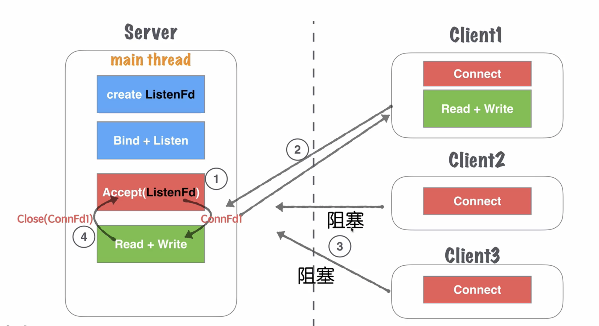
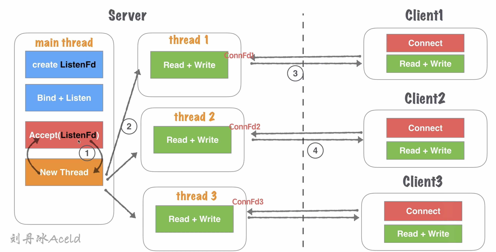
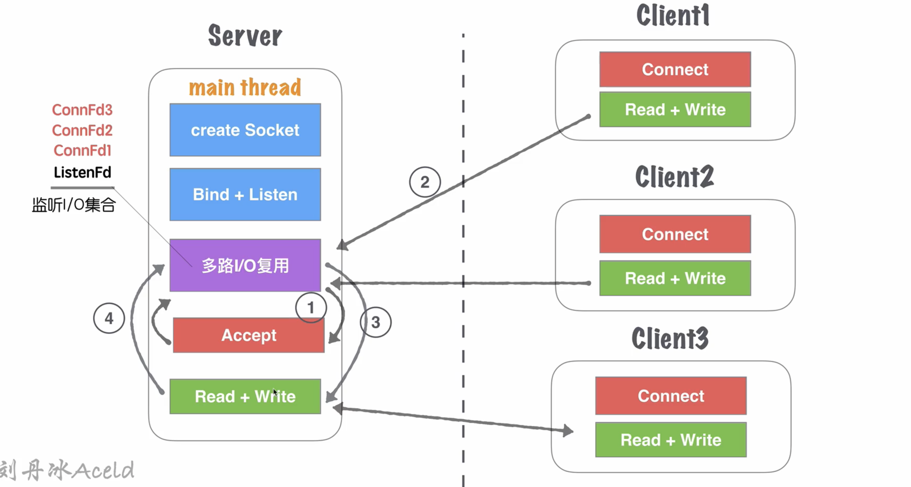
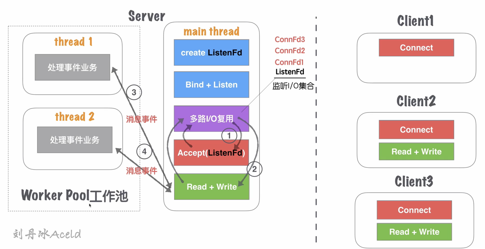
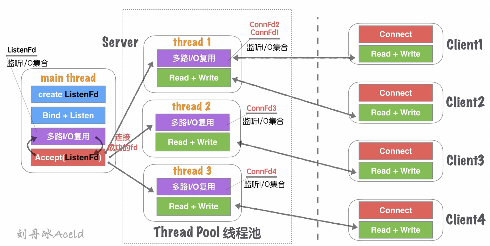
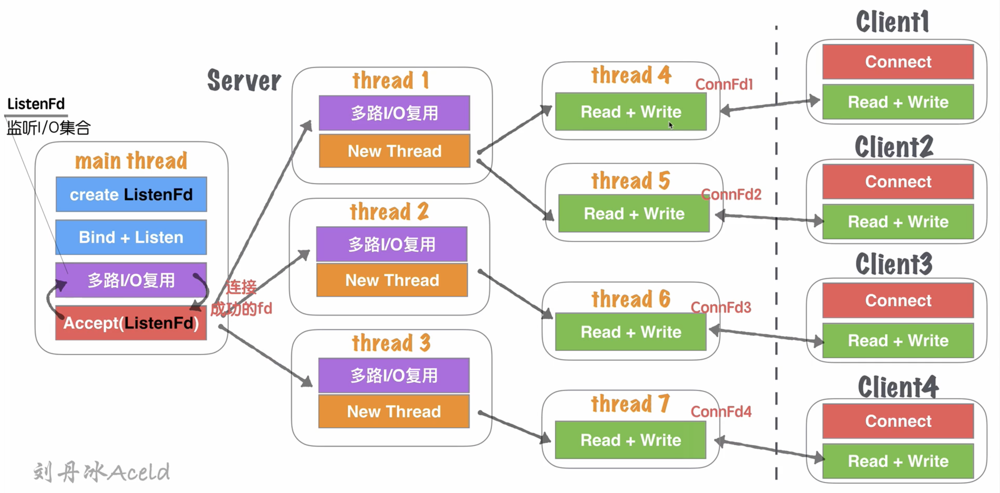

# 模型一 单线程Accept（无I/O复用）

流程：

1. Main thread 执行阻塞 `accept`，等待客户端 `connect` 连接，main thread 中 `accept` 响应并建立连接；
2. 创建连接成功后得到Connfd1套接字，在 main thread 串行处理套接字读写，处理业务；
3. 在步骤2处理业务中，如果有新的客户端发起 `connect` 请求，Server无响应，直到当前套接字全部业务处理完毕；
4. 当前客户端处理完后，关闭连接，处理下一个客户端请求。

优点：

- 模型简单。

缺点：

- 非并发模型，并发量为1，监听并响应最大的网络连接量为1。

# 模型二 单线程Accept + 多线程读写业务（无I/O复用）

流程

1. Main thread 执行阻塞 `accept`，等待客户端 `connect` 连接，main thread 中 `accept` 响应并建立连接；
2. 创建连接成功后得到 Connfd1 套接字，创建一个新线程 thread1 用于处理客户端的读写业务，main thread 依然会回到 `accept`阻塞等待新的客户端连接；
3. thread1 通过套接字 Connfd1 与客户端进行通信读写；
4. server 在步骤2处理业务中，如果有新的客户端发起 `connect` 请求，main thread 中依然能够 `accept` 响应并建立连接，重复步骤2。

优点：

- 相比模型一，支持了并发的特性
- 使用比较灵活，一个客户端对应一个线程单独处理，server 处理业务内聚性高。

缺点：

- 每次都需要开辟新的线程，客户端和 server 线程的数量 1 ：1，对于高并发场景，线程数量受限于硬件的瓶颈，线程过多也会增加 CPU 切换的成本；
- 对于长连接，客户端一旦无业务读写，只要不关闭 server 就应对这个保持连接的状态（心跳检测，健康检查机制），占用连接资源和线程开销；
- 仅适合客户端数量小，可控的场景下。

# 模型三 单线程多路I/O复用

流程：

1. main thread 创建 listenfd 之后，采用多路 I/O 复用机制（select、epoll）进行 I/O 状态阻塞监控，有 Client1 客户端 `connect` 请求，I/O 复用机制检测到 listenfd 触发读时间，进行 `accept` 建立连接，并将新生成的 connfd1 加入到监听 I/O 集合；
2. Client1 再次进行正常读写业务请求，main thread 的多路 I/O 复用机制阻塞返回，触发读/写事件；
3. 对于 Client1 的读写业务，Server 依然在 main thread 重执行流程，此时如果有新的客户端发送 `connect` 请求，Server 不会即时响应；
4. 等待 Server 处理完一个连接的读写操作后，继续回到多路 I/O 复用机制阻塞，其他连接重复步骤2和步骤3。

优点：

- 单流程题解决了可以同时监听多个客户端读写状态的模型，不需要1:1的线程数量关系
- 多路 I/O 复用，阻塞（非忙轮询），不浪费资源，CPU 利用率高

缺点：

- 虽然可以监听多个客户端的状态，但同一时间内只能处理一个客户端的读写操作，实际上读写业务并发为1；
- 当多个客户端访问 Server，业务串行执行，大量请求会有排队延迟。当 Client3 占据 main thread 流程时，Client1 和 Client2 流程会卡在 I/O 复用等待下次监听事件触发。

# 模型四 单线程多路I/O复用 + 多线程业务工作池

流程：

1. main thread 创建 listenfd 之后，采用多路 I/O 复用机制（select、epoll）进行 I/O 状态阻塞监控，有 Client1 客户端 `connect` 请求，I/O 复用机制检测到 listenfd 触发读时间，进行 `accept` 建立连接，并将新生成的 connfd1 加入到监听 I/O 集合；
2. Connfd1 有数据可读，触发读事件，进行读写消息；
3. main thread 按照固定的协议读取消息，并交给 worker poll 工作线程池，工作线程池在 server 启动前就开启了固定数量的 thread，并且里面线程只处理业务消息，不进行套接字读写操作；
4. 工作池处理完业务，触发 connfd1 写事件，将回执客户端消息通过 main thread 写给对方。

优点：

- 对于模型三，将业务处理部分通过工作池分离。能够减少客户端访问 Server 导致业务串行执行的延迟时间；
- 实际读写的业务并发为1，但业务流程的并发为 worker pool 线程数量，加快了业务处理的并行效率。

缺点：

- 读写依然是 main thread 单独处理，最高的读写并行通道依然为1；
- 虽然有多个 worker 线程处理业务，但最后返回给客户端依然需要排队，出口还是 main thread 的 `read/write` 通道。

# 模型五 单线程多路I/O复用 + 多线程多路I/O复用（线程池）

流程：

1. Server启动监听之前，开辟固定数量(N)的线程，用thread pool管理；
2. main thread 创建 listenFd 之后，采用多路 I/O 复用机制进行 I/O 状态阻塞监控。当 Client1 发起 `connect` 请求，I/O 复用机制检测到 listenFd 触发读事件，进行 `accept` 建立连接，并将新生成的 connfd1 分发给 thread pool 中的某个线程进行监听；
3. thread pool 中的每个 thread 都启动多路 I/O 复用机制，用于监听 main thread 建立成功并且分发下来的 socket 套接字；
4. thread1 监听 connfd1 和 connfd2，thread2 监听 connfd3，thread3 监听 connfd4，当对应的 connfd 有读写事件发生时，对应的线程处理该套接字的业务请求。

优点：

- 将之前的 main thread 单流程的读写（模型三），分散到多线程完成，增加了同一时刻读写的并行通道，N，即线程池数量；
- Server 同时监听的 connfd 套接字数量，几乎成倍增加，之前的全部的监控数量取决于 main thread 的多路 I/O 复用机制的最大限制（select 1024，epoll默认于内存大小有关，3-6W不等）；
- 如果良好的线程池数量和 CPU 核心数量适配，尝试 CPU 核心和 thread 绑定，从而降低 CPU 的切换频率；
- 多个身处于同一个 thread 的客户端，会出现读写延迟现象，每个 thread 模型与模型三一致的。

# 模型六 单线程多路I/O复用 + 多线程多路I/O复用 + 多线程

流程：

1. Server启动监听之前，开辟固定数量(N)的线程，用thread pool管理；
2. main thread 创建 listenFd 之后，采用多路 I/O 复用机制进行 I/O 状态阻塞监控。当 Client1 发起 `connect` 请求，I/O 复用机制检测到 listenFd 触发读事件，进行 `accept` 建立连接，并将新生成的 connfd1 分发给 thread pool 中的某个线程进行监听；
3. thread pool 中每个 thread 都启动多路 I/O 复用机制，用于监听 main thread 建立成功并且分发下来的 socket 套接字。一旦其中某个被监听的客户端套接字触发 I/O 读写事件，会开辟一个新线程处理 I/O 读写业务；
4. 某个读写线程完成当前业务后，如果套接字没有被关闭，那么将当前客户端套接字重新加回线程池监控线程中，自身线程销毁。

优点：

- 在模型五基础上，除了能够保证同时响应最高的并发数，又能够解决读写并行通道的局限问题；
- 同一时刻的读写并行通道，达到了最大化的极限，一个客户端可以对应一个单独的执行流程处理读写业务。

缺点：

- 要求 CPU 核心数量足够大；
- 需要保证 server 开辟的 thread 数量与客户端一致，造成大量 CPU 切换的成本浪费。