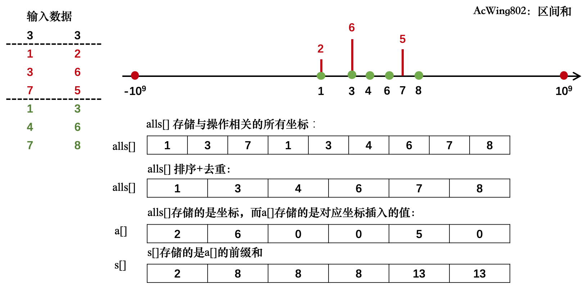
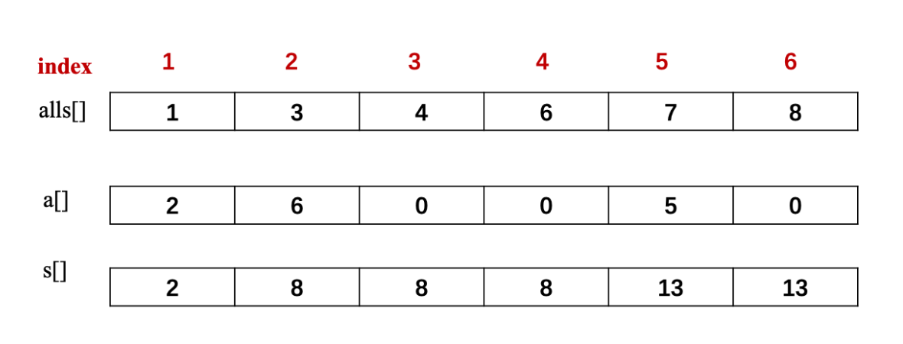

# 题目

假定有一个无限长的数轴，数轴上每个坐标上的数都是$0$。

现在，我们首先进行 `n` 次操作，每次操作将某一位置 `x` 上的数加 `c`。

接下来，进行 `m` 次询问，每个询问包含两个整数 `l` 和 `r`，你需要求出在区间 `[l,r]` 之间的所有数的和。

**输入格式**

第一行包含两个整数 `n` 和 `m`。

接下来 `n` 行，每行包含两个整数 `x` 和 `c`。

再接下来 `m` 行，每行包含两个整数 `l` 和 `r`。

**输出格式**

共 `m` 行，每行输出一个询问中所求的区间内数字和。

**数据范围**

$-10^9 \leq x \leq 10^9,$

$1\leq n, m \leq 10^5,$

$-10^9 \leq l \leq r \leq 10^9,$

$-10000 \leq c \leq 10000$

**输入样例**

```
3 3
1 2
3 6
7 5
1 3
4 6
7 8
```

**输出样例**：

```
8
0
5
```

# 思路

**离散化**，把无限空间中有限的个体映射到有限的空间中去，以此提高算法的时空效率。本质是做映射，将区间上间隔很大的点映射到相邻的数组元素中，减少对空间的需求。



需要写一个映射的函数 `find()`，这个函数的工作是输入一个坐标，输出该坐标在离散化后的位置，离散化后的下标，一般是从1开始，所以这里 `find(1) = 1`

```cpp
int find(int x) {
    // 返回输入坐标的离散化坐标，最后return r + 1，方便离散和的求解
    int l = 0, r = alls.size() - 1;
    while (l < r) {
        int mid = (l + r) >> 1;
        if (alls[mid] >= x) r = mid;
        else l = mid + 1;
    }
    return r + 1; // 映射到1, 2, ...n
}
```

离散化后的下标可以通过操纵 `a[]` 和 `s[]` 数组来执行插入和查询操作，如下图所示。



# 代码

```cpp
#include <iostream>
#include <vector>
#include <algorithm>

using namespace std;

using PII = pair<int, int>;

const int N = 300010; // n+2m

int a[N], s[N]; // a[N]存储插入的值，s[N]前缀和
vector<int> alls; // 所有要离散化的值
vector<PII> add, querys; // 插入和询问操作

int find(int x) {
    // 返回输入坐标的离散化坐标，最后return r + 1，方便离散和的求解
    int l = 0, r = alls.size() - 1;
    while (l < r) {
        int mid = (l + r) >> 1;
        if (alls[mid] >= x) r = mid;
        else l = mid + 1;
    }
    return r + 1; // 映射到1, 2, ...n（求前缀和方便）
}

int main () {
    int n, m;
    cin >> n >> m;
    for (int i = 0; i < n; ++i) {
        int x, c;
        cin >> x >> c;
        add.push_back({x, c});
        alls.push_back(x); // 存放是位置
    }
    for (int i = 0; i < m; ++i) {
        int l, r;
        cin >> l >> r;
        querys.push_back({l, r});
        alls.push_back(l);
        alls.push_back(r);
    }
    
    // 排序，去重
    sort(alls.begin(), alls.end());
    alls.erase(unique(alls.begin(), alls.end()), alls.end());
    // unique 使用必须要先过一遍sort排序
    
    // 处理n次插入操作
    for (auto item : add) {
        int x = find(item.first);
        a[x] += item.second;
    }
    // 预处理前缀和
    for (int i = 1; i <= alls.size(); ++i) s[i] = s[i - 1] + a[i];
   	// 处理m次询问
    for (auto q : querys) {
        int l = find(q.first), r = find(q.second);
        cout << s[r] - s[l-1] << endl;
    }
    return 0;
}
```

